Blackwell GPUs introduce hardware support for **microscaling FP8 (MXFP8)** — a block-scaled quantization format that gives you FP8 compute throughput with much better accuracy than per-tensor FP8. cuDNN's SDPA implementation takes full advantage of this, but the scaling strategy varies across the different tensors in the attention pipeline. Let's break down exactly how it works.

## MXFP8 vs Per-Tensor FP8

In regular FP8 (as used on Hopper), each tensor gets **one scale factor** shared across all elements. This means the scale has to accommodate the global max, wasting dynamic range in regions with small values.

MXFP8 uses **block-wise scaling**: the tensor is divided into blocks of 32 elements, and each block gets its own scale factor stored as `E8M0` (a pure power-of-2). This lets each block adapt to its local magnitude, dramatically reducing quantization error.

```
Per-tensor FP8:   1 scale for entire [B, H, S, D] tensor
MXFP8:            1 scale per 32-element block → ceil(dim/32) scales
```

## Forward Pass: Input Scaling

The forward pass takes Q, K, V as MXFP8 (`FP8_E4M3`) with block-wise scale factors (`FP8_E8M0`). The key detail is **which dimension gets the block scaling** — and it depends on which dimension is the contraction axis in the upcoming matrix multiply.

### BMM1: Q × K^T

For the first matmul, Q contracts with K along the **d (head dimension)** axis. So both Q and K are scaled block-wise along d:

```
Q [B, H, S_q, D]   →  scale along D  →  SF_Q [B, H, S_q, ceil(D/32)]
K [B, H, S_kv, D]  →  scale along D  →  SF_K [B, H, S_kv, ceil(D/32)]
```

Each group of 32 consecutive elements in the head dimension shares one E8M0 scale factor. This is **row-wise scaling** — each row (sequence position) of Q and K has its own set of block scales.

### BMM2: P × V

For the second matmul, the attention weights P contract with V along the **s_kv (sequence)** axis. So V is scaled block-wise along s_kv:

```
V [B, H, S_kv, D]  →  scale along S_kv  →  SF_V [B, H, ceil(S_kv/32), D]
```

This is **column-wise scaling** — each column (head dimension position) of V has its own set of block scales along the sequence axis.

Here's a diagram of the forward pass data flow:

```mermaid
graph TD
    subgraph "Inputs (MXFP8 E4M3)"
        Q["Q [B,H,S_q,D]<br/>+ SF_Q [B,H,S_q,D/32]<br/><i>row-wise scales</i>"]
        K["K [B,H,S_kv,D]<br/>+ SF_K [B,H,S_kv,D/32]<br/><i>row-wise scales</i>"]
        V["V [B,H,S_kv,D]<br/>+ SF_V [B,H,S_kv/32,D]<br/><i>column-wise scales</i>"]
    end

    Q --> BMM1["BMM1: Q × K^T<br/><i>MXFP8 matmul</i>"]
    K --> BMM1

    BMM1 --> S["S [B,H,S_q,S_kv]<br/><i>FP32</i>"]
    S --> |"× attn_scale"| SOFT["Softmax<br/><i>FP32</i>"]
    SOFT --> P["P [B,H,S_q,S_kv]<br/><i>FP32</i>"]

    P --> |"× 16.0 → FP8 → × 1/16"| PQ["P_quantized<br/><i>fixed scale = 16.0</i>"]

    PQ --> BMM2["BMM2: P × V<br/><i>MXFP8 matmul</i>"]
    V --> BMM2

    BMM2 --> O["O [B,H,S_q,D]<br/><i>BF16 output</i>"]

    style Q fill:#1a2e1a,stroke:#76b900
    style K fill:#1a2e1a,stroke:#76b900
    style V fill:#1a2e1a,stroke:#76b900
    style PQ fill:#2e1a1a,stroke:#ff7b72
    style O fill:#1a1a2e,stroke:#79aaff
    style BMM1 fill:#0d1117,stroke:#d2a8ff
    style BMM2 fill:#0d1117,stroke:#d2a8ff
```



## The Fixed Scale for P

After softmax, the attention probability matrix **P** needs to be quantized to FP8 for BMM2. But unlike Q, K, V which use current/online block scales of 32, P uses a **fixed scale of 16.0**:

```python
# From the cuDNN reference implementation
s_scale = 16.0
inv_s_scale = 1.0 / 16.0

P_fp8 = quantize_to_fp8(P * s_scale)   # scale up, then quantize
P_dequant = P_fp8.float() * inv_s_scale  # dequantize and scale back down
```

Why fixed? There's no need for the overhead of computing per-block max values when the output distribution is this well-behaved. Because softmax outputs are bounded to `[0, 1]`, the dynamic range is known ahead of time. A fixed scale of 16.0 maps the `[0, 1]` range into a region that uses the FP8 E4M3 representable range efficiently.

## Backward Pass: Dual-Orientation Scaling

The backward pass is where MXFP8 scaling gets interesting. The gradient tensor **dS** needs to be used in two different matrix multiplications that contract along different axes — so it gets quantized **twice**, in two orientations:

```mermaid
graph TD
    subgraph "Backward Inputs"
        Qr["Q (row-wise + col-wise)<br/>MXFP8"]
        Kr["K (row-wise + col-wise)<br/>MXFP8"]
        Vr["V (row-wise)<br/>MXFP8"]
        dO["dO (row-wise + col-wise)<br/>MXFP8"]
        Of["O, dO in F16<br/><i>for O·dO computation</i>"]
    end

    Of --> DOT["D = rowsum(O ⊙ dO)<br/><i>FP32</i>"]
    dO --> dP["dP = dO × V^T<br/><i>FP32</i>"]
    Vr --> dP

    dP --> dS_compute["dS = P ⊙ (dP − D) × attn_scale<br/><i>FP32</i>"]
    DOT --> dS_compute

    dS_compute --> |"online quantize<br/>along S_kv"| dS_d["dS_fp8 + SF_dS<br/><i>for dQ = dS × K</i>"]
    dS_compute --> |"online quantize<br/>along S_q"| dS_s["dS_fp8_t + SF_dS_t<br/><i>for dK = dS^T × Q</i>"]

    dS_d --> dQ["dQ = dS × K"]
    Kr --> dQ
    dS_s --> dK["dK = dS^T × Q"]
    Qr --> dK

    style dS_d fill:#2e1a1a,stroke:#ff7b72
    style dS_s fill:#2e1a1a,stroke:#ff7b72
    style dQ fill:#0d1117,stroke:#d2a8ff
    style dK fill:#0d1117,stroke:#d2a8ff
```



The dual quantization of dS works like this:

```python
# dS quantized along s_kv (for dQ = dS @ K)
dS_fp8, SF_dS = quantize_to_mxfp8(dS, block_dim=s_kv, block_size=32)

# dS quantized along s_q (for dK = dS^T @ Q)
dS_fp8_t, SF_dS_t = quantize_to_mxfp8(dS, block_dim=s_q, block_size=32)
```

This is **online quantization** — the scale factors for dS are computed on-the-fly from the actual gradient values, not pre-computed. The cuDNN kernel fuses the dS computation with the quantization step, so there's no extra memory pass.

### Full Backward Input Requirements

| Tensor | Format | Scaling |
|--------|--------|---------|
| Q | MXFP8 E4M3 | Row-wise **and** column-wise scales |
| K | MXFP8 E4M3 | Row-wise **and** column-wise scales |
| V | MXFP8 E4M3 | Row-wise scales only |
| dO | MXFP8 E4M3 | Row-wise **and** column-wise scales |
| O | FP16/BF16 | No MXFP8 scaling (used for O·dO) |
| dO (copy) | FP16/BF16 | No MXFP8 scaling (used for O·dO) |

Q, K, and dO need **both row-wise and column-wise** scales because the backward pass uses them in matmuls that contract along different dimensions. V only needs row-wise scales because it's only used in one orientation.

## Memory Layout: F8_128x4 Reordering

Blackwell hardware requires a special memory layout called **F8_128x4** for MXFP8 tensors. Scale factors must follow this layout:

```
Data tensor:   Can stay in original shape
Scale tensor:  padded to multiples of 4 along the scale dimension and 128 in the remainder dimension. Plus, needs to be contiguous in memory.

Example for Q [B, H, S=500, D=192]:
  S_padded = ceil(500/128) × 128 = 512
  D_scale  = ceil(192/32) = 6
  D_scale_padded = ceil(6/4) × 4 = 8

  Q data:   [B, H, 500, 192]  (FP8_E4M3)
  Q scales: [B, H, 512, 8]    (FP8_E8M0)
```

This reordering enables efficient vectorized dequantization in the fused kernel — the hardware can load a 128-element tile and its 4 corresponding scale factors in a single coalesced transaction, and plumb it as-is all the way to the tensor core.

## Try It Yourself

The cudnn-frontend repo has complete samples:

- **C++ forward:** [`samples/cpp/sdpa/mxfp8_fwd.cpp`](https://github.com/NVIDIA/cudnn-frontend/blob/main/samples/cpp/sdpa/mxfp8_fwd.cpp)
- **C++ backward:** [`samples/cpp/sdpa/mxfp8_bwd.cpp`](https://github.com/NVIDIA/cudnn-frontend/blob/main/samples/cpp/sdpa/mxfp8_bwd.cpp)
- **Python tests:** [`test/python/sdpa/mxfp8.py`](https://github.com/NVIDIA/cudnn-frontend/blob/main/test/python/sdpa/mxfp8.py)
- **Python reference:** [`test/python/sdpa/mxfp8_ref.py`](https://github.com/NVIDIA/cudnn-frontend/blob/main/test/python/sdpa/mxfp8_ref.py) — emulates the exact recipe used inside the kernel

**Learn more:** [cuDNN Attention API](https://docs.nvidia.com/deeplearning/cudnn/frontend/latest/operations/Attention.html) · [OCP Microscaling Spec](https://www.opencompute.org/documents/ocp-microscaling-formats-mx-v1-0-spec-final-pdf) · [GTC 2025: cuDNN on Blackwell](https://www.nvidia.com/en-us/on-demand/session/gtc25-s73071/)
