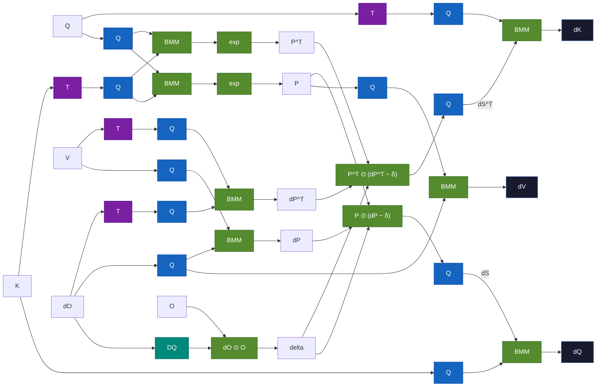

Blackwell GPUs introduce hardware support for **microscaling FP8 (MXFP8)** — a block-scaled quantization format that gives you FP8 compute throughput with much better accuracy than per-tensor FP8. cuDNN's SDPA implementation takes full advantage of this, but the scaling strategy varies across the different tensors in the attention pipeline. Let's break down exactly how it works.

## MXFP8 vs Per-Tensor FP8

In regular FP8 (as used on Hopper), each tensor gets **one scale factor** shared across all elements. This means the scale has to accommodate the global max, wasting dynamic range in regions with small values.

MXFP8 uses **block-wise scaling**: the tensor is divided into blocks of 32 elements, and each block gets its own scale factor stored as `E8M0` (a pure power-of-2). This lets each block adapt to its local magnitude, dramatically reducing quantization error.

```
Per-tensor FP8:   1 scale for entire [B, H, S, D] tensor
MXFP8:            1 scale per 32-element block → ceil(dim/32) scales
```

## Forward Pass: Input Scaling

The forward pass takes Q, K, V as MXFP8 (`FP8_E4M3`) with block-wise scale factors (`FP8_E8M0`). The key detail is **which dimension gets the block scaling** — and it depends on which dimension is the contraction axis in the upcoming matrix multiply.

### BMM1: Q × K^T

For the first matmul, Q contracts with K along the **d (head dimension)** axis. So both Q and K are scaled block-wise along d:

```
Q [B, H, S_q, D]   →  scale along D  →  SF_Q [B, H, S_q, ceil(D/32)]
K [B, H, S_kv, D]  →  scale along D  →  SF_K [B, H, S_kv, ceil(D/32)]
```

Each group of 32 consecutive elements in the head dimension shares one E8M0 scale factor. This is **row-wise scaling** — each row (sequence position) of Q and K has its own set of block scales.

### BMM2: P × V

For the second matmul, the attention weights P contract with V along the **s_kv (sequence)** axis. So V is scaled block-wise along s_kv:

```
V [B, H, S_kv, D]  →  scale along S_kv  →  SF_V [B, H, ceil(S_kv/32), D]
```

This is **column-wise scaling** — each column (head dimension position) of V has its own set of block scales along the sequence axis.

Here's a diagram of the forward pass data flow:


## The Fixed Scale for P

After softmax, the attention probability matrix **P** needs to be quantized to FP8 for BMM2. But unlike Q, K, V which use current/online block scales of 32, P uses a **fixed scale of 256.0**:

```python
# From the cuDNN reference implementation
s_scale = 256.0
inv_s_scale = 1.0 / 256.0

P_fp8 = quantize_to_fp8(P * s_scale)   # scale up, then quantize
P_dequant = P_fp8.float() * inv_s_scale  # dequantize and scale back down
```

Why fixed? There's no need for the overhead of computing per-block max values when the output distribution is this well-behaved. Because softmax outputs are bounded to `[0, 1]`, the dynamic range is known ahead of time. A fixed scale of 256.0 maps the `[0, 1]` range into a region that uses the FP8 E4M3 representable range efficiently.

## Backward Pass: Full Quantized Data Flow

The backward pass is where MXFP8 scaling gets really interesting. Every input tensor needs **two quantized copies** — one transposed-then-quantized (**T→Q**) and one quantized directly (**Q**) — because the backward pass uses each tensor in matmuls that contract along different axes. Since transposing MXFP8 data would put the block scales along the wrong dimension, the kernel produces both orientations upfront.

**S is recomputed twice** from Q and K (never stored from the forward pass) — once producing P^T and once producing P. This avoids a costly MXFP8 transpose of the softmax output. Similarly, dP is computed in dual orientations for the same reason.

Node colors: **Q** (blue) = Quantize, **T** (purple) = Transpose, **DQ** (teal) = Dequantize, **BMM/exp** (green) = Compute



Key observations from this data flow:

- **Dual S recomputation** — Flash attention never materializes the full S matrix; it recomputes tiles on-the-fly. Two separate BMMs produce P in transposed and normal orientations for their downstream consumers, avoiding an MXFP8 transpose (which would require requantization).
- **Dual dP computation** — dP = dO × V^T is likewise computed in both orientations. The transposed path uses T→Q versions of V and dO; the normal path uses directly-quantized versions.
- **Delta uses dequantized dO** — the element-wise dO ⊙ O needs full precision, so dO is dequantized (DQ) back to FP16/BF16. O is kept in FP16/BF16 from the forward pass.
- **Online dS quantization** — after computing P ⊙ (dP − δ), the result is quantized on-the-fly into dS^T and dS, each scaled along the contraction axis needed by its downstream BMM.
- **Three output matmuls** — dK = dS^T × Q, dQ = dS × K, dV = P^T × dO. Each uses the appropriately-oriented quantized inputs.

The dual quantization of dS works like this:

```python
# dS quantized along s_kv (for dQ = dS @ K)
dS_fp8, SF_dS = quantize_to_mxfp8(dS, block_dim=s_kv, block_size=32)

# dS quantized along s_q (for dK = dS^T @ Q)
dS_fp8_t, SF_dS_t = quantize_to_mxfp8(dS, block_dim=s_q, block_size=32)
```

This is **online quantization** — the scale factors for dS are computed on-the-fly from the actual gradient values, not pre-computed. The cuDNN kernel fuses the dS computation with the quantization step, so there's no extra memory pass.

### Full Backward Input Requirements

| Tensor | Format | Scaling |
|--------|--------|---------|
| Q | MXFP8 E4M3 | Row-wise **and** column-wise scales |
| K | MXFP8 E4M3 | Row-wise **and** column-wise scales |
| V | MXFP8 E4M3 | Row-wise scales only |
| dO | MXFP8 E4M3 | Row-wise **and** column-wise scales |
| O | FP16/BF16 | No MXFP8 scaling (used for O·dO) |
| dO (copy) | FP16/BF16 | No MXFP8 scaling (used for O·dO) |

Q, K, and dO need **both row-wise and column-wise** scales because the backward pass uses them in matmuls that contract along different dimensions. V only needs row-wise scales because it's only used in one orientation.

## Memory Layout: F8_128x4 Reordering

Blackwell hardware requires a special memory layout called **F8_128x4** for MXFP8 tensors. Scale factors must follow this layout:

```
Data tensor:   Can stay in original shape
Scale tensor:  padded to multiples of 4 along the scale dimension and 128 in the remainder dimension. Plus, needs to be contiguous in memory.

Example for Q [B, H, S=500, D=192]:
  S_padded = ceil(500/128) × 128 = 512
  D_scale  = ceil(192/32) = 6
  D_scale_padded = ceil(6/4) × 4 = 8

  Q data:   [B, H, 500, 192]  (FP8_E4M3)
  Q scales: [B, H, 512, 8]    (FP8_E8M0)
```

This reordering enables efficient vectorized dequantization in the fused kernel — the hardware can load a 128-element tile and its 4 corresponding scale factors in a single coalesced transaction, and plumb it as-is all the way to the tensor core.

## Using MXFP8 Attention via TransformerEngine

If you're using [NVIDIA TransformerEngine](https://github.com/NVIDIA/TransformerEngine), you don't need to manage scales manually — TE handles the MXFP8 quantization, dual-orientation scaling, and cuDNN graph construction for you. The key is the `MXFP8BlockScaling` recipe with `fp8_dpa=True`:

```python
import torch
import transformer_engine.pytorch as te
from transformer_engine.common.recipe import Format, MXFP8BlockScaling

# Create MXFP8 recipe with FP8 attention enabled
mxfp8_recipe = MXFP8BlockScaling(
    fp8_format=Format.E4M3,  # E4M3 for both fwd and bwd (block scaling makes E5M2 unnecessary)
    fp8_dpa=True,             # Enable FP8 dot-product attention (Beta)
    fp8_mha=True,             # Skip casts at DPA boundaries for full FP8 MHA
)

# Standard TE attention module
attn = te.DotProductAttention(
    num_attention_heads=32,
    kv_channels=128,
    attention_dropout=0.0,
    qkv_format="bshd",
    attn_mask_type="causal",
)

q = torch.randn(1, 4096, 32, 128, dtype=torch.bfloat16, device="cuda")
k = torch.randn(1, 4096, 32, 128, dtype=torch.bfloat16, device="cuda")
v = torch.randn(1, 4096, 32, 128, dtype=torch.bfloat16, device="cuda")

# The autocast context handles all MXFP8 quantization internally
with te.autocast(enabled=True, recipe=mxfp8_recipe):
    out = attn(q, k, v)  # Q,K,V quantized to MXFP8 → cuDNN FusedAttention → BF16 output
```

A few things to note about what happens under the hood:

- **`fp8_dpa=True`** tells TE to quantize Q, K, V to MXFP8 before calling into cuDNN's FusedAttention backend. TE computes the row-wise and column-wise E8M0 block scales, applies the F8_128x4 layout, and builds the cuDNN graph with all the scale tensors wired up.
- **`fp8_mha=True`** goes a step further — it keeps the data in FP8 across the entire multi-head attention block. Without it, TE inserts BF16 casts at the DPA boundaries: `LayerNormLinear (BF16) → cast to FP8 → DPA → cast to BF16 → Linear`. With `fp8_mha=True`: `LayerNormLinear (FP8) → DPA → Linear` — no extra cast overhead.
- **`Format.E4M3`** is recommended over `Format.HYBRID` for MXFP8 because block-wise scaling gives each 32-element group its own dynamic range, eliminating the need for E5M2's wider exponent range in the backward pass.
- The backward pass FP8 behavior can be controlled with `NVTE_FP8_DPA_BWD=0` (env var) to disable FP8 in the backward pass only, if needed for debugging.

You can check MXFP8 hardware support at runtime:

```python
from transformer_engine.common.recipe import is_mxfp8_available
if is_mxfp8_available():
    recipe = MXFP8BlockScaling(fp8_dpa=True, fp8_mha=True)
else:
    # Fall back to per-tensor FP8 on Hopper
    from transformer_engine.common.recipe import DelayedScaling
    recipe = DelayedScaling(fp8_format=Format.HYBRID, amax_history_len=16)
```

**Note:** `fp8_dpa` and `fp8_mha` are Beta features in TE — the API may change in future releases. Requires the FusedAttention backend (not Flash Attention) and cuDNN ≥ 9.3.0.

## Try It Yourself

The cudnn-frontend repo has complete samples:

- **C++ forward:** [`samples/cpp/sdpa/mxfp8_fwd.cpp`](https://github.com/NVIDIA/cudnn-frontend/blob/main/samples/cpp/sdpa/mxfp8_fwd.cpp)
- **C++ backward:** [`samples/cpp/sdpa/mxfp8_bwd.cpp`](https://github.com/NVIDIA/cudnn-frontend/blob/main/samples/cpp/sdpa/mxfp8_bwd.cpp)
- **Python tests:** [`test/python/sdpa/mxfp8.py`](https://github.com/NVIDIA/cudnn-frontend/blob/main/test/python/sdpa/mxfp8.py)
- **Python reference:** [`test/python/sdpa/mxfp8_ref.py`](https://github.com/NVIDIA/cudnn-frontend/blob/main/test/python/sdpa/mxfp8_ref.py) — emulates the exact recipe used inside the kernel

**Learn more:** [cuDNN Attention API](https://docs.nvidia.com/deeplearning/cudnn/frontend/latest/operations/Attention.html) · [TE FP8 Primer](https://docs.nvidia.com/deeplearning/transformer-engine/user-guide/examples/fp8_primer.html) · [OCP Microscaling Spec](https://www.opencompute.org/documents/ocp-microscaling-formats-mx-v1-0-spec-final-pdf) · [GTC 2025: cuDNN on Blackwell](https://www.nvidia.com/en-us/on-demand/session/gtc25-s73071/)
