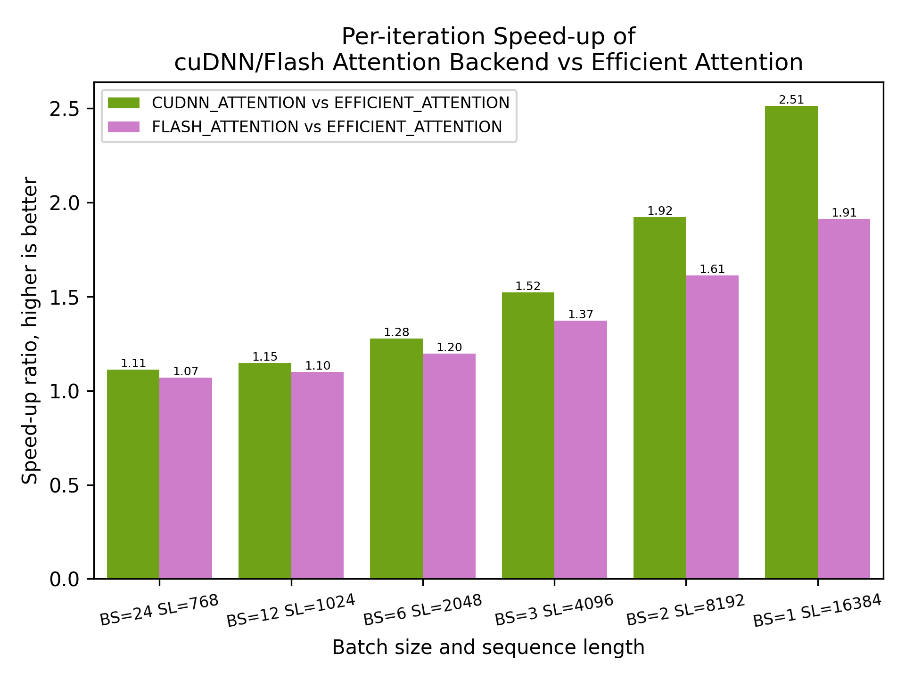

# Introduction

Llama-3.2-1B is a 1.3 billion parameter language model based on the Llama architecture. It is a smaller variant of the Llama model family, designed to provide good performance while being more efficient and requiring less computational resources than larger models. In particular, this model is one of the few in the Llama family that can comfortably run on a single consumer-grade GPU. The model was trained on a large corpus of text data using the standard Llama training methodology.

The easiest way to get this model is through the Hugging Face transformers library. It is a PyTorch implementation using the standard `torch.nn.Module` interface. Specifically, the attention in the model is implemented using `torch.nn.functional.scaled_dot_product_attention`. PyTorch provided multiple backends for this attention, swappable at runtime by setting the context manager `sdpa_kernel()` with backend set to `SDPBackend.CUDNN_ATTENTION`, `SDPBackend.EFFICIENT_ATTENTION`, or `SDPBackend.FLASH_ATTENTION` respectively.

This benchmark focuses on training. The model architecture is from the transformers library but the model is randomly initialized without using any pre-trained weights. The benchmark script simulates a training loop by running multiple iterations of forward and backward passes to the model. The goal is to measure the per-iteration time of training under different batch sizes, sequence lengths, and SDPA backends.

## Software versions

This benchmark code should run on any decently modern Python environment with CUDA-enabled GPU. In particular, it has been tested using the PyTorch docker image [from the NGC catalog](https://catalog.ngc.nvidia.com/orgs/nvidia/containers/pytorch), `nvcr.io/nvidia/pytorch:25.04-py3`. Specifically, the following are included in the image:

| Software | Version |
|----------|---------|
| Python   | 3.12.9  |
| CUDA     | 12.9    |
| cuDNN    | 9.9.0   |
| PyTorch  | 2.7.0   |

## Steps to reproduce

This benchmark is conducted by running the `training_perf.py` script and uses the first CUDA-enabled GPU in your system. This Python script depends on several other Python packages, including:

- `torch`
- `transformers`
- `pandas`
- `seaborn`
- `matplotlib`

The script uses the Hugging Face transformers library to create the Llama model. You also need to configure the environment for the Hugging Face library to run, including the `HF_TOKEN` and `HF_HOME` environment variables if necessary.

Note that the Llama model is a gated model in the Hugging Face Hub. Your token must have access to this model. Please visit <https://huggingface.co/meta-llama/Llama-3.2-1B> to request access.

For more accurate results, it is recommended to lock the clock frequency of the GPU using the following command:

```bash
nvidia-smi -i 0 -lgc <min_clock>,<max_clock>
```

which the min and max clock frequency are in MHz and should be the same value. You need to check the supported clock frequency of your specific GPU.

Once the environment is configured, you can run the script by executing the following command:

```bash
python training_perf.py
```

This will measure the mean time spent per training loop for 50 iterations under different batch sizes, sequence lengths, and SDPA backends. The script will output the timing data to a CSV file called `training_timing.csv`, and plot the results in `iteration_time.png` and `speedup.png`.

For your convenience, a `Dockerfile` is also provided that bootstraps all of the above. You can build the image by executing the following command:

```bash
docker build -t benchmark-llama-3.2-1b .
```

Then you can run the benchmark by executing the following command, which set the necessary environment variables and mount the current directory to the working directory of the container:

```bash
nvidia-smi -i 0 -lgc CLOCK_MHZ,CLOCK_MHZ   # optional, clock must be locked outside the container
docker run --gpus all --rm -e HF_TOKEN="hf_XXXXXXX" -e HF_HOME="/tmp/huggingface" -v $(pwd):/workspace benchmark-llama-3.2-1b
```

where `hf_XXXXXXX` is your Hugging Face token, and the clock frequency should match your GPU. Note the argument `-v <local_dir>:/workspace` in the docker command is to mount a local directory to the `/workspace` directory in the container. This is how you can have the script output stored in your host machine.

Running this benchmark will produce the following artifacts:

- `training_timing.csv`: the timing results
- `iteration_time.png`: the iteration time plot
- `speedup.png`: the speed-up plot

An example is show in the next section.

## Results

Below are the result of the benchmark running on a single B200 GPU or H200 GPU.

For both runs, the following software versions are used:

- CUDA: 12.9 (from NGC container)
- cuDNN: 9.9.0 (from NGC container)
- PyTorch: 2.7.0 (from NGC container)
- transformers: 4.35.0

### B200

The hardware configuration is:

- GPU: NVIDIA B200
- CPU: INTEL(R) XEON(R) PLATINUM 8570
- RAM: 2TB

The benchmark is conducted after the clock is locked at 1665 MHz, namely, the base clock of B200.

cuDNN attention is the fastest SDPA backend compared to flash attention and efficient attention, in the six setups we tested.

The left figure compares cuDNN and flash attention backends against efficient attention, which is the slowest SDPA backend among these three. The speed-up is the per-iteration speed-up, not the speed-up of the attention operation itself. The right figure displays per-iteration times (as recorded in `iteration_time.png`), where lower values indicate better performance.

|  |  |
|--------------------------|--------------------------|

Note that the exact implementation of the various backends are specific to PyTorch. We notice other implementation of Flash Attention from the [flash-attn](https://github.com/Dao-AILab/flash-attention) Python library, for example. But this comparison is limited to the off-the-shelf options from PyTorch.

For completeness, the exact timing results are shown below, which the script will output to [`training_timing.csv`](artifacts/b200_training_timing.csv):

| (sec per iter) | CUDNN_ATTENTION | EFFICIENT_ATTENTION | FLASH_ATTENTION |
|--|-----------------|---------------------|-----------------|
| BS=1 SL=16384 | 0.285 | 0.716 | 0.374 |
| BS=2 SL=8192 | 0.231 | 0.444 | 0.276 |
| BS=3 SL=4096 | 0.155 | 0.236 | 0.172 |
| BS=6 SL=2048 | 0.144 | 0.184 | 0.154 |
| BS=12 SL=1024 | 0.139 | 0.160 | 0.145 |
| BS=24 SL=768 | 0.200 | 0.222 | 0.208 |

### H200

The hardware configuration is:

- GPU: NVIDIA H200
- CPU: Intel(R) Xeon(R) Silver 4314 CPU @ 2.40GHz
- RAM: 256GB

Below is another run performed on an H200 GPU, with the clock frequency locked at 1500 MHz to match the H200’s base clock.
The figure on the left shows the per-iteration speed-up, while the figure on the right displays the per-iteration timing.

|  |  |
|--------------------------|--------------------------| 

and the exact timing results are shown below, the raw data is stored [here](artifacts/h200_training_timing.csv):

| (sec per iter) | CUDNN_ATTENTION | EFFICIENT_ATTENTION | FLASH_ATTENTION |
|--|-----------------|---------------------|-----------------|
| BS=1 SL=16384 | 0.424 | 0.850 | 0.500 |
| BS=2 SL=8192 | 0.357 | 0.566 | 0.397 |
| BS=3 SL=4096 | 0.243 | 0.322 | 0.260 |
| BS=6 SL=2048 | 0.229 | 0.270 | 0.240 |
| BS=12 SL=1024 | 0.222 | 0.243 | 0.228 |
| BS=24 SL=768 | 0.329 | 0.352 | 0.336 |

### How much faster is Blackwell vs Hopper?

Comparing the timing data we collected above between B200 and H200, this is what we get:

|  |  |
|--------------------------|--------------------------|

Keep it concise, we do not plot the efficient attention time here. While B200 is always faster than the previous generation H200, the actual difference depends on the backend. It is easier to compare if we plot the speed-up of B200 vs H200, as shown below:


It is easy to see that B200 can achieve around 1.2x to 1.6x speed-up over H200 for the entire training loop, depends on the batch size, sequence length, and SDPA backend. The speed-up is most significant when cuDNN attention backend is used because of the optimization implemented for Blackwell architecture. The other backends show some speed-up but not as much as cuDNN attention.

As a final note, the timing measured here involves the entire 16 layers of the Llama model and each iteration includes a forward pass and a backward pass. Attention operation, although important for the model, only accounts for a portion of the total operations. Should the other part of the model be optimized (such as the RMS norm used in the Llama model), the speed-up will be even more significant.