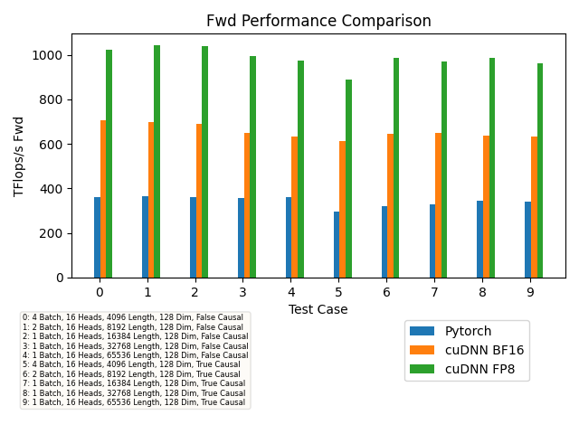
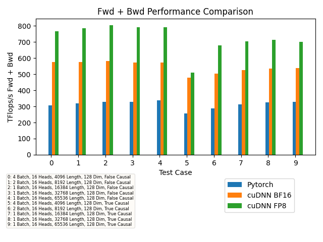

# Attention-benchmark

## Contents
- Dockerfile to create a docker container for the dependencies.
- benchmark_flash_attention.py which runs cudnn, pytorch upto 64k sequence length.
- Pytorch native sdpa operation vs cudnn sdpa operation.

## Steps to run
Lock the clocks.
For eg. in H200, use `nvidia-smi -q -d SUPPORTED_CLOCKS` to get  the supported clocks

```
sudo nvidia-smi -pm 1
sudo nvidia-smi -ac 3201,1980
sudo nvidia-smi -pl 700
```

Launch the docker build and run. 
```
docker build -t cudnn_attention_benchmark . && docker run --gpus=all --rm --shm-size=16g -it cudnn_attention_benchmark
```

## Sample output 

```
$ python benchmark_flash_attention.py 
Is flash sdp enabled in Pytorch : True
cudnn backend version : 90100
### causal=False, headdim=128, batch_size=32, seqlen=512 ###
Pytorch fwd: 302.38 TFLOPs/s, bwd: 169.09 TFLOPs/s, fwd + bwd: 193.45 TFLOPs/s
cudnn_bf16 fwd: 501.13 TFLOPs/s, bwd: 351.28 TFLOPs/s, fwd + bwd: 384.09 TFLOPs/s
cudnn_fp8 fwd: 678.07 TFLOPs/s, bwd: 418.37 TFLOPs/s, fwd + bwd: 469.78 TFLOPs/s
```

Please refer to the [benchmark_results.csv](benchmark_results.csv) for sample output.

## Results

#### Forward


#### Bprop


#### Fwd + Bprop


## Pytorch adoption

cuDNN v9 can achieve over 2x the performance of the comparable PyTorch eager implementation, as detailed in [(Beta) Implementing High-Performance Transformers with Scaled Dot Product Attention (SDPA)](https://pytorch.org/tutorials/intermediate/scaled_dot_product_attention_tutorial.html) PyTorch eager mode SDPA doesn't use cuDNN today, but adding a cuDNN-based implementation is in progress (see the PyTorch PRs for [Fprop](https://github.com/pytorch/pytorch/pull/115663), and [Bprop](https://github.com/pytorch/pytorch/pull/122510)).