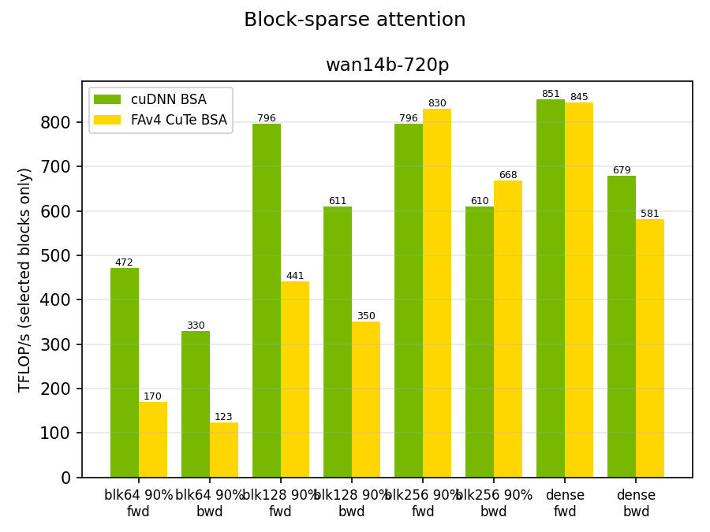
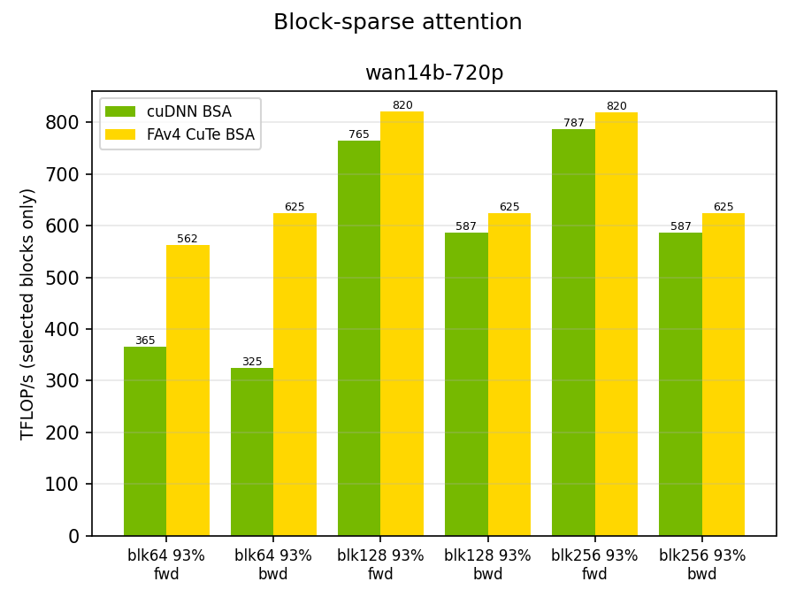
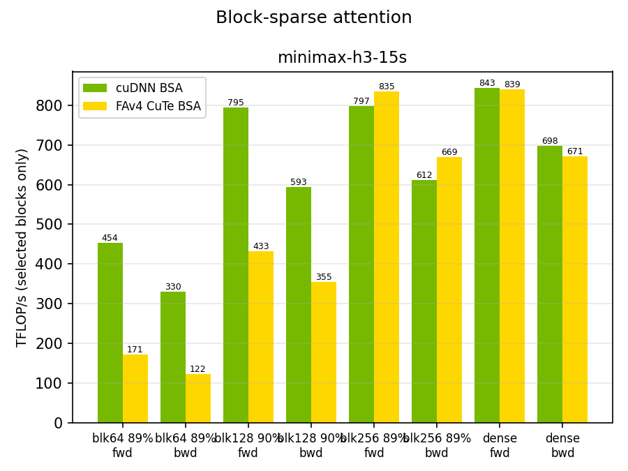

# Block Sparse Attention Benchmark

Microbenchmark of block-sparse attention (BSA) forward and backward, driven
through the public `cudnn.block_sparse_attention_forward`/`_backward` APIs,
with an optional FA4-lineage CuTe DSL arm (`flash_attn.cute`) on identical
block masks. `--direction fwd|bwd|both` selects the passes (default both).

## What is measured

The workload models video-generation sparse attention: batch 1, head_dim
128, bf16, and a boolean block mask. Blocks are selected all-or-nothing, and
both arms attend exactly the same token set in every cell. Two mask families
are provided (`--mask`):

- **`topk`** (default) — data-dependent per-head masks: seeded top-k
  selections of KV blocks per query block, diagonal block always kept.
  Models VSA-style learned sparsity; a different scatter per head and per
  row, and changing the granularity changes the selection problem itself.
- **`frame_causal`** — a structural mask for autoregressive video: tokens
  are grouped into frames of `--frame-size` tokens, and each query attends
  its own full frame, the previous `--window` frames (`-1` = all), and
  frame 0 as an anchor (disable with `--no-anchor`). The mask is identical
  across heads, rows within a frame share the same blocks in long
  contiguous runs, and per-row block counts vary (early frames attend
  little, late frames the most), exercising the variable-count metadata
  contract. Because the frame size is a multiple of every granularity, the
  same token set is expressed exactly at 64, 128, and 256 — for this family
  the granularity sweep isolates pure kernel efficiency on one fixed
  workload. The defaults (`--frame-size 2048 --window 1` + anchor) land
  near 90% sparsity at these sequence lengths.

Three sparse-block granularities are swept — **64, 128, and 256** tokens —
at each requested sparsity, plus one **dense** run per case (every block
selected) that shows the kernel's peak as an upper reference for the sparse
bars.

Reported TFLOPS count only the selected blocks — 2 matmuls forward
(QK^T, PV), 5 backward (recompute S, dV, dP, dQ, dK):

```
FLOPs = 2 * matmuls * D * block_tokens^2 * selected_blocks
```

Backward runs each arm's own forward once to produce the `out`/`lse` it
consumes; only the backward call is timed.

Granularity handling per arm (kept lossless in terms of attended tokens):

- **cuDNN**: 64 and 128 are native block sizes; 256-token masks are
  re-expressed on 128-token blocks.
- **FA4** (`flash_attn.cute`): the SM100 kernel selects at 256-token Q
  granularity with a 128-token KV tile cap, and its backward additionally
  requires 128-token KV sparse blocks (its N tile), consuming Q-direction
  (per-KV-block) index lists. Masks finer than the floor are aggregated —
  on the Q side always, and on the KV side for the backward at 64-token
  granularity (where the forward producing `out`/`lse` runs the same
  aggregated mask so the gradients stay exact). Aggregated rows attend the
  union of their blocks — real extra work the shared FLOP count does not
  credit. FA4's TFLOPS are therefore "work done per second on the requested
  mask", which is the deployment-relevant number when the workload's mask is
  finer than the kernel's granularity floor.

## Default cases

Wan2.1 text-to-video shapes at deployed latent sizes (padded to the VSA tile
grid), head_dim 128:

| case | heads | seqlen |
|---|---|---|
| `wan14b-720p` | 40 | 92160 |
| `minimax-h3-15s` | 56 | 91392 |

One case per model; other shapes (Wan-1.3B's 12 heads, 480P latents, H3's
~31k 5 s clip) are reachable as custom cases.

The MiniMax-H3 cases use the open-weights attention config (56 heads,
head_dim 128) at its published sequence scales (~31k visual tokens per
1344x768 124-frame clip, ~91k for 15 s, padded to 256-token blocks). H3
ships with full attention and lists sparse attention as planned, so the
dense bar reflects its current per-layer cost and the sparse bars the
available headroom.

Custom shapes: `--cases 12x65536` (heads x seqlen). The default sparsity is
0.9, the value video sparse-attention deployments typically target.

## Decode shape

`--decode-q N` switches to the chunked autoregressive-generation shape: the
query is only the last N tokens of the sequence, attending the full KV
history (s_q << s_kv). Both mask families support it — top-k keeps the
query's own block instead of the diagonal, and frame-causal places the
queries in the final frame. Forward only.

## Requirements

- Blackwell (SM100) GPU
- PyTorch with CUDA support
- `pip install nvidia-cudnn-frontend[cutedsl]` (or a development install of
  this repository's `python/` package with the `cutedsl` extra)
- Optional, for the FA4 arm: a flash-attention build providing
  `flash_attn.cute` with block-sparsity support, plus `nvidia-cutlass-dsl`
  and `quack-kernels`. The arm is skipped with a notice when not importable.

## How to run

```bash
python benchmark_block_sparse_attention.py                    # full default grid
python benchmark_block_sparse_attention.py --cases wan14b-480p --sparsities 0.8,0.9
python benchmark_block_sparse_attention.py --csv results.csv --plot results.png
python benchmark_block_sparse_attention.py --check            # fp32 parity checks
```

Timing uses CUDA events with an adaptive iteration count (~0.5 s per cell
after warmup). `--check` validates every arm and granularity against an fp32
masked-softmax reference at a small shape before trusting the numbers.

## Example results

`results/<model>/<arch>/` holds one full run per model — both mask families,
forward+backward, plus the decode shape — on a B200 (SM100, clock-locked at
847 MHz; absolute TFLOPS scale with clocks, relative comparisons are the
point):





