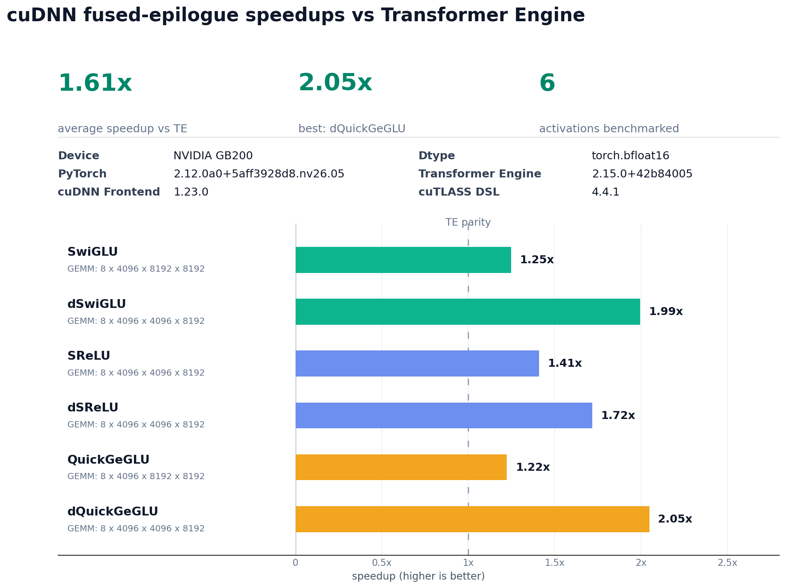
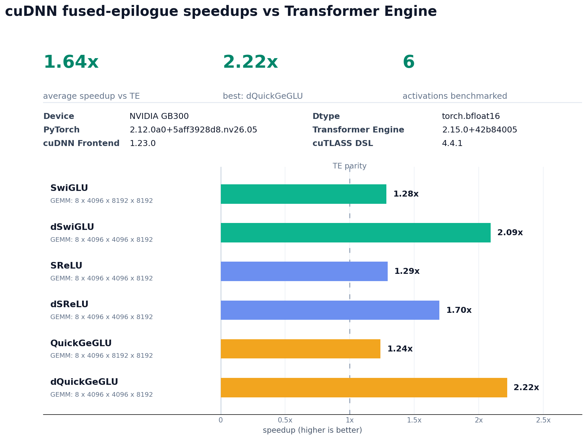

# cuteDSL Fusion Benchmarks

Microbenchmark comparing **fused cuDNN Frontend** grouped-GEMM + activation
kernels against the equivalent **unfused Transformer Engine** path
(grouped GEMM + activation) for Mixture-of-Experts activations. Timed with CUDA
graph replay; reports the per-activation speedup (`te/cudnn`).

Activations covered: `swiglu`, `dswiglu`, `srelu`, `dsrelu`, `geglu`, `dgeglu`
(the `d*` variants are the corresponding backward / GLU-bprop patterns).

For GLU-family kernels, the functional test also accounts for cuDNN Frontend's
32-column interleaved GLU layout. Forward GLU weights are packed from logical
`[gate, up]` order into `[gate32, up32, ...]` order before the fused path. For
backward GLU kernels, the saved activation input is packed the same way and the
fused gradient output is unpacked before comparison.

For `geglu` and `dgeglu`, cuDNN Frontend's cuteDSL implementation uses
Megatron-style QuickGeGLU: `quick_gelu(gate) * (up + linear_offset)`, with
`quick_gelu(gate) = gate * sigmoid(1.702 * gate)`. The benchmark also applies
the cuDNN FE clamp settings used by this kernel path: gate is clamped above and
the linear half is clamped symmetrically. TE's plain `tex.geglu`/`tex.dgeglu`
use tanh-GELU instead, so the functional oracle uses the cuDNN FE QuickGeGLU
formula for those two tests. This mirrors Megatron-LM's
`megatron/core/fusions/fused_bias_geglu.py` QuickGeGLU helper. By default this
oracle is an eager PyTorch expression; pass
`--functional-reference-backend torch_compile` to run the same expression through
`torch.compile`.

For `dsrelu`, cuDNN Frontend's cuteDSL backward epilogue treats the grouped GEMM
output as the saved SReLU input and `c_tensor` as the upstream gradient. The
functional oracle follows that operand order.

## How to run

In the latest PyTorch container (e.g. `nvcr.io/nvidia/pytorch:26.05-py3`), with
`cutedsl_fusion_benchmarks.py` available on the host:

```bash
docker run -it --gpus=all --workdir /workspace \
  -v "$(pwd):/host:ro" \
  nvcr.io/nvidia/pytorch:26.05-py3 \
  bash -c "cp /host/cutedsl_fusion_benchmarks.py /workspace && bash"
```

Then, inside the container:

```bash
PIP_CONSTRAINT="" pip install nvidia-cudnn-frontend[cutedsl] transformer-engine

python cutedsl_fusion_benchmarks.py
```

## Running the functional test

Run only the functional (correctness) subset:

```bash
python cutedsl_fusion_benchmarks.py --activation all --functional-only
```

## Running custom sizes

```bash
python cutedsl_fusion_benchmarks.py --activation all --experts 8 --tokens 4096 --glu-bprop-tokens 2048 --k 8192 --n 4096
```

## Profiling with nsys

```bash
nsys profile --force-overwrite=true --trace=cuda,nvtx,osrt --cuda-graph-trace=node --sample=none --cpuctxsw=none \
  python cutedsl_fusion_benchmarks.py --activation all --experts 8 --tokens 4096 --glu-bprop-tokens 2048 --k 8192 --n 4096
```

## Results

Pass `--output-dir` to write `output.txt` (device/versions/summary),
`output_verbose.txt` (per-activation detail), and `results.png` (speedup plot):

```bash
python cutedsl_fusion_benchmarks.py --output-dir results
```

The results below were generated with the default shape
(`experts=8, tokens/expert=4096, K=8192, N=4096`, `bf16`) using
`torch 2.12.0a0+nv26.05`, `transformer-engine 2.15.0`,
`nvidia-cudnn-frontend 1.23.0`, and `nvidia-cutlass-dsl 4.4.1`.

### B200



### B300


