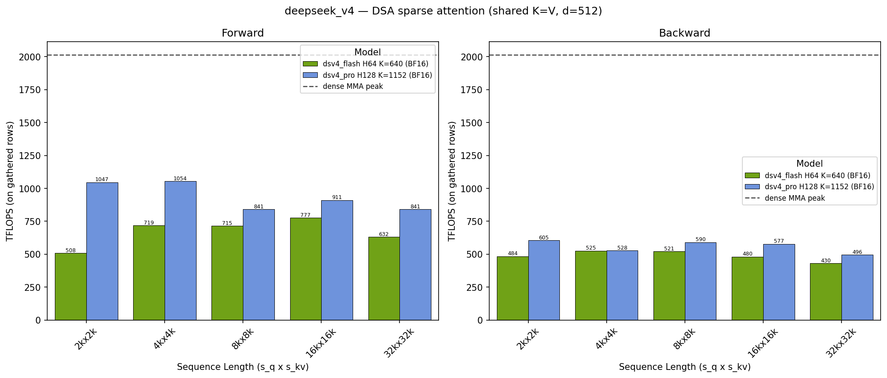

# DSA Sparse Attention Benchmarks

Benchmarks for the cuDNN Frontend DeepSeek Sparse Attention (DSA) kernels
(`cudnn.DSA.SparseAttentionForward` / `SparseAttentionBackward`). Two ways to
run them:

- **Configuration-based suite** (`runner.py` + `configs/`) — sweeps model
  presets over sequence lengths and passes, writes a CSV and a fwd/bwd chart
  per run. Arranged like [`../attention_training`](../attention_training/README.md)
  and [`../attention_inference`](../attention_inference/README.md).
- **Single scripts** (`benchmark_dsa_sparse_attention_forward.py`,
  `benchmark_dsa_sparse_attention_backward.py`) — ad-hoc shapes, execute-vs-
  wrapper split, `profile` mode for nsys/ncu.

## Contents

- `configs/` - Benchmark configuration files
  - `deepseek_v4.py` - DeepSeek-V4 Flash (H64, K=640) and Pro (H128, K=1152), 2k..32k
  - `deepseek_v41.py` - DeepSeek-V4.1 Flash (H64, K=640; 2x / uncompressed pools, same per-query gather as V4), 2k..32k
  - `glm53.py` - GLM-5.3 (H64, d=576/512, K=2048) and GLM-5.3-Flash (H64, NoPE d=512, K=2048), 2k..32k
- `runner.py` - Configuration-based benchmark runner (one subprocess per case)
- `benchmark_single_dsa.py` - Single-case worker the runner calls; prints a `RESULT,` line
- `config_types.py` - `ModelPreset`, `DsaBenchmarkConfig`, `BenchmarkResult`
- `charts.py` - Chart generation
- `run_all.sh` - Runs configs and lands results in `results/<config>/<gpu>/`
- `results/` - Benchmark outputs (CSV and charts)

## Configuration-Based Suite

```bash
# from the repository root
python -m benchmark.dsa.runner --list-configs
python -m benchmark.dsa.runner --config deepseek_v4
python -m benchmark.dsa.runner --config deepseek_v4 --dry-run
python -m benchmark.dsa.runner --config deepseek_v4 --filter flash --pass fwd
python -m benchmark.dsa.runner --config deepseek_v4 --output-dir benchmark/dsa/results/deepseek_v4/b200

# all configs for one architecture label (optionally pinning a GPU)
benchmark/dsa/run_all.sh b200 GPU-<uuid>
```

Requires an SM100-family GPU for the forward pass, SM90 or SM100 for the
backward pass, PyTorch with CUDA, `pip install nvidia-cudnn-frontend[cutedsl]`
(or a development install of this repository's `python/` package), and
`pandas`/`matplotlib`/`seaborn` for CSV and charts. `pynvml` is optional; with
it each row records the dense-MMA peak at the sampled SM clock
(`peak_mma_tflops`) and the chart draws it as a dashed line.

### What a case measures

A case is one `(model, (s_q, s_kv), backend, dtype, pass)` tuple. Inputs are
flat MQA tensors — `q (s_q, H, d_qk)`, one shared `kv (s_kv, d_qk)` record
read as both K and V, and `topk_idxs (s_q, topk)` holding unique random rows of
the KV pool for every query, plus per-head sink logits and a full-length
`topk_length` (production passes it; it selects a different compiled variant).

- **fwd** times `SparseAttentionForward.execute` with preallocated outputs
  (`out`, `max_logits`, `lse`, and `lse_indexer` when `indexer_topk > 0`).
- **bwd** times `SparseAttentionBackward.execute` with preallocated `dq`/`dkv`
  and a reusable workspace; the `out`/`lse` it consumes come from a chunked
  PyTorch reference so no forward launch is in the timed region. Gradient
  zeroing the kernel performs itself is included, as a training step pays it.

Timing is CUDA events around each call after a 256 MiB L2 flush, median of
`num_iterations` after warmup (kernel compilation happens in warmup). Each
case runs in its own subprocess: a clean CUDA context and CuTe DSL compile
state, and one failure cannot take down the sweep. Shapes the kernels'
`check_support` rejects are recorded as `skipped=True` rows, distinct from
failures.

TFLOPS count only the gathered rows:

```
fwd FLOPs = 2 * s_q * H * topk * (d_qk + d_v)
bwd FLOPs = 2 * s_q * H * topk * (3 * d_qk + 2 * d_v)
```

so they are independent of `s_kv` and directly comparable to the dense
suites' numbers.

### Model presets

`deepseek_v4` (`configs/deepseek_v4.py`): V4's sparse core is flat MQA over a
shared K=V record of `d=512`. The lightning indexer selects 512 (Flash) /
1024 (Pro) entries per query and the softmax runs over their union with the
last 128 tokens and a per-head sink; folding the window into the index list
gives logical `K = 640` / `1152` with `indexer_topk = 512` / `1024` (the
indexer-selected prefix whose LSE the forward kernel also emits). Heads: 64
(Flash) / 128 (Pro). Sequence lengths 2k, 4k, 8k, 16k, 32k with `s_q == s_kv`;
every query gathers the full top-k, i.e. the per-token upper bound.

`deepseek_v41` (`configs/deepseek_v41.py`): V4.1-Flash keeps the V4 sparse
core — H=64, shared d=512 record, 512 indexer-selected entries plus the
128-token window, sink — and changes the pool the indexer selects from:
2x-compressed (layers 2-19) or uncompressed raw tokens (layers 20-39), with
the KV record and index picks produced by a few source layers and reused by
the layers after them. The per-query gather is unchanged, so the preset is
`K = 640`, `indexer_topk = 512`. Only a Flash checkpoint is published.

`glm53` (`configs/glm53.py`): GLM-5.3 (GLM-5.2's architecture) runs
V3.2-style DSA on the MLA latent — the absorbed query attends a 576-wide
shared record (512 KV latent + 64 RoPE) and reads the 512 latent channels
back as V; token top-2048, no window fold, no sink, so `indexer_topk = 0`
(the plain LSE is the indexer's teacher signal). `glm53_flash` is the hybrid
sibling (11 of 45 layers are sparse, the rest KDA): NoPE MLA, so the record
is 512 wide; its indexer scores 4-token pools and selects 512 of them =
2048 raw tokens, always adding the incomplete tail pool (<= 3 tokens, left
out of the round 2048).

To add a model, copy `configs/deepseek_v4.py`, edit the `ModelPreset`s
(`num_q_heads`, `head_dim_qk` in `{512, 576}`, `topk`, `indexer_topk`,
`has_sink`) and the `DsaBenchmarkConfig` (`seqlens`, `profile_pass`,
`deterministic_bwd`, iteration counts), and run `--config <name>`. Supported
forward variants are `(H, d_qk)` in `{(64, 512), (64, 576), (128, 512)}` with
`indexer_topk` in `{0, 512, 1024}` (`2048` for H64 too); backward accepts any
head count with `d_qk` in `{512, 576}` and a deterministic mode on SM100 for
H16/H32/H64/H96/H128.

### Output

```
results/<config>/<gpu>/
    <config>_<timestamp>.csv   # one row per case (see BenchmarkResult)
    <config>.webp               # fwd | bwd TFLOPS vs seqlen, one bar per model
```

### Results

#### B200 - DeepSeek-V4


- `dsv4_flash: H=64, d=512, K=640 (indexer_topk=512)`; `dsv4_pro: H=128, d=512, K=1152 (indexer_topk=1024)`; bf16, sink + `topk_length`, non-deterministic backward.

## Single Scripts

### Sparse Attention Forward

`benchmark_dsa_sparse_attention_forward.py` benchmarks the public SM100
`cudnn.DSA.sparse_attention_forward_wrapper` API for H64/D512 or D576 and the
H128/D512 small-top-k Prefill kernel. The default shape is the H64 production
anchor `S_q=4096, S_kv=5120, K=640, indexer_topk=512`.

Two cuDNN Frontend timings are reported:

- **DSA execute path (preallocated)** — the concrete CuTe kernel is
  compiled before timing, all enabled output buffers are reused, and each
  iteration calls the same `SparseAttentionForward.execute()` object.
- **DSA public wrapper** — each iteration calls
  `sparse_attention_forward_wrapper`, including any GPU work caused by output
  allocation and logical-K padding/layout normalization.

Both timings use CUDA events on the current stream after independent warmup.
The execute measurement is not raw kernel-only time: it still includes the
lightweight public execution adapter, and for a non-multiple-of-64 logical K
it also includes internal index padding. CUDA events measure GPU elapsed time;
Python/host-side wrapper and allocation overhead is not separately captured.
The script prints both logical and padded K so that distinction is visible.

Run the default H64/D512 case or select another frozen specialization:

```bash
python benchmark_dsa_sparse_attention_forward.py
python benchmark_dsa_sparse_attention_forward.py --heads 64 --head-dim 576 --topk 640 --indexer-topk 512
python benchmark_dsa_sparse_attention_forward.py --heads 128 --head-dim 512 --topk 1152 --indexer-topk 1024
```

Common options are `--seqlen-q`, `--seqlen-kv`, `--heads`, `--head-dim`,
`--topk`, `--indexer-topk`, `--warmup`, `--repeat`, `--seed`,
`--no-attn-sink`, and `--use-topk-length`. Forward
requires an SM100-family GPU, BF16 inputs, PyTorch with CUDA support, and the
cuDNN Frontend `[cutedsl]` dependencies.

### Sparse Attention Backward

Microbenchmark for the DeepSeek Sparse Attention (DSA) backward kernel in the
cuDNN Frontend CuTe DSL package, driven through the public
`cudnn.DSA.sparse_attention_backward_wrapper` API. The wrapper dispatches to
the Hopper (SM90) or Blackwell (SM100) implementation based on the active
CUDA device.

#### What is measured

Inputs are flat MQA tensors: `q (S_q, H, d_qk)`, a shared
`kv (S_kv, d_qk)` buffer (K = V), and per-query global top-k indices
`topk_idxs (S_q, topk)` with unique random indices per query row. The forward
`out`/`lse` consumed by the backward kernel come from a chunked PyTorch
reference so that this benchmark isolates backward and does not include a
forward launch.

Each timed iteration is one full wrapper call — gradient-buffer zeroing,
workspace allocation, and the preprocess/backward/convert kernels — i.e. the
cost a training step pays per backward invocation. Timing uses a single
CUDA-event window around `--repeat` iterations and reports the average.

Reported TFLOPS use the 5-matmul model of the backward pass (recompute S, dV,
dP, dQ, dK):

```
FLOPs = 2 * S_q * H * topk * (3 * d_qk + 2 * d_v)
```

#### Requirements

- Hopper (SM90) or Blackwell (SM100) GPU
- PyTorch with CUDA support
- `pip install nvidia-cudnn-frontend` (or a development install of
  this repository's `python/` package) -- the CuTe DSL dependencies are
  required dependencies and come with either installation method

#### How to run

Default sweep (`seqlens 4096,8192 x topks 128,512,1024,2048`, bf16,
`d_qk = d_v = 512`, 64 heads):

```bash
python benchmark_dsa_sparse_attention_backward.py
```

Custom shapes and CSV output:

```bash
python benchmark_dsa_sparse_attention_backward.py --seqlens 4096,8192,16384 --topks 512,2048 --csv results.csv
python benchmark_dsa_sparse_attention_backward.py --head-dim 576   # 512 value dims + 64 RoPE dims
python benchmark_dsa_sparse_attention_backward.py --nheads 16 --head-dim 576  # SM100 H16/D576 M128 backend
python benchmark_dsa_sparse_attention_backward.py --nheads 128  # SM100/SM103 BF16 H128/D512 two-CTA backend
python benchmark_dsa_sparse_attention_backward.py --nheads 128 --head-dim 576 --csv d576_2cta.csv  # SM100/SM103 BF16 H128/D576 two-CTA backend
```

The H128/D576 two-CTA route uses the same public-wrapper measurement, including
workspace allocation and initialization. Add `--no-topk-length` to cover the
variant without a lengths tensor; the default passes a full-length tensor.
The existing benchmark arguments and CSV format apply to both variants.

Options:

- `--seqlens` — comma-separated total query lengths; `seqlen_kv = seqlen_q`
  for every config. Configs with `topk > seqlen_kv` are skipped.
- `--topks` — comma-separated top-k values.
- `--nheads` — number of query heads (default 64).
- `--head-dim` — QK head dim, `512` or `576`; `head_dim_v` is derived (512).
- `--dtype` — `bfloat16` (default) or `float16`.
- `--no-attn-sink` — disable the attention sink (passes `-inf` sink logits).
- `--no-topk-length` — omit the `topk_length` tensor. Kernels with and
  without `topk_length` are different compiled variants; the default
  benchmarks the `topk_length` variant with every row at the full top-k
  count.
- `--warmup` / `--repeat` — iterations per config (defaults 10 / 50; the
  first warmup iteration also triggers kernel compilation).
- `--csv` — write results to a CSV file.

#### Results

##### B200

Generated on an NVIDIA B200 with the default
sweep settings (`nheads=64`, `d_qk = d_v = 512`, bf16, attention sink and
`topk_length` enabled, `warmup=10`, `repeat=50`), using `torch 2.12.1`,
`nvidia-cutlass-dsl 4.5.2`, and `nvidia-cudnn-frontend` built from this
repository. That DSL release predates the package's current `>=4.6.2` floor;
the numbers are a historical measurement and have not been re-run on a
supported DSL.

| seqlen_q | seqlen_kv | topk | BWD ms | BWD TFLOPS |
|---------:|----------:|-----:|-------:|-----------:|
|     4096 |      4096 |  128 |  0.563 |     305.09 |
|     4096 |      4096 |  512 |  1.243 |     552.87 |
|     4096 |      4096 | 1024 |  2.198 |     625.35 |
|     4096 |      4096 | 2048 |  4.168 |     659.46 |
|     8192 |      8192 |  128 |  1.094 |     313.97 |
|     8192 |      8192 |  512 |  2.489 |     552.16 |
|     8192 |      8192 | 1024 |  4.538 |     605.76 |
|     8192 |      8192 | 2048 |  8.562 |     642.06 |

#### Profiling

`profile` mode runs a single warmed-up backward call (using the first value
of `--seqlens` and the last value of `--topks`) wrapped in
`cudaProfilerStart/Stop` and an NVTX range, so nsys/ncu capture only the
kernels of interest:

```bash
nsys profile -t cuda,nvtx --capture-range=cudaProfilerApi --capture-range-end=stop -o dsa_bwd \
  python benchmark_dsa_sparse_attention_backward.py profile --seqlens 8192 --topks 2048

ncu --profile-from-start off -o dsa_bwd \
  python benchmark_dsa_sparse_attention_backward.py profile --seqlens 8192 --topks 2048
```
