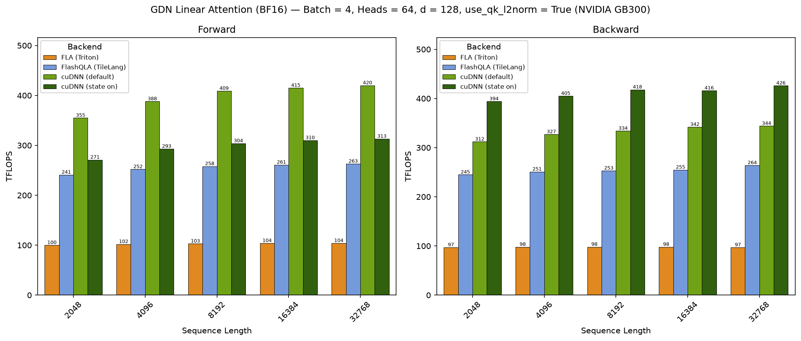
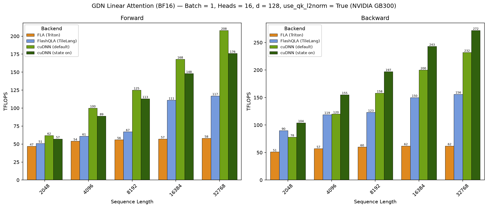
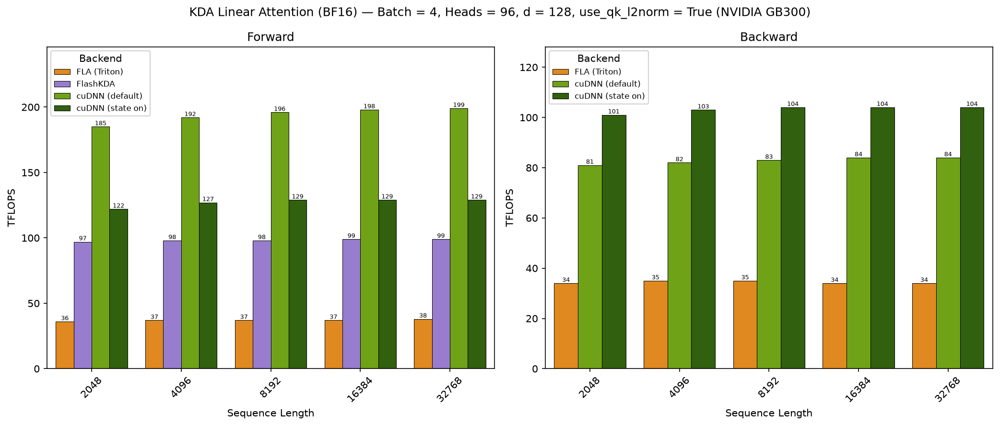
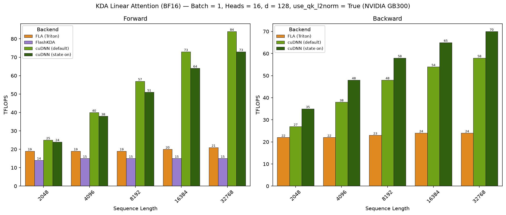
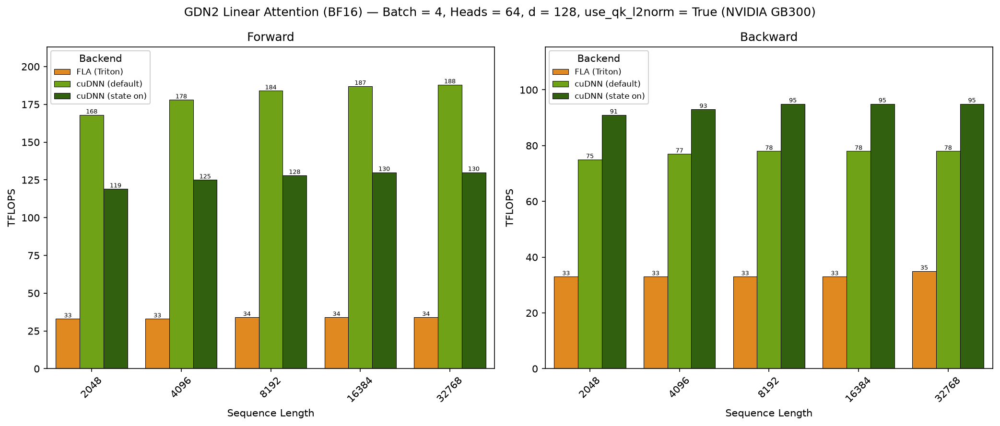
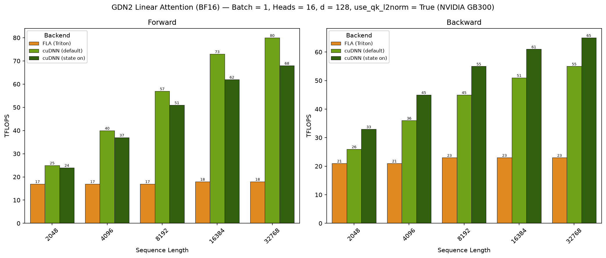
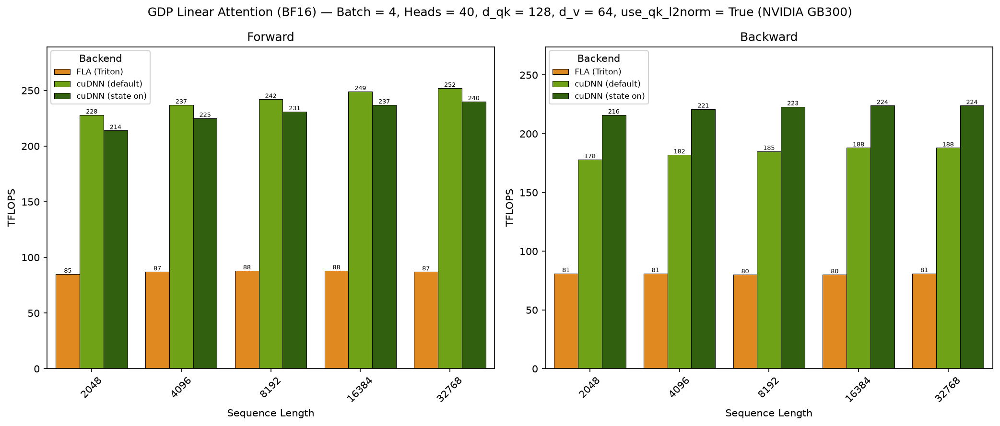
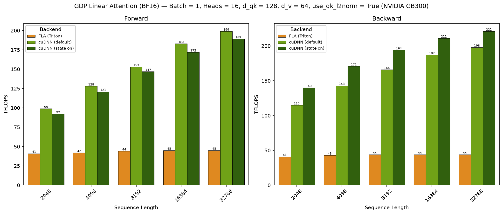

# Linear Attention Benchmark

## Introduction

This directory contains benchmarking tools for linear attention operations (GDN/KDA/GDN-2) across various backends. The benchmarks target training use cases with support for forward and backward passes.

## Contents

- `Dockerfile` - Docker container setup for running benchmarks
- `benchmark_single_linear_attention.py` - Single linear attention benchmark script
- `plot_results.py` - Renders the charts under `results/` from a sweep CSV
- `results/<variant>/<gpu>/` - Dated sweep CSVs and the charts rendered from them

## Quick Start

### 1. Build Docker Container

```bash
docker build -t cudnn_linear_attention_benchmark .

docker run -it --gpus all --rm cudnn_linear_attention_benchmark
```

### 2. Run Benchmarks

```bash
# cuDNN Frontend (BF16, GDN, forward + backward)
python benchmark_single_linear_attention.py \
    --batch_size 1 --seqlen 8192 \
    --num_q_heads 8 --num_kv_heads 64 --head_dim 128 \
    --la_backend cudnn --variant gdn --data_type bfloat16 \
    --skip_ref --fwd_bwd

# cuDNN Frontend (KDA, backward pass only)
python benchmark_single_linear_attention.py \
    --batch_size 1 --seqlen 8192 \
    --num_q_heads 16 --num_kv_heads 16 --head_dim 128 \
    --la_backend cudnn --variant kda --data_type bfloat16 \
    --skip_ref --profile_pass bwd

# cuDNN Frontend (GDN-2, forward pass)
python benchmark_single_linear_attention.py \
    --batch_size 1 --seqlen 8192 \
    --num_q_heads 16 --num_kv_heads 16 --head_dim 128 \
    --la_backend cudnn --variant gdn2 --data_type bfloat16 \
    --skip_ref --profile_pass fwd

# cuDNN Frontend (GDP, n Householder sub-tokens per token; k/v/beta carry
# seqlen * num_householder rows)
python benchmark_single_linear_attention.py \
    --batch_size 1 --seqlen 8192 \
    --num_q_heads 64 --num_kv_heads 64 --head_dim_qk 128 --head_dim_vo 64 \
    --la_backend cudnn --variant gdp --num_householder 3 --data_type bfloat16 \
    --skip_ref --fwd_bwd

# GQA (q-heads grouped over v-heads, backward pass only)
python benchmark_single_linear_attention.py \
    --batch_size 1 --seqlen 8192 \
    --num_q_heads 64 --num_kv_heads 8 --head_dim_qk 128 --head_dim_vo 128 \
    --la_backend cudnn --variant gdn --data_type bfloat16 \
    --skip_ref --profile_pass bwd

# FLA (flash-linear-attention) comparison point
python benchmark_single_linear_attention.py \
    --batch_size 1 --seqlen 8192 \
    --num_q_heads 8 --num_kv_heads 64 --head_dim 128 \
    --la_backend fla --variant gdn --data_type bfloat16 \
    --skip_ref --fwd_bwd

# FlashQLA (TileLang) comparison point (gdn variant only)
python benchmark_single_linear_attention.py \
    --batch_size 1 --seqlen 8192 \
    --num_q_heads 8 --num_kv_heads 64 --head_dim 128 \
    --la_backend flash_qla --variant gdn --data_type bfloat16 \
    --skip_ref --fwd_bwd

# FlashKDA comparison point (kda variant only, forward only, bf16)
python benchmark_single_linear_attention.py \
    --batch_size 1 --seqlen 8192 \
    --num_q_heads 32 --num_kv_heads 32 --head_dim 128 \
    --la_backend flash_kda --variant kda --data_type bfloat16 \
    --skip_ref

# Input initial state and dump state for every chunk
python benchmark_single_linear_attention.py \
    --batch_size 1 --seqlen 8192 \
    --num_q_heads 8 --num_kv_heads 64 --head_dim 128 \
    --la_backend cudnn --variant gdn --data_type bfloat16 \
    --skip_ref --fwd_bwd --initial_state --store_on
```

Run `python benchmark_single_linear_attention.py --help` for all options.

Every variant and backend applies the q/k L2 normalization; pass `--no_qk_l2norm` to opt out.

The decay gates are all ones (alpha = 1, log gate 0) for every variant and backend, so the measured schedule does not depend on the input draw; kda and gdn2 feed the raw safe-gate logit of that gate, whose in-kernel `lower_bound * sigmoid` transform reproduces alpha = 1 exactly in fp32. The write strengths (beta, and w for GDN-2) stay random.

## Supported Backends

| Backend | Description |
|---------|-------------|
| `cudnn` | cuDNN (native, via the cuDNN Frontend torch custom ops) |
| `fla`   | FLA (flash-linear-attention, Triton; `gdn`, `kda`, `gdn2`, and `gdp`) |
| `flash_qla` | FlashQLA (TileLang fused GDN kernels, `gdn` variant only) |
| `flash_kda` | FlashKDA (`kda` forward variant only) |

The cuDNN backend routes through the pygraph engines: FROST (Cutlass DSL) on SM100-SM103 and SM107, the cuTile engines elsewhere. `gdn2` and `gdp` are FROST-only.

Default head counts are per variant: `kda` 96, `gdp` 40, `gdn`/`gdn2` 16/8 (the tracked sweeps run `gdn`/`gdn2` at 64/64).

## Results

Forward and backward TFLOPS, rendered by `plot_results.py` from the dated CSVs
under `results/<variant>/<gpu>/`. Three sweeps per variant: batch 4 over the
sequence length (`<variant>_fixed_batch_*`), sequence length 8192 over the
batch (`<variant>_fixed_seq_*`), and the low-occupancy point batch 1 with 16
heads over the sequence length (`<variant>_low_bh_*`, the regime the exact
piece chain serves). The `cudnn (state on)` bars dump the per-chunk
state-checkpoint series in the forward pass and reuse it in the backward
pass. Runs were captured on GB200 and GB300 (GB300 results shown below).

### GB300 - GDN

- `batch=4; num_q_heads=64; num_kv_heads=64; head_dim=128; seqlen 2048-32768; bf16`

- `batch=1; num_q_heads=16; num_kv_heads=16; head_dim=128; seqlen 2048-32768; bf16`

### GB300 - KDA

- `batch=4; num_q_heads=96; num_kv_heads=96; head_dim=128; seqlen 2048-32768; bf16`

- `batch=1; num_q_heads=16; num_kv_heads=16; head_dim=128; seqlen 2048-32768; bf16`

### GB300 - GDN-2

- `batch=4; num_q_heads=64; num_kv_heads=64; head_dim=128; seqlen 2048-32768; bf16`

- `batch=1; num_q_heads=16; num_kv_heads=16; head_dim=128; seqlen 2048-32768; bf16`

### GB300 - GDP

- `batch=4; num_q_heads=40; num_kv_heads=40; head_dim_qk=128; head_dim_vo=64; num_householder=3; seqlen 2048-32768; bf16` (FLA is the only third-party GDP backend)

- `batch=1; num_q_heads=16; num_kv_heads=16; head_dim_qk=128; head_dim_vo=64; num_householder=3; seqlen 2048-32768; bf16`
