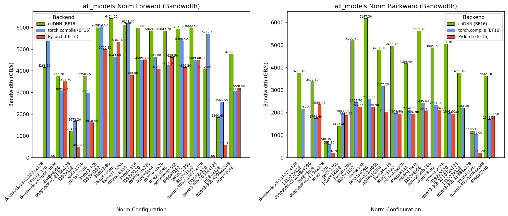
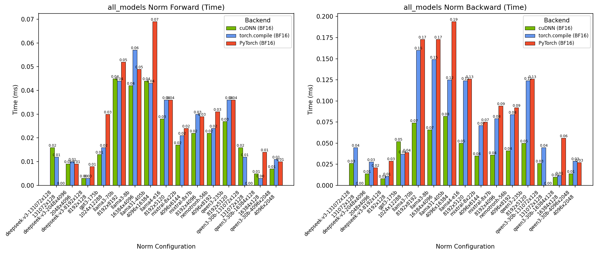
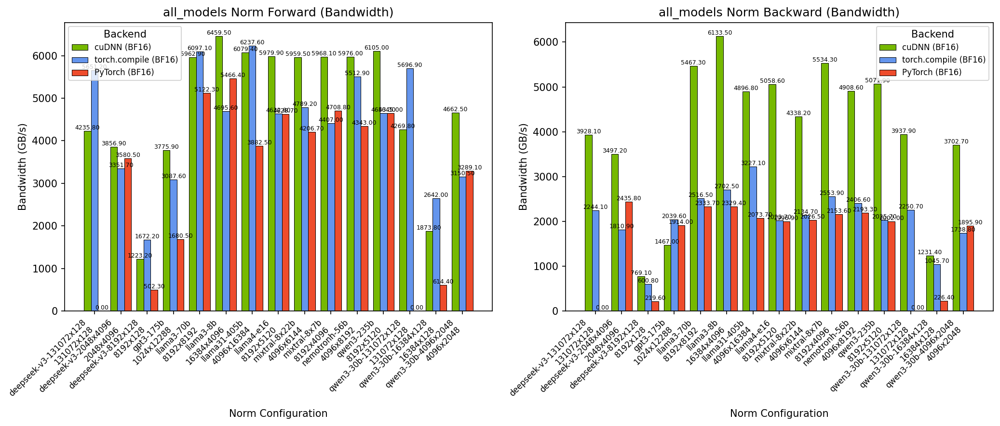
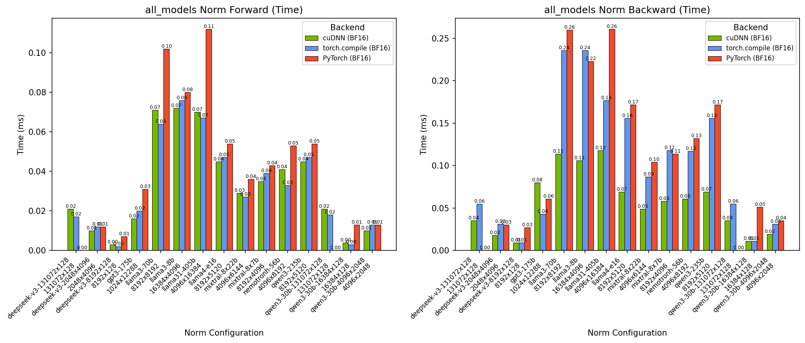
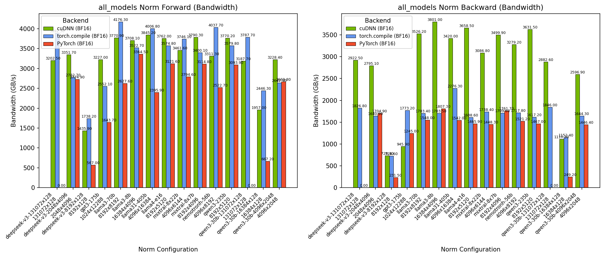

# Normalization Benchmark (RMSNorm / LayerNorm)

## Introduction

This directory contains benchmarking tools for normalization operations (RMSNorm and LayerNorm) across cuDNN, PyTorch, and torch.compile backends. The benchmark configurations are extracted from real LLM training workloads.

## Contents

- `Dockerfile` - Docker container setup for running benchmarks
- `benchmark_single_norm.py` - Single norm benchmark script
- `configs/` - Benchmark configuration files (one per model)
- `runner.py` - Configuration-based benchmark runner
- `config_types.py` - Data types for benchmark configuration
- `charts.py` - Chart generation utilities
- `../results/` - Benchmark outputs (CSV and charts)

## Quick Start

### 1. Build Docker Container

```bash
docker build -t cudnn_norm_benchmark .

docker run -it --gpus all --rm cudnn_norm_benchmark
```

### 2. Run Benchmarks

```bash
# Run Llama 3 8B norm benchmark
python -m benchmark.norms.runner --config llama3_8b

# Run all models
python -m benchmark.norms.runner --config all_models

# Dry run (show what would be executed)
python -m benchmark.norms.runner --config llama3_8b --dry-run

# Filter by backend
python -m benchmark.norms.runner --config all_models --backend cudnn

# Filter by data type
python -m benchmark.norms.runner --config all_models --dtype bfloat16

# List available configs
python -m benchmark.norms.runner --list-configs
```

## Configuration-Based Benchmarking

### Creating Custom Configurations

1. Copy the template:
   ```bash
   cp configs/llama3_8b.py configs/my_config.py
   ```

2. Edit your config:
   ```python
   from ..config_types import NormPreset, NormBenchmarkConfig

   MY_NORM = NormPreset(
       name="my_model",
       norm_type="rms_norm",  # or "layer_norm"
       N=8192,                # batch_size * seq_len
       C=4096,                # embedding dimension
       epsilon=1e-5,
       has_bias=False,
   )

   CONFIG = NormBenchmarkConfig(
       name="my_benchmark",
       norms=[MY_NORM],
       backends=["cudnn", "pytorch", "torch_compile"],
       data_types=["bfloat16"],
       profile_pass="both",  # "fwd", "bwd", or "both"
       num_iterations=20,
   )
   ```

3. Run:
   ```bash
   python -m benchmark.norms.runner --config my_config
   ```

### Configuration Options

| Parameter | Description | Default |
|-----------|-------------|---------|
| `norms` | List of `NormPreset` to benchmark | Required |
| `backends` | Backends to compare | `["cudnn", "pytorch", "torch_compile"]` |
| `data_types` | Data types to test | `["bfloat16"]` |
| `profile_pass` | Which pass to profile (`fwd`, `bwd`, `both`) | `"both"` |
| `num_iterations` | Iterations per benchmark | `20` |
| `num_warmup_iterations` | Warmup iterations | `5` |

### Available Model Configs

| Config | Model | Norm Type | N | C |
|--------|-------|-----------|---|---|
| `llama3_8b` | Llama 3 8B | RMSNorm | 16384 | 4096 |
| `llama3_70b` | Llama 3 70B | RMSNorm | 8192 | 8192 |
| `llama31_405b` | Llama 3.1 405B | RMSNorm | 4096 | 16384 |
| `llama4_e16` | Llama 4 E16 | RMSNorm | 8192 | 5120 |
| `gpt3_175b` | GPT-3 175B | LayerNorm | 1024 | 12288 |
| `mixtral_8x7b` | Mixtral 8x7B | RMSNorm | 8192 | 4096 |
| `mixtral_8x22b` | Mixtral 8x22B | RMSNorm | 4096 | 6144 |
| `nemotronh_56b` | NemotronH 56B | RMSNorm | 4096 | 8192 |
| `deepseek_v3` | DeepSeek V3 | RMSNorm | 3 sizes | 128-4096 |
| `qwen3_235b` | Qwen3 235B | RMSNorm | 8192 | 5120 |
| `qwen3_30b` | Qwen3 30B | RMSNorm | 3 sizes | 128-2048 |
| `all_models` | All above | Mixed | All | All |

### Output

The runner produces (in `benchmark/results/`):
- **CSV**: `<config>_<timestamp>.csv` with time and bandwidth metrics
- **Charts**:
  - `<config>_time.png` - Forward/backward time comparison
  - `<config>_bandwidth.png` - Forward/backward bandwidth comparison
- Charts show backends side-by-side (cuDNN, PyTorch, torch.compile)

## Single Benchmark Script

For running individual benchmarks:

```bash
# cuDNN RMSNorm
python benchmark_single_norm.py \
    --norm_type rms_norm --N 16384 --C 4096 \
    --epsilon 1e-5 --backend cudnn \
    --data_type bfloat16 --profile_pass both

# PyTorch LayerNorm
python benchmark_single_norm.py \
    --norm_type layer_norm --N 1024 --C 12288 \
    --epsilon 1e-5 --has_bias --backend pytorch \
    --data_type bfloat16 --profile_pass both

# torch.compile RMSNorm
python benchmark_single_norm.py \
    --norm_type rms_norm --N 8192 --C 8192 \
    --epsilon 1e-5 --backend torch_compile \
    --data_type bfloat16 --profile_pass both
```

Run `python benchmark_single_norm.py --help` for all options.

## Programmatic Usage

```python
from benchmark.norms import (
    NormBenchmarkRunner,
    NormBenchmarkConfig,
    NormPreset,
    load_config,
)

# Load existing config
config = load_config("llama3_8b")

# Or create programmatically
config = NormBenchmarkConfig(
    name="custom",
    norms=[NormPreset("test", "rms_norm", 8192, 4096)],
    backends=["cudnn", "pytorch"],
)

runner = NormBenchmarkRunner()
results = runner.run_config(config)
runner.save_csv(results, config)
```

## Supported Backends

| Backend | Description |
|---------|-------------|
| `cudnn` | cuDNN (native, via cuDNN Frontend) |
| `pytorch` | PyTorch eager mode (`torch.nn.functional.rms_norm` / `layer_norm`) |
| `torch_compile` | PyTorch with `torch.compile()` |

## Metrics

- **Time (ms)**: Median kernel execution time (forward and backward)
- **Bandwidth (GB/s)**: Effective memory bandwidth, computed from total bytes read/written divided by execution time

## Benchmark Results

### GB200 - All Models (Time)

- Forward and backward time comparison across all model configurations
- Backends: cuDNN, PyTorch, torch.compile
- Results obtained on NVIDIA GB200 GPU

### GB200 - All Models (Bandwidth)

- Forward and backward bandwidth comparison across all model configurations
- Backends: cuDNN, PyTorch, torch.compile
- Results obtained on NVIDIA GB200 GPU

### GB300 - All Models (Time)

- Forward and backward time comparison across all model configurations
- Backends: cuDNN, PyTorch, torch.compile
- Results obtained on NVIDIA GB300 GPU

### GB300 - All Models (Bandwidth)

- Forward and backward bandwidth comparison across all model configurations
- Backends: cuDNN, PyTorch, torch.compile
- Results obtained on NVIDIA GB300 GPU

### H200 - All Models (Time)

- Forward and backward time comparison across all model configurations
- Backends: cuDNN, PyTorch, torch.compile
- Results obtained on NVIDIA H200 GPU

### H200 - All Models (Bandwidth)

- Forward and backward bandwidth comparison across all model configurations
- Backends: cuDNN, PyTorch, torch.compile
- Results obtained on NVIDIA H200 GPU