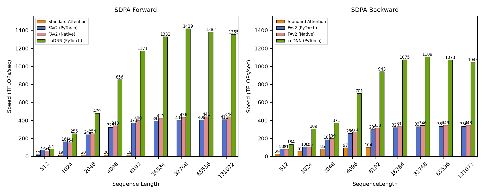
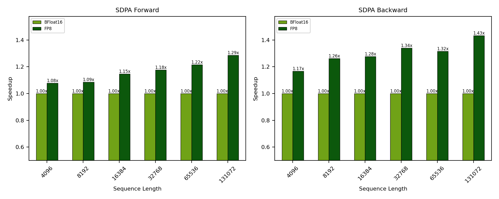

# Scaled Dot Product Attention Benchmark
## Introduction

The benchmarking script in this current directory profiles scaled dot product attention (SDPA) from various backends. Here we benchmark attention layer dimensions inspired by [Llama-3.1-405B](https://ai.meta.com/blog/meta-llama-3-1/) with sequence lengths ranging from 512 to 131,072. 

The provided benchmark targets training use cases--causal masking is enabled for grouped query attention (GQA). Layer dimensions and causal masking can be altered by modifying the preset parameters in `benchmark_{bf16,fp8}_sdpa.py`. Inference-specific attention optimizations such as paged attention are not benchmarked at this time.

## Contents

- `Dockerfile` to create a Docker container for the dependencies and run the benchmark.
- `benchmark_bf16_sdpa.py` which runs cudnn, pytorch, and other backends up to 128k sequence length.
- `benchmark_fp8_sdpa.py` which runs cudnn on fp8 along with bf16 up to 128k sequence length.
- Sample benchmark output and results on B200 in the `artifacts` directory.
- Useful Python scripts for running single attention layers: 
  - `benchmark_single_sdpa.py` for benchmarking a single flash attention instance from various backends.
  - See below for usage example.

## Software versions

This benchmark code should run on any decently modern Python environment with CUDA-enabled GPU. The results in `artifacts` were collected using the PyTorch docker image [from the NVIDIA GPU CLOUD (NGC) catalog](https://catalog.ngc.nvidia.com/orgs/nvidia/containers/pytorch), `nvcr.io/nvidia/pytorch:25.06-py3`, where cuDNN 9.10.2 was used. We provide a `Dockerfile` to reproduce the environment with the following library versions


| Software       | Version |
|----------------|---------|
| Python         | 3.12.9  |
| CUDA           | 12.9.0  |
| cuDNN          | 9.10.2  |
| PyTorch        | 2.8.0   |
| FlashAttention | 2.7.4   |


## Steps to run
### 0. *Optional*: Lock Clocks
Although the benchmarking code inserts dynamically-sized delays to avoid GPU throttling, most reproducible results can be obtained when clocks are locked. For example, use `nvidia-smi -q -d SUPPORTED_CLOCKS` to get the supported clocks

```
sudo nvidia-smi -pm 1
nvidia-smi -lgc <min_clock>,<max_clock>
```

### 1. Build docker container
Launch the docker build and run. We prodivde a simple `Dockerfile` to help run the benchmark
```
docker build -t cudnn_attention_benchmark .
docker run -it --gpus all --rm -v $(pwd):/workspace cudnn_attention_benchmark
```

### 2. Run Benchmark script
The `benchmark_{bf16,fp8}_sdpa.py` scripts execute a predefined set of attention layers of various sequence lengths, where the transformer dimensions are inspired by [Llama-3.1-405B](https://ai.meta.com/blog/meta-llama-3-1/) (`num_q_heads=128; num_kv_heads=8; head_dim=128; is_causal=True; dtype=bfloat16`)

The following scaled dot product attention backends are benchmarked:
- [PyTorch's SDPA backends](https://docs.pytorch.org/docs/stable/generated/torch.nn.functional.scaled_dot_product_attention.html):
    - cuDNN (`CUDNN_ATTENTION`)
    - Standard Attention (`MATH`)
    - FlashAttention-2 (`FLASH_ATTENTION`; PyTorch FAv2 )
- [FlashAttention-2](https://github.com/Dao-AILab/flash-attention)'s original implementation (native FAv2)

Please note that FlashAttention-3 is currently not supported on NVIDIA's Blackwell generation GPUs.

Sample outputs:
```
$ python3 benchmark_bf16_sdpa.py
[INFO] torch.__version__ = '2.8.0a0+5228986c39.nv25.06'
[INFO] torch.version.cuda = '12.9'
[INFO] torch.cuda.is_available() = True
[INFO] torch.cuda.device_count() = 1
[INFO] torch.cuda.current_device() = 0
[INFO] torch.cuda.get_device_name(torch.cuda.current_device()) = 'NVIDIA B200'
[INFO] torch.backends.cudnn.version() = 91002
[INFO] torch.backends.cudnn.enabled = True
[INFO] flash_attn.__version__ = '2.7.4.post1'
[INFO] Begin benchmark for layers (batch_size,q_seqlen,kv_seqlen,num_q_heads,num_kv_heads,head_dim)
[INFO] sdpa_configs = [(1, 512, 512, 128, 8, 128), (1, 1024, 1024, 128, 8, 128), (1, 2048, 2048, 128, 8, 128), (1, 4096, 4096, 128, 8, 128), (1, 8192, 8192, 128, 8, 128), (1, 16384, 16384, 128, 8, 128), (1, 32768, 32768, 128, 8, 128), (1, 65536, 65536, 128, 8, 128), (1, 131072, 131072, 128, 8, 128)]
[INFO] Running layer (1, 512, 512, 128, 8, 128)
...
[INFO] Saving results to ./artifacts/sdpa_bf16_benchmark_results_NVIDIA_B200.csv
[INFO] Saving plot to ./artifacts/sdpa_bf16_benchmark_results_NVIDIA_B200.png
```

```
$ python3 benchmark_sdpa_fp8.py
[INFO] cuDNN Backend Version: cudnn.backend_version() = 91002
[INFO] cuDNN Frontend Version: cudnn.__version__ = '1.12.0'
[INFO] torch.__version__ = '2.8.0a0+5228986c39.nv25.06'
[INFO] torch.version.cuda = '12.9'
[INFO] torch.cuda.is_available() = True
[INFO] torch.cuda.device_count() = 1
[INFO] torch.cuda.current_device() = 0
[INFO] torch.cuda.get_device_name(torch.cuda.current_device()) = 'NVIDIA B200'
[INFO] Begin benchmark for layers (batch_size,q_seqlen,kv_seqlen,num_q_heads,num_kv_heads,head_dim)
[INFO] sdpa_configs = [(1, 512, 512, 128, 8, 128), (1, 1024, 1024, 128, 8, 128), (1, 2048, 2048, 128, 8, 128), (1, 4096, 4096, 128, 8, 128), (1, 8192, 8192, 128, 8, 128), (1, 16384, 16384, 128, 8, 128), (1, 32768, 32768, 128, 8, 128), (1, 65536, 65536, 128, 8, 128), (1, 131072, 131072, 128, 8, 128)]
[INFO] Running layer (1, 512, 512, 128, 8, 128)
[INFO]   Benchmarking data type fp8
[INFO]   Benchmarking data type bf16
...
[INFO] Saving results to ./artifacts/sdpa_fp8_benchmark_results_NVIDIA_B200.csv
[INFO] Saving plot to ./artifacts/sdpa_fp8_benchmark_results_NVIDIA_B200.png
```

Benchmarked performance numbers are stored in the [artifacts](artifacts) directory as csv and png files.

## Results
Below are the result of the benchmark running on a single B200 GPU.

For both runs, the following software versions are used:

- CUDA: 12.9 (from NGC container)
- PyTorch: 2.8.0 (from NGC container)
- cuDNN: 9.10.2 (Installed via `apt-get`; see `Dockerfile`)


### B200 - BF16 Performance Comparison between Backends

- SDPA parameters were used `batch=1; num_q_heads=128; num_kv_heads=8; head_dim=128; is_causal=True; dtype=bfloat16`. 
- Sequence lengths are shown in the x-axis. 
- Results were obtained on an NVIDIA B200 GPU with free clock.

### B200 - cuDNN's FP8 Performance Relative to BF16

- SDPA parameters were used `batch=1; num_q_heads=128; num_kv_heads=8; head_dim=128; is_causal=True; dtype=bfloat16`. 
- Sequence lengths are shown in the x-axis. 
- Results were obtained on an NVIDIA B200 GPU with free clock.

## Pytorch adoption
As demonstrated can be seen from the results, cuDNN v9 can achieve over 2x the performance of the comparable PyTorch eager implementation. Refer to [PyTorch's scaled_dot_product_attention()](https://docs.pytorch.org/docs/stable/generated/torch.nn.functional.scaled_dot_product_attention.html) and [sdpa_kernel](https://docs.pytorch.org/docs/stable/generated/torch.nn.attention.sdpa_kernel.html#torch.nn.attention.sdpa_kernel) context manager documentations for enabling the cuDNN backend for scaled dot product attention.

## `benchmark_single_sdpa.py`
`benchmark_single_sdpa.py` is provided to conveniently run a single SDPA operation. Try running `python benchmark_single_sdpa.py --help` to see available flags.

Example commands and outputs:
```
## For running various PyTorch backends (FlashAttention, cuDNN, ...) or FlashAttention-2:
$ python benchmark_single_sdpa.py --batch_size 1 --q_seqlen 32768 --kv_seqlen 32768 --num_q_heads 128 --num_kv_heads 8 --head_dim 128 --is_causal --data_type bfloat16 --num_iterations 10 --sdpa_backend pyt_cudnn --data_type bfloat16 --fwd_bwd
pyt_cudnn:: Median (fwd, bwd) Execution Times: 24.645 ms (1428 TFLOPS), 78.674 ms (1118 TFLOPS) (max difference vs. pyt_reference: 0.000000 from 10 iterations)

## For directly running cuDNN via cuDNN Frontend
$ python benchmark_single_sdpa.py --batch_size 1 --q_seqlen 32768 --kv_seqlen 32768 --num_q_heads 128 --num_kv_heads 8 --head_dim 128 --is_causal --data_type bfloat16 --num_iterations 10 --sdpa_backend cudnn_fe --data_type bfloat16 --fwd_bwd
cudnn_fe:: Median (fwd, bwd) Execution Times: 24.543 ms (1434 TFLOPS), 73.210 ms (1201 TFLOPS) (max difference vs. pyt_reference: 0.000000 from 10 iterations)

## For running cuDNN FP8
$ python benchmark_single_sdpa.py --batch_size 1 --q_seqlen 32768 --kv_seqlen 32768 --num_q_heads 128 --num_kv_heads 8 --head_dim 128 --is_causal --data_type bfloat16 --num_iterations 10 --sdpa_backend cudnn_fe --data_type fp8 --fwd_bwd
cudnn_fe:: Median (fwd, bwd) Execution Times: 21.334 ms (1649 TFLOPS), 56.373 ms (1560 TFLOPS) (max difference vs. pyt_reference: 0.000000 from 10 iterations)
```

The cuDNN version used in the benchmark can be replaced by setting the `LD_LIBRARY_PATH` environment variable.
```
$ export LD_LIBRARY_PATH=<my_path_to_cuDNN_9.10.2>
$ python benchmark_single_sdpa.py --batch_size 1 --q_seqlen 16384 --kv_seqlen 16384 --num_q_heads 128 --num_kv_heads 8 --head_dim 128 --is_causal --data_type bfloat16 --num_iterations 10 --sdpa_backend cudnn_fe --fwd_bwd --data_type fp8 --verbose
[INFO] cuDNN Backend Version: cudnn.backend_version() = 91002
[INFO] cuDNN Frontend Version: cudnn.__version__ = '1.12.0'
[INFO] torch.__version__ = '2.8.0a0+5228986c39.nv25.06'
[INFO] torch.version.cuda = '12.9'
[INFO] torch.cuda.is_available() = True
[INFO] torch.cuda.device_count() = 1
[INFO] torch.cuda.current_device() = 0
[INFO] torch.cuda.get_device_name(torch.cuda.current_device()) = 'NVIDIA B200'
cudnn_fe:: Median (fwd, bwd) Execution Times: 5.634 ms (1561 TFLOPS), 15.282 ms (1439 TFLOPS) (max difference vs. pyt_reference: 0.000000 from 10 iterations)
```