# Scaled Dot Product Attention Benchmark

## Introduction

This directory contains benchmarking tools for Scaled Dot Product Attention (SDPA) operations across various backends. The benchmarks target training use cases with support for causal masking and grouped query attention (GQA).

## Contents

- `Dockerfile` - Docker container setup for running benchmarks
- `benchmark_single_sdpa.py` - Single SDPA benchmark script
- `configs/` - Benchmark configuration files
  - `llama.py` - Llama 3.1 GQA benchmarks (causal + non-causal)
  - `dsv3.py` - DeepSeek V3 MHA benchmarks (causal only)
- `runner.py` - Configuration-based benchmark runner
- `config_types.py` - Data types for benchmark configuration
- `charts.py` - Chart generation utilities
- `../results/` - Benchmark outputs (CSV and charts)

## Quick Start

### 1. Build Docker Container

```bash
docker build -t cudnn_attention_benchmark .

docker run -it --gpus all --rm cudnn_attention_benchmark
```

### 2. Run Benchmarks

```bash
# Run Llama 3.1 benchmark suite
python -m benchmark.sdpa_benchmark_training.runner --config llama

# Run DeepSeek V3 benchmark suite
python -m benchmark.sdpa_benchmark_training.runner --config dsv3

# Run GPT-OSS benchmark suite
python -m benchmark.sdpa_benchmark_training.runner --config gpt_oss

# Dry run (show what would be executed)
python -m benchmark.sdpa_benchmark_training.runner --config llama --dry-run

# Filter by backend
python -m benchmark.sdpa_benchmark_training.runner --config llama --backend cudnn

# Filter by data type
python -m benchmark.sdpa_benchmark_training.runner --config llama --dtype bfloat16
```

## Configuration-Based Benchmarking

### Creating Custom Configurations

1. Copy the template:
   ```bash
   cp configs/llama.py configs/my_config.py
   ```

2. Edit your config:
   ```python
   from ..config_types import ModelPreset, BenchmarkConfig

   MY_MODEL = ModelPreset(
       name="my_model",
       num_q_heads=32,
       num_kv_heads=8,
       head_dim=128,
   )

   CONFIG = BenchmarkConfig(
       name="my_benchmark",
       models=[MY_MODEL],
       seqlens=[(4096, 4096), (8192, 8192)],
       backends=["cudnn", "flash_attention_4"],
       data_types=["bfloat16", "fp8"],
       attn_masks=["top_left", "no_mask"],
       profile_pass="fwd",  # "fwd", "bwd", or "both"
       num_iterations=10,
   )
   ```

3. Run:
   ```bash
   python -m benchmark.sdpa_benchmark_training.runner --config my_config
   ```

### Configuration Options

| Parameter | Description | Default |
|-----------|-------------|---------|
| `models` | List of `ModelPreset` to benchmark | Required |
| `seqlens` | List of `(q_seqlen, kv_seqlen)` tuples | Required |
| `backends` | Backends to compare | `["cudnn"]` |
| `data_types` | Data types to test | `["bfloat16"]` |
| `attn_masks` | Attention masks (`top_left`, `no_mask`) | `["top_left"]` |
| `profile_pass` | Which pass to profile (`fwd`, `bwd`, `both`) | `"fwd"` |
| `batch_size` | Batch size | `1` |
| `num_iterations` | Iterations per benchmark | `10` |
| `deterministic_bwd` | Deterministic modes for backward | `[False]` |
| `sliding_window_size` | Sliding window attention size (requires `top_left` mask) | `None` |

### Model Presets

Standard model:
```python
LLAMA3_1 = ModelPreset(
    name="llama3.1",
    num_q_heads=64,
    num_kv_heads=8,
    head_dim=128,
)
```

Asymmetric head dimensions (DeepSeek V3):
```python
DSV3 = ModelPreset(
    name="dsv3",
    num_q_heads=128,
    num_kv_heads=128,
    head_dim_qk=192,  # Q/K head dimension
    head_dim_vo=128,  # V/O head dimension
)
```

Sliding window attention (GPT-OSS):
```python
GPT_OSS = ModelPreset(
    name="gpt_oss",
    num_q_heads=64,
    num_kv_heads=8,  # GQA with 8:1 ratio
    head_dim=64,
)

CONFIG = BenchmarkConfig(
    ...
    sliding_window_size=128,  # Look back 128 tokens from diagonal (requires top_left mask)
)
```

### Output

The runner produces (in `benchmark/results/`):
- **CSV**: `<config>_<timestamp>.csv`
- **Charts**: Separate chart per mask type:
  - `<config>_top_left.png` (causal)
  - `<config>_no_mask.png` (non-causal)
- Charts show backends side-by-side with distinct colors for BF16 vs FP8

## Single Benchmark Script

For running individual benchmarks:

```bash
# cuDNN Frontend (BF16)
python benchmark_single_sdpa.py \
    --batch_size 1 --q_seqlen 8192 --kv_seqlen 8192 \
    --num_q_heads 64 --num_kv_heads 8 --head_dim 128 \
    --sdpa_backend cudnn --data_type bfloat16 \
    --attn_mask top_left --fwd_bwd

# cuDNN Frontend (FP8)
python benchmark_single_sdpa.py \
    --batch_size 1 --q_seqlen 8192 --kv_seqlen 8192 \
    --num_q_heads 64 --num_kv_heads 8 --head_dim 128 \
    --sdpa_backend cudnn --data_type fp8 \
    --attn_mask top_left --fwd_bwd

# FlashAttention 4
python benchmark_single_sdpa.py \
    --batch_size 1 --q_seqlen 8192 --kv_seqlen 8192 \
    --num_q_heads 64 --num_kv_heads 8 --head_dim 128 \
    --sdpa_backend flash_attention_4 --data_type bfloat16 \
    --attn_mask top_left --fwd_bwd
```

Run `python benchmark_single_sdpa.py --help` for all options.

## Comparing With `test_repro --perf`

The benchmark script above is useful for standalone SDPA timing. To compare those numbers against the Python SDPA test harness, use `pytest ...::test_repro --perf`.

`--perf` enables timing-only execution for `test_repro`. In this mode, the test prints the median `graph.execute` time and skips the reference path so the measurement matches the benchmark workflow more closely.

### Timing Methods

- `--timing_method cupti`: Uses `torch.profiler` device time. This is the default and is the closest match to `benchmark_single_sdpa.py`.
- `--timing_method events`: Uses CUDA events for comparison.

### Example: Causal Training Case

```bash
# benchmark (CUPTI-style timing)
python benchmark/sdpa_benchmark_training/benchmark_single_sdpa.py \
    --batch_size 1 --q_seqlen 8192 --kv_seqlen 8192 \
    --num_q_heads 64 --num_kv_heads 8 --head_dim 128 \
    --sdpa_backend cudnn --data_type bfloat16 \
    --attn_mask top_left --skip_ref --fwd_bwd

# test_repro --perf (CUPTI by default)
pytest -vv -s test/python/test_mhas_v2.py::test_repro --perf --repro "{
    'data_type': 'torch.bfloat16',
    'is_infer': False,
    'is_padding': False, 'is_alibi': None, 'is_bias': None, 'is_dropout': None,
    'with_sink_token': False, 'with_score_max': False, 'with_score_sum_exp': False,
    'batches': 1, 'd_qk': 128, 'd_v': 128,
    's_q': 8192, 's_kv': 8192,
    'h_q': 64, 'h_k': 8, 'h_v': 8,
    'shape_q': (1, 64, 8192, 128), 'stride_q': (67108864, 128, 8192, 1),
    'shape_k': (1, 8, 8192, 128),  'stride_k': (8388608, 128, 1024, 1),
    'shape_v': (1, 8, 8192, 128),  'stride_v': (8388608, 128, 1024, 1),
    'shape_o': (1, 64, 8192, 128), 'stride_o': (67108864, 128, 8192, 1),
    'diag_align': 'cudnn.diagonal_alignment.TOP_LEFT',
    'right_bound': 0,
    'rng_data_seed': 42, 'rng_geom_seed': 42,
}"

# test_repro --perf with CUDA events instead of CUPTI
pytest -vv -s test/python/test_mhas_v2.py::test_repro --perf --timing_method events --repro "{
    'data_type': 'torch.bfloat16',
    'is_infer': False,
    'is_padding': False, 'is_alibi': None, 'is_bias': None, 'is_dropout': None,
    'with_sink_token': False, 'with_score_max': False, 'with_score_sum_exp': False,
    'batches': 1, 'd_qk': 128, 'd_v': 128,
    's_q': 8192, 's_kv': 8192,
    'h_q': 64, 'h_k': 8, 'h_v': 8,
    'shape_q': (1, 64, 8192, 128), 'stride_q': (67108864, 128, 8192, 1),
    'shape_k': (1, 8, 8192, 128),  'stride_k': (8388608, 128, 1024, 1),
    'shape_v': (1, 8, 8192, 128),  'stride_v': (8388608, 128, 1024, 1),
    'shape_o': (1, 64, 8192, 128), 'stride_o': (67108864, 128, 8192, 1),
    'diag_align': 'cudnn.diagonal_alignment.TOP_LEFT',
    'right_bound': 0,
    'rng_data_seed': 42, 'rng_geom_seed': 42,
}"
```

## Programmatic Usage

```python
from benchmark.sdpa_benchmark_training import (
    BenchmarkRunner,
    BenchmarkConfig,
    ModelPreset,
    load_config,
)

# Load existing config
config = load_config("llama")

# Or create programmatically
config = BenchmarkConfig(
    name="custom",
    models=[ModelPreset("test", 64, 8, 128)],
    seqlens=[(4096, 4096)],
    backends=["cudnn"],
)

runner = BenchmarkRunner()
results = runner.run_config(config)
runner.save_csv(results, config)
```

## Supported Backends

| Backend | Description |
|---------|-------------|
| `cudnn` | cuDNN (native, via cuDNN Frontend) |
| `flash_attention_4` | FlashAttention 4 |
| `flash_attention_3` | FlashAttention 3 |
| `pyt_flash_attention` | PyTorch FlashAttention |
| `pyt_cudnn` | PyTorch cuDNN backend |
| `pyt_efficient_attention` | PyTorch xFormers |

## Benchmark Results

### GB200 - Llama 3.1 Causal (top_left)
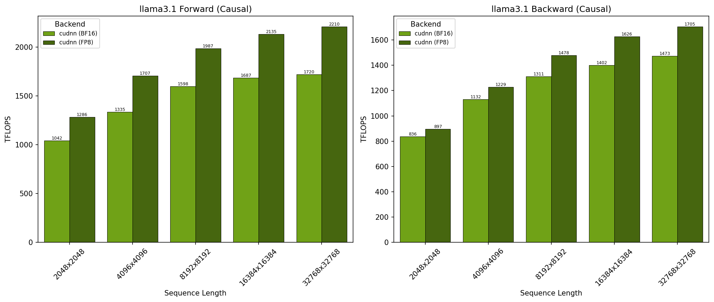
- SDPA parameters: `batch=1; num_q_heads=64; num_kv_heads=8; head_dim=128; is_causal=True`
- Sequence lengths shown on x-axis
- Results obtained on NVIDIA GB200 GPU

### GB200 - Llama 3.1 Non-Causal (no_mask)
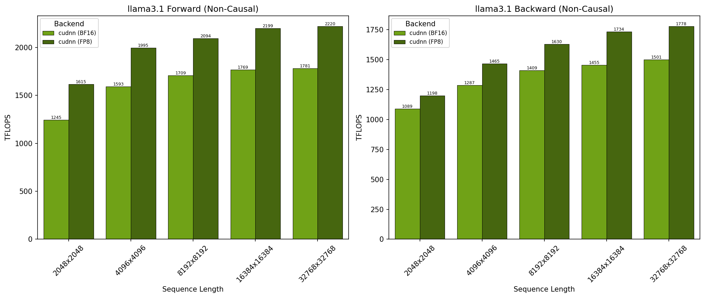
- SDPA parameters: `batch=1; num_q_heads=64; num_kv_heads=8; head_dim=128; is_causal=False`
- Sequence lengths shown on x-axis
- Results obtained on NVIDIA GB200 GPU

### GB200 - DeepSeek V3 Causal (top_left)
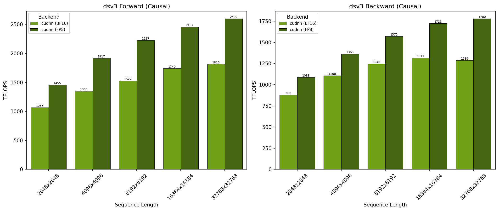
- SDPA parameters: `batch=1; num_q_heads=128; num_kv_heads=128; head_dim_qk=192; head_dim_vo=128; is_causal=True`
- Sequence lengths shown on x-axis
- Results obtained on NVIDIA GB200 GPU

### GB200 - GPT-OSS Causal (top_left)
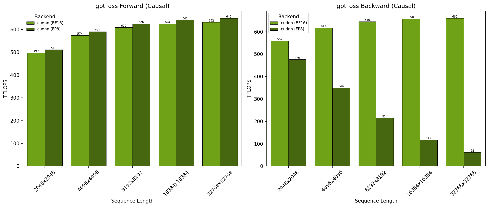
- SDPA parameters: `batch=1; num_q_heads=64; num_kv_heads=8; head_dim=64; is_causal=True`
- Sequence lengths shown on x-axis
- Results obtained on NVIDIA GB200 GPU

### GB300 - Llama 3.1 Causal (top_left)
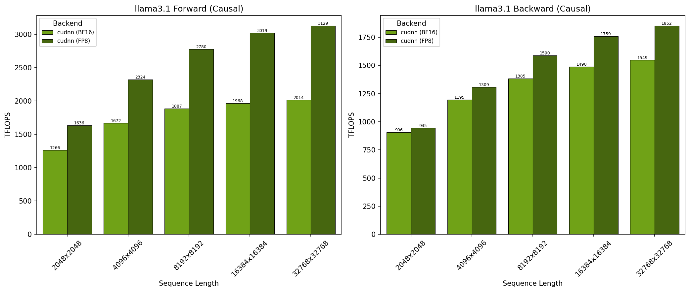
- SDPA parameters: `batch=1; num_q_heads=64; num_kv_heads=8; head_dim=128; is_causal=True`
- Sequence lengths shown on x-axis
- Results obtained on NVIDIA GB300 GPU

### GB300 - Llama 3.1 Non-Causal (no_mask)
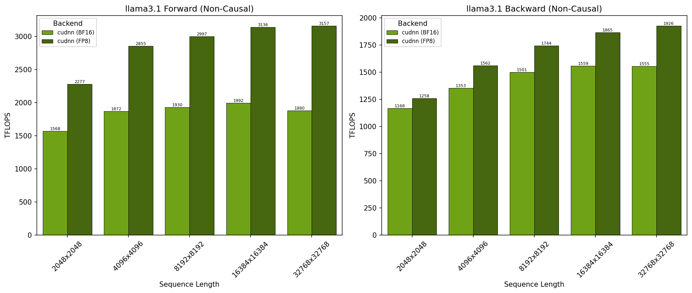
- SDPA parameters: `batch=1; num_q_heads=64; num_kv_heads=8; head_dim=128; is_causal=False`
- Sequence lengths shown on x-axis
- Results obtained on NVIDIA GB300 GPU

### GB300 - DeepSeek V3 Causal (top_left)
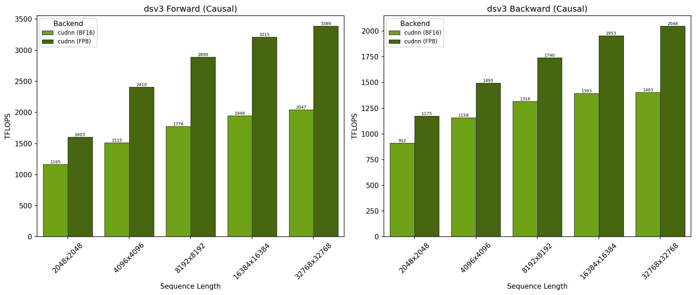
- SDPA parameters: `batch=1; num_q_heads=128; num_kv_heads=128; head_dim_qk=192; head_dim_vo=128; is_causal=True`
- Sequence lengths shown on x-axis
- Results obtained on NVIDIA GB300 GPU

### GB300 - GPT-OSS Causal (top_left)
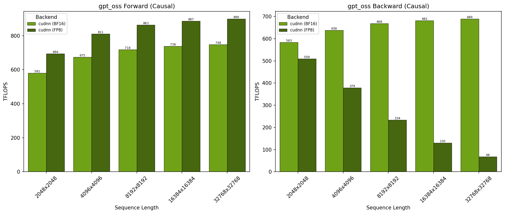
- SDPA parameters: `batch=1; num_q_heads=64; num_kv_heads=8; head_dim=64; is_causal=True`
- Sequence lengths shown on x-axis
- Results obtained on NVIDIA GB300 GPU

### H200 - Llama 3.1 Causal (top_left)
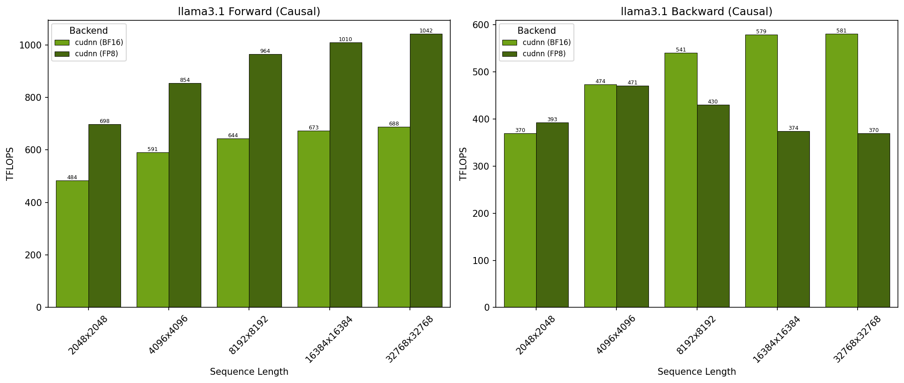
- SDPA parameters: `batch=1; num_q_heads=64; num_kv_heads=8; head_dim=128; is_causal=True`
- Sequence lengths shown on x-axis
- Results obtained on NVIDIA H200 GPU

### H200 - Llama 3.1 Non-Causal (no_mask)
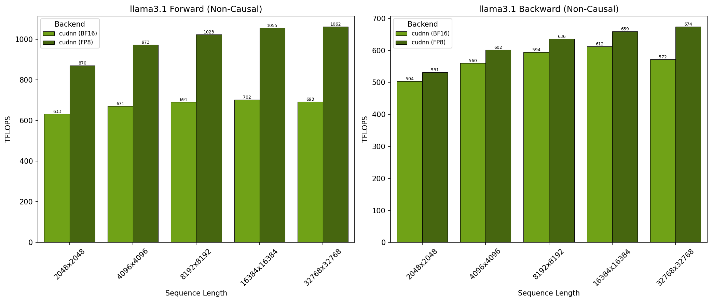
- SDPA parameters: `batch=1; num_q_heads=64; num_kv_heads=8; head_dim=128; is_causal=False`
- Sequence lengths shown on x-axis
- Results obtained on NVIDIA H200 GPU

### H200 - DeepSeek V3 Causal (top_left)
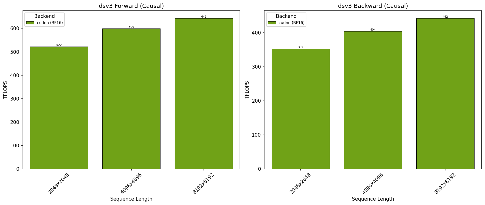
- SDPA parameters: `batch=1; num_q_heads=128; num_kv_heads=128; head_dim_qk=192; head_dim_vo=128; is_causal=True`
- Sequence lengths shown on x-axis
- Results obtained on NVIDIA H200 GPU

### H200 - GPT-OSS Causal (top_left)
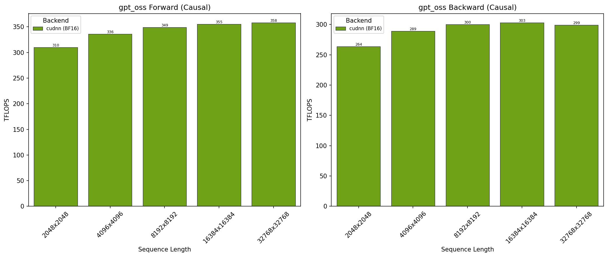
- SDPA parameters: `batch=1; num_q_heads=64; num_kv_heads=8; head_dim=64; is_causal=True`
- Sequence lengths shown on x-axis
- Results obtained on NVIDIA H200 GPU
