The cuDNN library provides a declarative programming model for describing computation as a graph of operations. This *graph API* was introduced in cuDNN 8.0 to provide a more flexible API, especially with the growing importance of operation fusion.

The user starts by building a graph of operations. At a high level, the user is describing a dataflow graph of operations on tensors, which typically represents a partition of the user’s full network graph, which they would like to offload to a GPU kernel (or small set of kernels). Given a *finalized graph*, the user then selects and configures an engine that can execute that graph. There are several methods for selecting and configuring engines, which have tradeoffs with respect to ease-of-use, runtime overhead, and engine performance.

## Key Concepts

As mentioned previously, the key concepts in the graph API are:

- [Operations and Operation Graphs](/developer/graph-api#operations-and-operation-graphs)
- [Engines and Engine Configurations](/developer/graph-api#engines-and-engine-configurations)
- [Heuristics](/developer/graph-api#heuristics)

These concepts are covered in the subsections below. Later we'll go through an example to tie them all together.

### Operations and Operation Graphs

An operation graph is a dataflow graph of operations on tensors. It is meant to be a mathematical specification and is decoupled from the underlying *engines* that can implement it, as there may be more than one engine available for a given graph.

I/O tensors connect the operations implicitly, for example, an operation A may produce a tensor X, which is then consumed by operation B, implying that operation B depends on operation A.

### Engines and Engine Configurations

For a given operation graph, there are some number of engines that are candidates for implementing that graph. The typical way to query for a list of candidate engines is through a heuristics query, covered below.

An engine has knobs for configuring the engine.

### Other Runtime Concepts

### Heuristics

A *heuristic* is a way to get a list of engine configurations that are intended to be sorted from the most performant to least performant for the given operation graph. There are three modes:

- Heuristics Mode A - intended to be fast and be able to handle most operation graph patterns. It returns a list of engine configs ranked by the expected performance.
- Heuristics Mode B - intended to be more generally accurate than mode A, but with the tradeoff of higher CPU latency to return the list of engine configs. The underlying implementation may fall back to the mode A heuristic in cases where we know mode A can do better.
- Fallback Heuristics Mode - intended to be fast and provide functional fallbacks without expectation of optimal performance.

The recommended workflow is to query either mode A or B and check for support. The first engine config with support is expected to have the best performance.

You can "auto-tune", that is, iterate over the list and time for each engine config and choose the best one for a particular problem on a particular device. Both the C++ and Python APIs have utility functions for doing this.

If all the engine configs are not supported, then use the mode fallback to find the functional fallbacks.

Expert users may also want to filter engine configs based on properties of the engine, such as numerical notes, behavior notes, or adjustable knobs. Numerical notes inform the user about the numerical properties of the engine such as whether it does datatype down conversion at the input or during output reduction. The behavior notes can signal something about the underlying implementation like whether or not it uses runtime compilation. The adjustable knobs allow fine grained control of the engine's behavior and performance.

## Supported Graph Patterns

The cuDNN Graph API supports a set of graph patterns. These patterns are supported by a large number of engines, each with their own support surfaces. These engines are grouped into four different classes, as reflected by the following four subsections: pre-compiled single operation engines, generic runtime fusion engines, specialized runtime fusion engines, and specialized pre-compiled fusion engines. The specialized engines, whether they use runtime compilation or pre-compilation, are targeted to a set of important use cases, and thus have a fairly limited set of patterns they currently support. Over time, we expect to support more of those use cases with the generic runtime fusion engines, whenever practical.

Since these engines have some overlap in the patterns they support, a given pattern may result in zero, one, or more engines.

### Pre-Compiled Single Operation Engines

One basic class of engines includes pre-compiled engines that support an operation graph with just one operation; specifically: `ConvolutionFwd`, `ConvolutionBwdFilter`, `ConvolutionBwdData`, or `ConvolutionBwBias`.

#### ConvolutionBwdData

`ConvolutionBwdData` computes the convolution data gradient of the tensor `dy`. In addition, it uses scaling factors ɑ and ꞵ to blend this result with the previous output. This graph operation is similar to [cudnnConvolutionBackwardData()](https://docs.nvidia.com/deeplearning/cudnn/backend/latest/api/cudnn-cnn-library.html#cudnnConvolutionBackwardData).

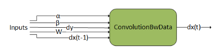

#### ConvolutionBwdFilter

`ConvolutionBwdFilter` computes the convolution filter gradient of the tensor `dy`. In addition, it uses scaling factors ɑ and ꞵ to blend this result with the previous output. This graph operation is similar to [cudnnConvolutionBackwardFilter()](https://docs.nvidia.com/deeplearning/cudnn/backend/latest/api/cudnn-cnn-library.html#cudnnConvolutionBackwardFilter).

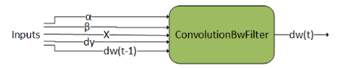

#### ConvolutionFwd

`ConvolutionFwd` computes the convolution of X with filter data W. In addition, it uses scaling factors ɑ and ꞵ to blend this result with the previous output. This graph operation is similar to [cudnnConvolutionForward()](https://docs.nvidia.com/deeplearning/cudnn/backend/latest/api/cudnn-cnn-library.html#cudnnConvolutionForward).

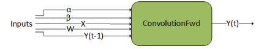

### Generic Runtime Fusion Engines

The engines documented in the previous section support single-op patterns. Of course, for fusion to be interesting, the graph needs to support multiple operations. And ideally, we want the supported patterns to be flexible to cover a diverse set of use cases. To accomplish this generality, cuDNN has runtime fusion engines that generate the kernel (or kernels) at runtime based on the graph pattern. This section outlines the patterns supported by these runtime fusion engines (that is, engines with `CUDNN_BEHAVIOR_NOTE_RUNTIME_COMPILATION` behavioral note).

We can think of the support surface as covering the following generic patterns:

1. `Matmul` fusions: $g_{2}\left( C=Matmul\left( A=g_{1A} \left( inputs \right), B=g_{1B} \right(inputs)), inputs \right)$
2. `ConvolutionFwd` fusions: $g_{2}\left( Y=ConvolutionFwd\left( X=g_{1} \left( inputs \right), W\right), inputs \right)$
3. `ConvolutionBwdFilter` fusions: $g_{2}\left( dw=ConvolutionBwdFiler\left( dy, X=g_{1} \right(inputs)), inputs \right)$
4. `ConvolutionBwdData` fusions: $g_{2}\left( dx=ConvolutionBwdData\left( dy=g_{1} \left( inputs \right), W \right), inputs \right)$
5. `Pointwise` fusions: $g_{2}\left( inputs \right)$

<Note>
- g1 (including g1A and g1B) indicates fusion operations applied to the inputs of the `matmul` and `convolution` operation.
- g2 indicates fusion operations apply to the output of the `matmul` and `convolution` operation.
- g2 can have more than one output.
- The fusion patterns in g1 will be referred to as the mainloop fusion, and the fusion patterns in g2 will be referred to as the epilogue fusion.
- The arrow going into g2 can go into any of g2 nodes and does not necessarily need to feed into a root node.
- The abbreviated notations for operations are used in the diagrams and throughout the text for visualization purposes.
</Note>

#### Support Surface

The generic runtime fusion engine includes three independent support surfaces indexed as 90, 80, and 70. A cuDNN graph that fulfills the requirements of at least one support surface will be able to be executed by the generic runtime fusion engine. The following table lists a summary of the features in each support surface. For best performance, we recommend targeting the highest indexed support surface possible and fall back to lower indexed support surfaces if needed.

| Feature | Support Surface 90 | Support Surface 80 | Support Surface 70 |
| --- | --- | --- | --- |
| Compute Capability | >= 9.0 | >= 8.0 | >= 7.0 |
| `Matmul` Fusions | Supported | Supported | Supported |
| `ConvolutionFwd` Fusions | Supported | Supported | Supported |
| `ConvolutionBwdFilter` Fusions | Supported | Not Supported | Supported |
| `ConvolutionBwdData` Fusions | Partially Supported | Not Supported | Supported |
| `Pointwise` and `Reduction` Fusions | Not Supported | Not Supported | Supported |
| FP8 `Matmul` and `Convolution` Operations | Supported | Supported for Compute Capability >= 8.9 | Not Supported |
| g1 (Mainloop) Fusions | Supported | Supported | Partially Supported |
| g2 (Epilogue) Fusions | Supported | Supported | Supported |
| [Mixed Input Precision Matmul/Convolution](/developer/graph-api#mixed-input-precision-matmul-and-convolution) | Supported | Supported | Not Supported |
| Grouped Convolution | Supported | Supported | Not Supported |

The detailed supported features of each support surface are listed in the following subsections.

##### Support Surface 90

**Compute Capability**

- NVIDIA GPUs with compute capability 9.0 are supported.

**Generic Limitations**

- Strided `ConvolutionBwdData` fusions are not supported.
- `Pointwise` and `Reduction` fusions are not supported.

**Advanced Matmul/Convolution Variations**

- Mixed input precision `Matmul`, `ConvolutionFwd`, and `ConvolutionBwdData` fusions are supported.
- Grouped `ConvolutionFwd`, `ConvolutionBwdFilter`, and `ConvolutionBwdData` fusions are supported.

**I/O and Intermediate Data Type**

- The input tensor data type can be any of `{FLOAT, INT32, HALF, BFLOAT16, INT8, FP8_E4M3, FP8_E5M2}`.
- The input tensor data type of `Matmul`, `ConvolutionFwd`, `ConvolutionBwdFilter`, and `ConvolutionBwdData` operations can be any of `{FLOAT, HALF, BFLOAT16, INT8, FP8_E4M3, FP8_E5M2}`.
- The output tensor data type can be any of `{INT64, FLOAT, INT32, HALF, BFLOAT16, INT8, UINT8, FP8_E4M3, FP8_E5M2}`.
- The output data types of `CUDNN_BACKEND_OPERATION_REDUCTION_DESCRIPTOR` operations can only be `FLOAT`.
- The intermediate virtual tensor data type can be any of `{FLOAT, INT32, HALF, BFLOAT16, INT8, FP8_E4M3, FP8_E5M2}`, and this intermediate storage type is obeyed by the code-generator. Generally, `FP32` is recommended.

**Compute Data Type**

- Compute data type can be either `FP32` or `INT32` for `CUDNN_BACKEND_OPERATION_POINTWISE_DESCRIPTOR` operations.
- Compute data type can only be `FP32` for `CUDNN_BACKEND_OPERATION_REDUCTION_DESCRIPTOR` operations.
- The support surface of the compute data type of `Matmul`, `ConvolutionFwd`, `ConvolutionBwdFilter`, and `ConvolutionBwdData` operations depends on the input data types of the operation. The combinatory support surface is listed in the following table.

| `matmul` / `convolution` Operation Input Data Type | `matmul` / `convolution` Operation Compute Data Type |
| --- | --- |
| `INT8` | `INT32` |
| `FP8_E4M3`, `FP8_E5M2` | `FLOAT`, `FAST_FLOAT_FOR_FP8` |
| `HALF` | `FLOAT`, `HALF` |
| `BFLOAT16` | `FLOAT` |
| `FLOAT` | `FLOAT` |

**Mainloop Fusions: g** 1

- g1 is a directed acyclic graph (DAG) that can consist of zero or any number of the `CUDNN_BACKEND_OPERATION_POINTWISE_DESCRIPTOR` operations.
- All the input tensors must have an alignment of 128 bits. For grouped `ConvolutionFwd`, `ConvolutionBwdFilter`, and `ConvolutionBwdData` fusions, the alignment requirement is per group.
- All the intermediate tensors must be virtual.
- The support surface of dimension and layout are listed in the table below. This table does **not** apply to tensors in g2.

| Pattern | Dimension | Layout |  |  |  |  |  |  |
| --- | --- | --- | --- | --- | --- | --- | --- | --- |
| `Matmul` fusions |  | Tensor A must have dimension `dim[B, M, K] or dim[1, M, K]`. | Dimensions of input tensors to g1A can be `dim[1, 1, 1]`, `dim[B, 1, 1]`, `dim[1, M, 1]`, `dim[B, M, 1]`, `dim[1, 1, K]`, `dim[B, 1, K]`, `dim[1, M, K]`, or `dim[B, M, K]`. | Tensor B must have dimension `dim[B, K, N] or dim[1, K, N]`. | Dimensions of input tensors to g1B can be `dim[1, 1, 1]`, `dim[B, 1, 1]`, `dim[1, 1, N]`, `dim[B, 1, N]`, `dim[1, K, 1]`, `dim[B, K, 1]`, `dim[1, K, N]`, or `dim[B, K, N]`. |  | All tensors can be in either row-major or column-major layout. | The leading dimension must be fully packed. |
| `ConvolutionFwd` fusions |  | Tensor X must have dimension `dim[N, C, (D,) H, W]`. | Dimensions of tensors operating with X can be `dim[1, 1, (1,) 1, 1]`, `dim[1, C, (1,) 1, 1]`, or `dim[N, C, (D), H, W]`. Exception: `dim[1, C, (1,) 1, 1]` is not compatible in grouped `ConvolutionFwd` fusions. | Tensor W must have dimension `dim[K, C, (T,) R, S]`. |  | All tensors must be in NHWC layout. | The leading dimension must be fully packed. |  |
| `ConvolutionBwdFilter` fusions |  | Tensor dy must have dimension `dim[N, K, (O,) P, Q]`. | Tensor X must have dimension `dim[N, C, (D,) H, W]`. | Fusion operation in g1 is not supported. |  | All tensors can be in either NHWC or CHWN layout. | For `INT8`, `FP8_E4M3`, and `FP8_E5M2` data types, dy or X being in NHWC layout may result in low performance. | The leading dimension must be fully packed. |
| `ConvolutionBwdData` fusions |  | Tensor dy must have dimension `dim[N, K, (O,) P, Q]`. | Dimensions of tensors operating with dy can be `dim[1, 1, (1,) 1, 1]`, `dim[1, K, (1,) 1, 1]`, or `dim[N, K, (O,) P, Q]`. | Tensor W must have dimension `dim[K, C, (T,) R, S]`. |  | All tensors can be in either NHWC or CHWN layout. | For `INT8`, `FP8_E4M3`, and `FP8_E5M2` data types, dy being in CHWN layout or W being in NHWC layout may result in low performance. | The leading dimension must be fully packed. |

**Epilogue Fusion: g** 2

- g2 is a directed acyclic graph (DAG) that can consist of zero or any number of the `CUDNN_BACKEND_OPERATION_POINTWISE_DESCRIPTOR` operation and zero or one `CUDNN_BACKEND_OPERATION_REDUCTION_DESCRIPTOR` operation.
- `CUDNN_BACKEND_OPERATION_REDUCTION_DESCRIPTOR` operation can only be the exit node of g2.
- All the input and output tensors must have an alignment of 8 bits. For grouped `ConvolutionFwd`, `ConvolutionBwdFilter`, and `ConvolutionBwdData` fusions, the alignment requirement is per group.
- In `CUDNN_BACKEND_OPERATION_POINTWISE_DESCRIPTOR` operations, the tensors being broadcasted cannot be placed as the first input.
- The support surface of dimension and layout are listed in the table below. This table does **not** apply to tensors in g1.

| Pattern | Dimension | Layout |  |  |  |  |  |  |  |
| --- | --- | --- | --- | --- | --- | --- | --- | --- | --- |
| `Matmul` fusions |  | Tensor C must have dimension `dim[B, M, N]` and be the first input operand of each operation. | Dimensions of other input tensors to g2 can be `dim[1, 1, 1]`, `dim[B, 1, 1]`, `dim[1, M, 1]`, `dim[B, M, 1]`, `dim[1, 1, N]`, `dim[B, 1, N]`, `dim[1, M, N]`, or `dim[B, M, N]`. | Dimensions of output tensors from g2 can be `dim[B, M, N]`. | If the last operation in g2 is `CUDNN_BACKEND_OPERATION_REDUCTION_DESCRIPTOR`, the dimension of the last output tensor can be `dim[1, 1, 1]`, `dim[B, 1, 1]`, `dim[1, M, 1]`, `dim[B, M, 1]`, `dim[1, 1, N]`, `dim[B, 1, N]`, or `dim[1, M, N]`. |  | All tensors can be in either row-major or column-major layout, but need to be the same. | The leading dimension must be fully packed. | If `CUDNN_BACKEND_OPERATION_REDUCTION_DESCRIPTOR` operation presents, all tensor layouts must be row-major. |
| `ConvolutionFwd` fusions |  | Tensor Y must have dimension `dim[N, K, (O,) P, Q]` and be the first input operand of each operation. | Dimensions of other input tensors to g2 can be `dim[1, 1, (1,) 1, 1]`, `dim[N, 1, (O,) P, Q]`, `dim[1, K, (1,) 1, 1]`, or `dim[N, K, (O,) P, Q]`. | Dimensions of output tensors from g2 can be `dim[N, K, (O,) P, Q]`. | If the last operation in g2 is `CUDNN_BACKEND_OPERATION_REDUCTION_DESCRIPTOR`, the dimension of the last output tensor can be `dim[1, 1, (1,) 1, 1]`, `dim[N, 1, (O,) P, Q]`, `dim[1, K, (1,) 1, 1]`, `dim[N, K, (1,) 1, 1]`, or `dim[N, 1, (1,) 1, 1]`. | Grouped `ConvolutionFwd` fusions cannot have `CUDNN_BACKEND_OPERATION_REDUCTION_DESCRIPTOR` operation in g2. |  | All tensors must be in an NHWC layout. | The leading dimension must be fully packed. |
| `ConvolutionBwdFilter` fusions |  | Tensor dw must have dimension `dim[K, C, (T,) R, S]` and be the first input operand of each operation. | Dimensions of other input tensors to g2 can be `dim[1, 1, (1,) 1, 1]`, `dim[1, C, (T,) R, S]`, `dim[K, 1, (1,) 1, 1]`, or `dim[K, C, (T,) R, S]`. | Dimensions of output tensors from g2 can be `dim[K, C, (T,) R, S]`. | If the last operation in g2 is `CUDNN_BACKEND_OPERATION_REDUCTION_DESCRIPTOR`, the dimension of the last output tensor can be `dim[1, 1, (1,) 1, 1]`, `dim[1, C, (T,) R, S]`, or `dim[K, 1, (1,) 1, 1]`. | Grouped `ConvolutionBwdFilter` fusions cannot have `CUDNN_BACKEND_OPERATION_REDUCTION_DESCRIPTOR` operation in g2. |  | All tensors must be in an NHWC layout. | The leading dimension must be fully packed. |
| `ConvolutionBwdData` fusions |  | Tensor dx must have dimension `dim[N, C, (D,) H, W]`. | Dimensions of other input tensors to g2 can be `dim[1, 1, (1,) 1, 1]`, `dim[N, 1, (D,) H, W]`, `dim[1, C, (1,) 1, 1]`, or `dim[N, C, (D,) H, W]`. | Dimensions of output tensors from g2 can be `dim[N, C, (D,) H, W]`. | If the last operation in g2 is `CUDNN_BACKEND_OPERATION_REDUCTION_DESCRIPTOR`, the dimension of the last output tensor can be `dim[1, 1, (1,) 1, 1]`, `dim[N, 1, (D,) H, W]`, `dim[1, C, (1,) 1, 1]`, `dim[N, C, (1,) 1, 1]`, or `dim[N, 1, (1,) 1, 1]`. | Grouped `ConvolutionBwdData` fusions cannot have g2. |  | All tensors must be in an NHWC layout. | The leading dimension must be fully packed. |
| `Pointwise` and `Reduction` fusions | Not Supported | Not Supported |  |  |  |  |  |  |  |

##### Support Surface 80

**Compute Capability**

- NVIDIA GPUs with compute capability 8.0, 8.6. 8.7, 8.9, and 9.0 are supported.

**Generic Limitations**

- `ConvolutionBwdFilter` fusions are not supported.
- `ConvolutionBwdData` fusions are not supported.
- `Pointwise` and `Reduction` fusions are not supported.

**Advanced Matmul/Convolution Variations**

- Mixed input precision `Matmul` and `ConvolutionFwd` fusions are supported.
- Grouped `ConvolutionFwd` fusions are supported.

**I/O and Intermediate Data Type**

- The input tensor data type can be any of `{FLOAT, INT32, HALF, BFLOAT16, INT8, FP8_E4M3, FP8_E5M2}`.
- The input tensor data type of `Matmul` and `ConvolutionFwd` operations can be any of `{FLOAT, HALF, BFLOAT16, INT8, FP8_E4M3, FP8_E5M2}`. `FP8_E4M3` and `FP8_E5M2` input tensor data type of `Matmul` and `ConvolutionFwd` operations are only available with compute capability 8.9.
- The output tensor data type can be any of `{INT64, FLOAT, INT32, HALF, BFLOAT16, INT8, UINT8, FP8_E4M3, FP8_E5M2}`.
- The output data types of `CUDNN_BACKEND_OPERATION_REDUCTION_DESCRIPTOR` operations can only be `FLOAT`.
- The intermediate virtual tensor data type can be any of `{FLOAT, INT32, HALF, BFLOAT16, INT8, FP8_E4M3, FP8_E5M2}`, and this intermediate storage type is obeyed by the code-generator. Generally, `FP32` is recommended.
- `FP8_E4M3` and `FP8_E5M2` input, output, and intermediate tensor data type is only available with compute capability 8.9 and 9.0.

**Compute Data Type**

- Compute data type can be either `FP32` or `INT32` for `CUDNN_BACKEND_OPERATION_POINTWISE_DESCRIPTOR` operations.
- Compute data type can only be `FP32` for `CUDNN_BACKEND_OPERATION_REDUCTION_DESCRIPTOR` operations.
- The support surface of the compute data type of `Matmul`, `ConvolutionFwd`, `ConvolutionBwdFilter`, and `ConvolutionBwdData` operations depends on the input data types of the operation. The combinatory support surface is listed in the following table.

| `matmul` / `convolution` Operation Input Data Type | `matmul` / `convolution` Operation Compute Data Type | Note |
| --- | --- | --- |
| `INT8` | `INT32` |  |
| `FP8_E4M3`, `FP8_E5M2` | `FLOAT`, `FAST_FLOAT_FOR_FP8` | Available with compute capability 8.9 only |
| `HALF` | `FLOAT`, `HALF` |  |
| `BFLOAT16` | `FLOAT` |  |
| `FLOAT` | `FLOAT` |  |

**Mainloop Fusions: g** 1

- g1 is a directed acyclic graph (DAG) that can consist of zero or any number of the `CUDNN_BACKEND_OPERATION_POINTWISE_DESCRIPTOR` operation.
- All the input tensors must have an alignment of 32 bits. For ConvolutionFwd fusions with no operations in g1, the input tensors can have an alignment of 8 bits. For grouped `ConvolutionFwd` fusions, the alignment requirement is per group.
- All the intermediate tensors must be virtual.
- The support surface of dimension and layout are listed in the table below. This table does **not** apply to tensors in g2.

| Pattern | Dimension | Layout |  |  |  |  |  |  |
| --- | --- | --- | --- | --- | --- | --- | --- | --- |
| `Matmul` fusions |  | Tensor A must have dimension `dim[B, M, K]` or `dim[1, M, K]`. | Dimensions of input tensors to g1A can be `dim[1, 1, 1]`, `dim[B, 1, 1]`, `dim[1, M, 1]`, `dim[B, M, 1]`, `dim[1, 1, K]`, `dim[B, 1, K]`, `dim[1, M, K]`, or `dim[B, M, K]`. | Tensor B must have dimension `dim[B, K, N]` or `dim[1, K, N]`. | Dimensions of input tensors to g1B can be `dim[1, 1, 1]`, `dim[B, 1, 1]`, `dim[1, 1, N]`, `dim[B, 1, N]`, `dim[1, K, 1]`, `dim[B, K, 1]`, `dim[1, K, N]`, or `dim[B, K, N]`. |  | All tensors can be in either row-major or column-major layout. | The leading dimension must be fully packed. |
| `ConvolutionFwd` fusions |  | Tensor X must have dimension `dim[N, C, (D,) H, W]`. | Dimensions of tensors operating with X can be `dim[1, 1, (1,) 1, 1]`, `dim[1, C, (1,) 1, 1]`, or `dim[N, C, (D), H, W]`. Exception: `dim[1, C, (1,) 1, 1]` is not compatible in grouped `ConvolutionFwd` fusions. | Tensor W must have dimension `dim[K, C, (T,) R, S]`. |  | All tensors must be in an NHWC layout. | The leading dimension must be fully packed. |  |
| `ConvolutionBwdFilter` fusions | Not Supported | Not Supported |  |  |  |  |  |  |
| `ConvolutionBwdData` fusions | Not Supported | Not Supported |  |  |  |  |  |  |

**Epilogue Fusion: g** 2

- g2 is a directed acyclic graph (DAG) that can consist of zero or any number of the `CUDNN_BACKEND_OPERATION_POINTWISE_DESCRIPTOR` operation and zero or one `CUDNN_BACKEND_OPERATION_REDUCTION_DESCRIPTOR` operation.
- `CUDNN_BACKEND_OPERATION_REDUCTION_DESCRIPTOR` operation can only be the exit node of g2.
- All the input and output tensors must have an alignment of 8 bits. For grouped `ConvolutionFwd` fusions, the alignment requirement is per group.
- In `CUDNN_BACKEND_OPERATION_POINTWISE_DESCRIPTOR` operations, the tensors being broadcasted cannot be placed as the first input.
- The support surface of dimension and layout are listed in the table below. This table does **not** apply to tensors in g1.

| Pattern | Dimension | Layout |  |  |  |  |  |  |  |
| --- | --- | --- | --- | --- | --- | --- | --- | --- | --- |
| `Matmul` fusions |  | Tensor C must have dimension `dim[B, M, N]` and be the first input operand of each operation. | Dimensions of other input tensors to g2 can be `dim[1, 1, 1]`, `dim[B, 1, 1]`, `dim[1, M, 1]`, `dim[B, M, 1]`, `dim[1, 1, N]`, `dim[B, 1, N]`, `dim[1, M, N]`, or `dim[B, M, N]`. | Dimensions of output tensors from g2 can be `dim[B, M, N]`. | If the last operation in g2 is `CUDNN_BACKEND_OPERATION_REDUCTION_DESCRIPTOR`, the dimension of the last output tensor can be `dim[1, 1, 1]`, `dim[B, 1, 1]`, `dim[1, M, 1]`, `dim[B, M, 1]`, `dim[1, 1, N]`, `dim[B, 1, N]`, or `dim[1, M, N]`. |  | All tensors can be in either row-major or column-major layout, but need to be the same. | The leading dimension must be fully packed. | If `CUDNN_BACKEND_OPERATION_REDUCTION_DESCRIPTOR` operation presents, all tensor layouts must be row-major. |
| `ConvolutionFwd` fusions |  | Tensor Y must have dimension `dim[N, K, (O,) P, Q]` and be the first input operand of each operation. | Dimensions of other input tensors to g2 can be `dim[1, 1, (1,) 1, 1]`, `dim[N, 1, (O,) P, Q]`, `dim[1, K, (1,) 1, 1]`, or `dim[N, K, (O,) P, Q]`. | Dimensions of output tensors from g2 can be `dim[N, K, (O,) P, Q]`. | If the last operation in g2 is `CUDNN_BACKEND_OPERATION_REDUCTION_DESCRIPTOR`, the dimension of the last output tensor can be `dim[1, 1, (1,) 1, 1]`, `dim[N, 1, (O,) P, Q]`, `dim[1, K, (1,) 1, 1]`, or `dim[N, 1, (1,) 1, 1]`. | Grouped `ConvolutionFwd` fusions cannot have `CUDNN_BACKEND_OPERATION_REDUCTION_DESCRIPTOR` operation in g2. |  | All tensors must be in an NHWC layout. | The leading dimension must be fully packed. |
| `ConvolutionBwdFilter` fusions | Not Supported | Not Supported |  |  |  |  |  |  |  |
| `ConvolutionBwdData` fusions | Not Supported | Not Supported |  |  |  |  |  |  |  |
| `Pointwise` and `Reduction` fusions | Not Supported | Not Supported |  |  |  |  |  |  |  |

##### Support Surface 70

**Support Surface of Compute Capability**

- NVIDIA GPUs with compute capability 7.0, 7.2, 7.5, 8.0, 8.6, 8.7, 8.9, and 9.0 are supported.

**I/O and Intermediate Data Type**

- The input tensor data type can be any of `{FLOAT, INT32, HALF, BFLOAT16, INT8, FP8_E4M3, FP8_E5M2}`.
- The input tensor data type of `Matmul`, `ConvolutionFwd`, `ConvolutionBwdFilter`, and `ConvolutionBwdData` operations can be any of `{FLOAT, HALF, BFLOAT16, INT8}`.
- The output tensor data type can be any of `{INT64, FLOAT, INT32, HALF, BFLOAT16, INT8, UINT8, FP8_E4M3, FP8_E5M2, BOOLEAN}`.
- The output data types of `CUDNN_BACKEND_OPERATION_REDUCTION_DESCRIPTOR` operations can only be `FLOAT`.
- The intermediate virtual tensor data type can be any of `{FLOAT, INT32, HALF, BFLOAT16, INT8, FP8_E4M3, FP8_E5M2, BOOLEAN}`, and this intermediate storage type is obeyed by the code-generator. Generally, `FP32` is recommended.
- `FP8_E4M3` and `FP8_E5M2` data types are only allowed in pure `Pointwise` and `Reduction` fusions.

**Compute Data Type**

- Compute data type can be `FP32` or `BOOLEAN` for `CUDNN_BACKEND_OPERATION_POINTWISE_DESCRIPTOR` operations.
- Compute data type can only be `FP32` for `CUDNN_BACKEND_OPERATION_REDUCTION_DESCRIPTOR` operations.
- The support surface of the compute data type of `Matmul`, `ConvolutionFwd`, `ConvolutionBwdFilter`, and `ConvolutionBwdData` operations depends on the input data types of the operation. The combinatory support surface is listed in the following table.

| `Matmul` / `Convolution` Operation Input Data Type | `Matmul` / `Convolution` Operation Compute Data Type | Note |
| --- | --- | --- |
| `INT8` | `INT32` | Not available for `ConvolutionBwdFilter` and `ConvolutionBwdData` fusions |
| `HALF` | `FLOAT`, `HALF` | Available with compute capability 8.9 only |
| `HALF` | `FLOAT`, `HALF` |  |
| `BFLOAT16` | `FLOAT` |  |
| `FLOAT` | `FLOAT` |  |

**Mainloop Fusions: g** 1

- g1 is a directed acyclic graph (DAG) that can consist of zero or any number of the following operations:

  - `CUDNN_BACKEND_OPERATION_POINTWISE_DESCRIPTOR`
  - `CUDNN_BACKEND_OPERATION_CONCAT_DESCRIPTOR`
  - `CUDNN_BACKEND_OPERATION_SIGNAL_DESCRIPTOR`

- `CUDNN_BACKEND_OPERATION_CONCAT_DESCRIPTOR` or `CUDNN_BACKEND_OPERATION_SIGNAL_DESCRIPTOR` operations, if present, should be before any `Pointwise` operations.
- For compute capability &lt; 8.0, g1 is not supported.
- All the input tensors must have an alignment of 32 bits.
- All the intermediate tensors must be virtual.
- In `CUDNN_BACKEND_OPERATION_POINTWISE_DESCRIPTOR` operations, the tensors being broadcasted cannot be placed as the first input.
- The support surface of dimension and layout are listed in the table below. This table does **not** apply to tensors in g2.

| Pattern | Dimension | Layout |  |  |  |  |  |  |  |  |
| --- | --- | --- | --- | --- | --- | --- | --- | --- | --- | --- |
| `Matmul` fusions |  | Tensor A must have dimension `dim[B, M, K]` and be the first input operand of each operation. | If g1 presents, Tensor A must be in `HALF` data type, the other input tensors broadcasted and operated with tensor A can have any data type. | Dimensions of other input tensors to g1A can be `dim[1, 1, 1]`, `dim[B, M, 1]`, `dim[B, 1, K]`, or `dim[B, M, K]`. If the input tensor is in dimension `dim[B, M, K]`, it must have data type `HALF` as well. | Tensor B must have dimension `dim[B, K, N]`. | Fusion operation in g1B is not supported. |  | All tensors can be in either fully packed row-major layout or fully packed column-major layout. | All input tensors to g1A must have the same layout. | If the data type of the input tensor to the `matmul` operation is INT8, all the input tensors to g1A must be in row-major layout and the tensor B must be in column-major layout. |
| `ConvolutionFwd` fusions |  | Tensor X must have dimension `dim[N, C, (D,) H, W]` and be the first input operand of each operation. | Tensor W must have dimension `dim[K, C, (T,) R, S]`. | Fusion operations on X tensor can be only a chain of three specific `Pointwise` operations, in this exact order: `CUDNN_POINTWISE_MUL`, `CUDNN_POINTWISE_ADD`, and `CUDNN_POINTWISE_RELU_FWD`. This specific support is added to realize convolution batch norm fusion use cases. | All tensors involved can only be `HALF` data type. | `CUDNN_POINTWISE_MUL` and `CUDNN_POINTWISE_ADD` can only be operated with a tensor with dimension `dim[1, C, (1,) 1, 1]`. | All tensors must be in a fully packed NHWC layout. |  |  |  |
| `ConvolutionBwdFilter` fusions |  | Tensor dy must have dimension `dim[N, K, (O,) P, Q]` and be the first input operand of each operation. | Tensor X must have dimension `dim[N, C, (D,) H, W]`. | Fusion operations on X tensor can be only a chain of three specific `Pointwise` operations, in this exact order: `CUDNN_POINTWISE_MUL`, `CUDNN_POINTWISE_ADD`, and `CUDNN_POINTWISE_RELU_FWD`. This specific support is added to realize convolution batch norm fusion use cases. | All tensors involved can only be `HALF` data type. | `CUDNN_POINTWISE_MUL` and `CUDNN_POINTWISE_ADD` can only be operated with a tensor with dimension `dim[1, C, (1,) 1, 1]`. | All tensors must be in a fully packed NHWC layout. |  |  |  |
| `ConvolutionBwdData` fusions |  | Tensor dy must have dimension `dim[N, K, (O,) P, Q]` and be the first input operand of each operation. | Tensor W must have dimension `dim[K, C, (T,) R, S]`. | Fusion operation in g1 is not supported. | All tensors must be in a fully packed NHWC layout. |  |  |  |  |  |

**Epilogue Fusion: g** 2

- g2 is a directed acyclic graph (DAG) that can consist of zero or any number of the following operations:

  - `CUDNN_BACKEND_OPERATION_POINTWISE_DESCRIPTOR`
  - `CUDNN_BACKEND_OPERATION_RESAMPLE_FWD_DESCRIPTOR`
  - `CUDNN_BACKEND_OPERATION_RESAMPLE_BWD_DESCRIPTOR`
  - `CUDNN_BACKEND_OPERATION_GEN_STATS_DESCRIPTOR`
  - `CUDNN_BACKEND_OPERATION_SIGNAL_DESCRIPTOR`

and zero or one `CUDNN_BACKEND_OPERATION_REDUCTION_DESCRIPTOR` operation.

- `CUDNN_BACKEND_OPERATION_REDUCTION_DESCRIPTOR` operation can only be the exit node of g2.
- `CUDNN_BACKEND_OPERATION_SIGNAL_DESCRIPTOR` operations, if present, must be the final nodes in g2. Hence, `CUDNN_BACKEND_OPERATION_SIGNAL_DESCRIPTOR` operations cannot be used in conjunction with the `CUDNN_BACKEND_OPERATION_REDUCTION_DESCRIPTOR` operation.
- The input tensor to a `CUDNN_BACKEND_OPERATION_RESAMPLE_FWD_DESCRIPTOR` or `CUDNN_BACKEND_OPERATION_RESAMPLE_BWD_DESCRIPTOR` operation should not be produced by another operation within this graph, but should come from global memory. These two operations cannot be used in the `Matmul`, `ConvolutionBwdFilter`, and `ConvolutionBwdData` fusions, and are only supported with compute capability >= 7.5.
- All the input and output tensors must have an alignment of 32 bits, except the output of a `CUDNN_BACKEND_OPERATION_POINTWISE_DESCRIPTOR` operation can have an alignment of 8 bits.
- In `CUDNN_BACKEND_OPERATION_POINTWISE_DESCRIPTOR` operations, the tensors being broadcasted cannot be placed as the first input.
- The support surface of dimension and layout are listed in the table below. This table does **not** apply to tensors in g1.

| Pattern | Dimension | Layout |  |  |  |  |  |  |
| --- | --- | --- | --- | --- | --- | --- | --- | --- |
| `Matmul` fusions |  | Tensor C must have dimension `dim[B, M, N]` and be the first input operand of each operation. | Dimensions of other input tensors to g2 can be `dim[1, 1, 1]`, `dim[B, M, 1]`, `dim[B, 1, N]`, or `dim[B, M, N]`. | Dimensions of output tensors from g2 can be `dim[B, M, N]`. | If the last operation in g2 is `CUDNN_BACKEND_OPERATION_REDUCTION_DESCRIPTOR`, the dimension of the last output tensor can be `dim[1, 1, 1]`, `dim[B, M, 1]`, or `dim[B, 1, N]`. |  | All tensors can be in either fully packed row-major layout or fully packed column-major layout, but need to be the same. | If `CUDNN_BACKEND_OPERATION_REDUCTION_DESCRIPTOR` operation presents, all tensor layouts must be row-major. |
| `ConvolutionFwd` fusions |  | Tensor Y must have dimension `dim[N, K, (O,) P, Q]` and be the first input operand of each operation. | Dimensions of other input tensors to g2 can be `dim[1, 1, (1,) 1, 1]`, `dim[N, 1, (O,) P, Q]`, `dim[1, K, (1,) 1, 1]`, or `dim[N, K, (O,) P, Q]`. | Dimensions of output tensors from g2 can be `dim[N, K, (O,) P, Q]`. | If the last operation in g2 is `CUDNN_BACKEND_OPERATION_REDUCTION_DESCRIPTOR`, the dimension of the last output tensor can be `dim[1, 1, (1,) 1, 1]`, `dim[N, 1, (O,) P, Q]`, or `dim[1, K, (1,) 1, 1]`. | All tensors must be in a fully packed NHWC layout. |  |  |
| `ConvolutionBwdFilter` fusions |  | Tensor dw must have dimension `dim[K, C, (T,) R, S]` and be the first input operand of each operation. | Dimensions of other input tensors to g2 can be `dim[1, 1, (1,) 1, 1]`, `dim[1, C, (T,) R, S]`, `dim[K, 1, (1,) 1, 1]`, or `dim[K, C, (T,) R, S]`. | Dimensions of output tensors from g2 can be `dim[K, C, (T,) R, S]`. | If the last operation in g2 is `CUDNN_BACKEND_OPERATION_REDUCTION_DESCRIPTOR`, the dimension of the last output tensor can be `dim[1, 1, (1,) 1, 1]`, `dim[1, C, (T,) R, S]`, or `dim[K, 1, (1,) 1, 1]`. | All tensors must be in a fully packed NHWC layout. |  |  |
| `ConvolutionBwdData` fusions |  | Tensor dx must have dimension `dim[N, C, (D,) H, W]` and be the first input operand of each operation. | Dimensions of other input tensors to g2 can be `dim[1, 1, (1,) 1, 1]`, `dim[N, 1, (D,) H, W]`, `dim[1, C, (1,) 1, 1]`, or `dim[N, C, (D,) H, W]`. | Dimensions of output tensors from g2 can be `dim[N, C, (D,) H, W]`. | If the last operation in g2 is `CUDNN_BACKEND_OPERATION_REDUCTION_DESCRIPTOR`, the dimension of the last output tensor can be `dim[1, 1, (1,) 1, 1]`, `dim[N, 1, (D,) H, W]`, or `dim[1, C, (1,) 1, 1]`. | All tensors must be in a fully packed NHWC layout. |  |  |
| `Pointwise` and `Reduction` fusions |  | If all tensors are 3D, the same dimension requirements as `Matmul` g2. | If all tensors are 4D or 5D, the same dimension requirements as `ConvolutionFwd`, `ConvolutionBwdFilter`, and `ConvolutionBwdData` g2. | `CUDNN_BACKEND_OPERATION_REDUCTION_DESCRIPTOR` operation does not support 3D tensors. |  | If all tensors are 3D, the same layout requirements as `Matmul` g2. | If all tensors are 4D or 5D, the same layout requirements as `ConvolutionFwd`, `ConvolutionBwdFilter`, and `ConvolutionBwdData` g2. |  |

#### Operation Specific Constraints for the Runtime Fusion Engines

Every operation in the supported generic patterns of the runtime fusion engines is subject to a few specific constraints regarding their parameter surface. The following subsections document these.

Note that these constraints are in addition to (1) any constraints mentioned in the [Backend Descriptor Types](https://docs.nvidia.com/deeplearning/cudnn/backend/latest/api/cudnn-graph-library.html#graph-backend-desc-types), and (2) limitations in relation to other operations in the directed acyclic graph (DAG), as mentioned in the [Support Surface](/developer/graph-api#support-surface) section.

##### Matmul

This operation represents matrix-matrix multiplication: A * B = C. For complete details on the interface, refer to the [CUDNN_BACKEND_OPERATION_MATMUL_DESCRIPTOR](https://docs.nvidia.com/deeplearning/cudnn/backend/latest/api/cudnn-graph-library.html#cudnn-backend-operation-matmul-descriptor) section.

##### Convolutions

There are three operation nodes that represent different types of convolutions namely:

`ConvolutionFwd`

  This operation represents forward convolution, that is, computing the response tensor of image tensor convoluted with filter tensor. For complete details on the interface, as well as general constraints, refer to the [CUDNN_BACKEND_OPERATION_CONVOLUTION_FORWARD_DESCRIPTOR](https://docs.nvidia.com/deeplearning/cudnn/backend/latest/api/cudnn-graph-library.html#cudnn-backend-operation-convolution-forward-descriptor) section.

`ConvolutionBwdFilter`

  This operation represents convolution backward filters, that is, computing filter gradients from a response and an image tensor. For complete details on the interface, as well as general constraints, refer to the [CUDNN_BACKEND_OPERATION_CONVOLUTION_BACKWARD_FILTER_DESCRIPTOR](https://docs.nvidia.com/deeplearning/cudnn/backend/latest/api/cudnn-graph-library.html#cudnn-backend-operation-convolution-backward-filter-descriptor) section.

`ConvolutionBwdData`

  This operation represents convolution backward data, that is, computing input data gradients from a response and a filter tensor. For complete details on the interface, as well as general constraints, refer to the [CUDNN_BACKEND_OPERATION_CONVOLUTION_BACKWARD_DATA_DESCRIPTOR](https://docs.nvidia.com/deeplearning/cudnn/backend/latest/api/cudnn-graph-library.html#cudnn-backend-operation-convolution-backward-data-descriptor) section.

|  | Input Tensor Attribute Name | Output Tensor Attribute Name |
| --- | --- | --- |
| `ConvolutionFwd` | `CUDNN_ATTR_OPERATION_CONVOLUTION_FORWARD_X`, `CUDNN_ATTR_OPERATION_CONVOLUTION_FORWARD_W` | `CUDNN_ATTR_OPERATION_CONVOLUTION_FORWARD_Y` |
| `ConvolutionBwdFilter` | `CUDNN_ATTR_OPERATION_CONVOLUTION_BWD_DATA_DX`, `CUDNN_ATTR_OPERATION_CONVOLUTION_BWD_DATA_DY` | `CUDNN_ATTR_OPERATION_CONVOLUTION_BWD_DATA_W` |
| `ConvolutionBwdData` | `CUDNN_ATTR_OPERATION_CONVOLUTION_BWD_FILTER_DW`, `CUDNN_ATTR_OPERATION_CONVOLUTION_BWD_FILTER_DY` | `CUDNN_ATTR_OPERATION_CONVOLUTION_BWD_FILTER_X` |

The FP8 data type since NVIDIA Ada Lovelace architecture has two variants: `CUDNN_DATA_FP8_E4M3` and `CUDNN_DATA_FP8_E5M2` as I/O data types. Using them as inputs to the operation will result in FP8 Tensor Cores being used. The precision of the accumulation inside the FP8 Tensor Cores is controlled by the compute type, which may have one of two possible values: `CUDNN_DATA_FLOAT` and `CUDNN_DATA_FAST_FLOAT_FOR_FP8`.

`CUDNN_DATA_FAST_FLOAT_FOR_FP8` is faster and sufficiently accurate for inference or the forward pass of training. However, for FP8 training backward pass computations (that is, computing weight and activation gradients), we recommend choosing the more accurate `CUDNN_DATA_FLOAT` compute type to preserve a higher level of accuracy which may be necessary for some models.

| Operation | Recommended I/O Type | Recommended Compute Type |
| --- | --- | --- |
| `ConvolutionFwd` | `CUDNN_DATA_FP8_E4M3` | `CUDNN_DATA_FAST_FLOAT_FOR_FP8`, `CUDNN_DATA_FLOAT` |
| `ConvolutionBwdData` | `CUDNN_DATA_FP8_E4M3` | `CUDNN_DATA_FLOAT` |
| `BatchNorm` | `CUDNN_DATA_FP8_E4M3` | `CUDNN_DATA_FLOAT` |
| `Pooling` | `CUDNN_DATA_FP8_E4M3`, `CUDNN_DATA_FP8_E5M2` | `CUDNN_DATA_FLOAT` |
| `Pointwise` | `CUDNN_DATA_FP8_E4M3`, `CUDNN_DATA_FP8_E5M2` | `CUDNN_DATA_FLOAT` |

##### Pointwise

Represents a pointwise operation that implements the equation `Y = op (alpha1 * X)` or `Y = op (alpha1 * X, alpha2 * B)`. Refer to the [CUDNN_BACKEND_OPERATION_POINTWISE_DESCRIPTOR](https://docs.nvidia.com/deeplearning/cudnn/backend/latest/api/cudnn-graph-library.html#cudnn-backend-operation-pointwise-descriptor) and [CUDNN_BACKEND_POINTWISE_DESCRIPTOR](https://docs.nvidia.com/deeplearning/cudnn/backend/latest/api/cudnn-graph-library.html#cudnn-backend-pointwise-descriptor) sections for more information and general constraints.

The following tables list the constraints for `Pointwise` operations, in addition to the general constraints listed above, and any constraints listed in the [Support Surface](/developer/graph-api#support-surface) section, in relation to other operations. Note that these additional constraints only apply when these operations are used in the runtime fusion engines.

| Attribute | Requirement |  |  |  |  |
| --- | --- | --- | --- | --- | --- |
| Tensor data type for `CUDNN_ATTR_OPERATION_POINTWISE_XDESC`, `CUDNN_ATTR_OPERATION_POINTWISE_YDESC` and, if applicable, `CUDNN_ATTR_OPERATION_POINTWISE_BDESC`, `CUDNN_ATTR_OPERATION_POINTWISE_TDESC` | For all operators, all data types are supported. |  |  |  |  |
| `CUDNN_ATTR_POINTWISE_MATH_PREC` |  | For any of the logical operators (`CUDNN_POINTWISE_LOGICAL_AND`, `CUDNN_POINTWISE_LOGICAL_OR`, and `CUDNN_POINTWISE_LOGICAL_NOT`), math precision needs to be `CUDNN_DATA_INT32`. | For any of the following operations (`CUDNN_POINTWISE_ADD`, `CUDNN_POINTWISE_ADD_SQUARE`, `CUDNN_POINTWISE_DIV`, `CUDNN_POINTWISE_MAX`, `CUDNN_POINTWISE_MIN`, `CUDNN_POINTWISE_MOD`, `CUDNN_POINTWISE_ABS`, `CUDNN_POINTWISE_CEIL`, `CUDNN_POINTWISE_FLOOR`, `CUDNN_POINTWISE_MUL`, `CUDNN_POINTWISE_SUB`, `CUDNN_POINTWISE_NEG`, `CUDNN_POINTWISE_CMP_EQ`, `CUDNN_POINTWISE_CMP_NEQ`, `CUDNN_POINTWISE_CMP_GT`, `CUDNN_POINTWISE_CMP_GE`, `CUDNN_POINTWISE_CMP_LT`, `CUDNN_POINTWISE_CMP_LE`, `CUDNN_POINTWISE_GEN_INDEX`, `CUDNN_POINTWISE_BINARY_SELECT`), math precision can be either `CUDNN_DATA_FLOAT` or `CUDNN_DATA_INT32`. | For any of the `CUDNN_POINTWISE_IDENTITY` operations, the math precision can be any data type. However, if the math precision is other than `CUDNN_DATA_INT32` or `CUDNN_DATA_FLOAT`, the input data type, the output data type, and the math precision must be the same. | For all other operators, only `CUDNN_DATA_FLOAT` math precision is supported. |
| `CUDNN_ATTR_OPERATION_POINTWISE_ALPHA1` | `1.0f` |  |  |  |  |
| `CUDNN_ATTR_OPERATION_POINTWISE_ALPHA2` | `1.0f` |  |  |  |  |

| Attribute | Requirement |  |  |
| --- | --- | --- | --- |
| Tensor data type for `CUDNN_ATTR_OPERATION_POINTWISE_XDESC`, `CUDNN_ATTR_OPERATION_POINTWISE_YDESC` and, if applicable, `CUDNN_ATTR_OPERATION_POINTWISE_BDESC` |  | For any of the logical operators (`CUDNN_POINTWISE_LOGICAL_AND`, `CUDNN_POINTWISE_LOGICAL_OR`, and `CUDNN_POINTWISE_LOGICAL_NOT`), data type can be any of `CUDNN_DATA_INT32`, `CUDNN_DATA_INT8`, or `CUDNN_DATA_BOOLEAN`. | For all other operators, all data types are supported. |
| `CUDNN_ATTR_POINTWISE_MATH_PREC` |  | For any of the logical operators (`CUDNN_POINTWISE_LOGICAL_AND`, `CUDNN_POINTWISE_LOGICAL_OR`, and `CUDNN_POINTWISE_LOGICAL_NOT`), math precision needs to be `CUDNN_DATA_BOOLEAN`. | For all other operators, only `CUDNN_DATA_FLOAT` is supported. |
| `CUDNN_ATTR_OPERATION_POINTWISE_ALPHA1` | `1.0f` |  |  |
| `CUDNN_ATTR_OPERATION_POINTWISE_ALPHA2` | `1.0f` |  |  |

##### GenStats

Represents an operation that generates per-channel statistics. Refer to the [CUDNN_BACKEND_OPERATION_GEN_STATS_DESCRIPTOR](https://docs.nvidia.com/deeplearning/cudnn/backend/latest/api/cudnn-graph-library.html#cudnn-backend-operation-gen-stats-descriptor) section for more information and general constraints.

The following table lists the constraints for GenStats operations, in addition to the general constraints listed above, and any constraints listed in the [Support Surface](/developer/graph-api#support-surface) section, in relation to other operations. Note that these additional constraints only apply when GenStats operations are used in the runtime fusion engines.

| Attribute | Requirement |  |  |
| --- | --- | --- | --- |
| Tensor data type for `CUDNN_ATTR_OPERATION_GENSTATS_XDESC` |  | Prior to the NVIDIA Ampere architecture GPU: `CUDNN_DATA_HALF` | On NVIDIA Ampere architecture and later: `CUDNN_DATA_HALF` and `CUDNN_DATA_FLOAT` |
| Tensor shape for `CUDNN_ATTR_OPERATION_GENSTATS_SUMDESC` and `CUDNN_ATTR_OPERATION_GENSTATS_SQSUMDESC` | Both should be of shape [1, C, 1, 1] for 2D conv or [1, C, 1, 1, 1] for 3D conv. |  |  |
| Tensor data type for `CUDNN_ATTR_OPERATION_GENSTATS_SUMDESC` and `CUDNN_ATTR_OPERATION_GENSTATS_SQSUMDESC` | `CUDNN_DATA_FLOAT` |  |  |
| `CUDNN_ATTR_POINTWISE_MATH_PREC` | `CUDNN_DATA_FLOAT` |  |  |
| Tensor layout for `CUDNN_ATTR_OPERATION_GENSTATS_XDESC`, `CUDNN_ATTR_OPERATION_GENSTATS_SUMDESC`, and `CUDNN_ATTR_OPERATION_GENSTATS_SQSUMDESC` | NHWC fully packed |  |  |

##### Reduction

This operation represents reducing values of a tensor in one or more dimensions. Refer to the [CUDNN_BACKEND_OPERATION_REDUCTION_DESCRIPTOR](https://docs.nvidia.com/deeplearning/cudnn/backend/latest/api/cudnn-graph-library.html#cudnn-backend-operation-reduction-descriptor) section for more information and general constraints.

The following table lists constraints for Reduction forward operations, in addition to the general constraints listed above, and any constraints listed in the [Support Surface](/developer/graph-api#support-surface) section, in relation to other operations. Note that these additional constraints only apply when Reduction operations are used in the runtime fusion engines.

| Attribute | Requirement |
| --- | --- |
| Tensor data type for `CUDNN_ATTR_OPERATION_REDUCTION_YDESC` | `CUDNN_DATA_FLOAT` |
| `CUDNN_ATTR_REDUCTION_COMP_TYPE` | `CUDNN_DATA_FLOAT` |
| Tensor layout for `CUDNN_ATTR_OPERATION_REDUCTION_XDESC` and `CUDNN_ATTR_OPERATION_REDUCTION_YDESC` | NHWC/NDHWC/BMN fully packed |
| `CUDNN_ATTR_REDUCTION_OPERATOR` | `CUDNN_REDUCE_TENSOR_ADD`, `CUDNN_REDUCE_TENSOR_MIN`, and `CUDNN_REDUCE_TENSOR_MAX` |

##### ResampleFwd

This operation represents resampling of the spatial dimensions of an image to a desired value. Resampling is supported in both directions, upsampling and downsampling. Downsampling represents the standard operation of pooling, commonly used in convolutional neural networks. Refer to the [CUDNN_BACKEND_OPERATION_RESAMPLE_FWD_DESCRIPTOR](https://docs.nvidia.com/deeplearning/cudnn/backend/latest/api/cudnn-graph-library.html#cudnn-backend-operation-resample-fwd-descriptor) section for more information and general constraints.

The following are constraints for `ResampleFwd` operations, in addition to the general constraints listed above, and any constraints listed in the [Support Surface](/developer/graph-api#support-surface) section, in relation to other operations. Note that these additional constraints only apply when `ResampleFwd` operations are used in the runtime fusion engines.

We allow a choice amongst four modes for resample. All modes have the following common support specifications:

  - Supported layout: NHWC or NDHWC, NCHW or NCDHW
  - Spatial dimensions supported: 2 or 3
  - Input dimensions supported: 4 or 5
  - Packed boolean data type is not supported.
  - If specified, the index tensor dimension should be equal to the response tensor dimension.

When the tensor format is NCHW/NCDHW, the following additional restrictions apply:

  - Upsampling is not supported.
  - `Int64_t` indices are not supported.
  - Only supports symmetric padding using the prepadding backend API.

There are some mode specific restrictions also. The following tables list the values that are allowed for particular parameters. For the parameters not listed, we allow any value which is mathematically correct.

The following downsampling modes are supported:

  - `CUDNN_RESAMPLE_AVGPOOL_INCLUDE_PADDING`
  - `CUDNN_RESAMPLE_AVGPOOL_EXCLUDE_PADDING`
  - `CUDNN_RESAMPLE_MAXPOOL`

| Attribute | Average Pooling | Max Pooling |
| --- | --- | --- |
| `CUDNN_ATTR_RESAMPLE_PADDING_MODE` | `CUDNN_ZERO_PAD` | `CUDNN_NEG_INF_PAD` |
| `CUDNN_ATTR_OPERATION_RESAMPLE_FWD_ALPHA` | `1.0` | `1.0` |
| `CUDNN_ATTR_OPERATION_RESAMPLE_FWD_BETA` | `0.0` | `0.0` |
| `CUDNN_ATTR_RESAMPLE_COMP_TYPE` | `CUDNN_DATA_FLOAT` | `CUDNN_DATA_FLOAT` |

For the upsampling modes, `CUDNN_RESAMPLE_NEAREST` is not supported for any combination of parameters. `CUDNN_RESAMPLE_BILINEAR` has the following support specifications.

| Attribute | Bilinear |
| --- | --- |
| Input dimensions | Equal to `0.5 x` output dimensions |
| `CUDNN_ATTR_RESAMPLE_PRE_PADDINGS` | `0.5` |
| `CUDNN_ATTR_RESAMPLE_POST_PADDINGS` | `1` |
| `CUDNN_ATTR_RESAMPLE_STRIDES` | `0.5` |
| `CUDNN_ATTR_RESAMPLE_WINDOW_DIMS` | `2` |
| Data type for `CUDNN_ATTR_OPERATION_RESAMPLE_FWD_XDESC` and `CUDNN_ATTR_OPERATION_RESAMPLE_FWD_YDESC` | `CUDNN_DATA_FLOAT` |
| `CUDNN_ATTR_RESAMPLE_COMP_TYPE` | `CUDNN_DATA_FLOAT` |
| `CUDNN_ATTR_OPERATION_RESAMPLE_FWD_ALPHA` | `1.0` |
| `CUDNN_ATTR_OPERATION_RESAMPLE_FWD_BETA` | `0.0` |
| `CUDNN_ATTR_RESAMPLE_PADDING_MODE` | `CUDNN_EDGE_VAL_PAD` |

##### Resampling Index Tensor Dump for Training

For max-pooling resampling mode, an index tensor can be provided to be used as a mask for backpropagation.

Values in the index tensors are:

  - Zero-indexed row-major position of maximum value of input tensor in the resampling window.
  - In case of multiple input pixels with maximum value, the first index in a left-to-right top-to-bottom scan is selected.

An example of index element selection:

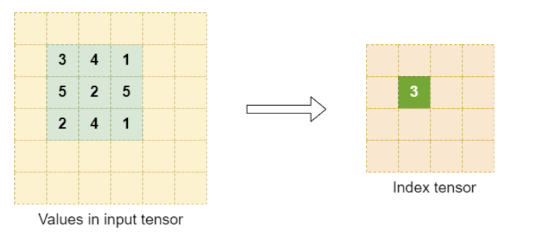

Select an appropriate element size for the index tensor. As a reference, any element size such that the maximum zero-indexed window position fits should be sufficient.

##### ResampleBwd

This operation represents backward resampling of the spatial dimensions of an output response to a desired value. Resampling is supported in both directions, upsampling and downsampling. Backwards downsampling represents the standard operation of backward pooling, commonly used in convolutional neural networks. Refer to the [CUDNN_BACKEND_OPERATION_RESAMPLE_BWD_DESCRIPTOR](https://docs.nvidia.com/deeplearning/cudnn/backend/latest/api/cudnn-graph-library.html#cudnn-backend-operation-resample-bwd-descriptor) section for more information and general constraints.

The following are constraints for Resample backward operations, in addition to the general constraints listed above, and any constraints listed in the [Support Surface](/developer/graph-api#support-surface) section, in relation to other operations. Note that these additional constraints only apply when Resample backward operations are used in the runtime fusion engines.

We allow a choice amongst four modes for resample. All modes have the following common support specifications:

  - Supported layout: NHWC or NDHWC, NCHW or NCDHW
  - Spatial dimensions supported: 2 or 3
  - Input dimensions supported: 4 or 5

For layout NHWC or NDHWC:

  - The index tensor should be provided for only max pooling mode, and should adhere to the format described in the [Resampling Index Tensor Dump for Training](/developer/graph-api#resampling-index-tensor-dump-for-training) section.
  - The index tensor dimensions should be equal to the input gradient tensor dimensions.

For layout NCHW or NCDHW:

  - X, Y, and DY are required when max pooling mode is used.
  - `Int64_t` indices are not supported.

There are some mode specific restrictions also. The following tables list the values that are allowed for particular parameters. For the parameters not listed, we allow any value which is mathematically correct.

The following backward downsampling modes are supported:

  - `CUDNN_RESAMPLE_AVGPOOL_INCLUDE_PADDING`
  - `CUDNN_RESAMPLE_AVGPOOL_EXCLUDE_PADDING`
  - `CUDNN_RESAMPLE_MAXPOOL`

| Attribute | Average Pooling | Max Pooling |
| --- | --- | --- |
| `CUDNN_ATTR_RESAMPLE_PADDING_MODE` | `CUDNN_ZERO_PAD` | `CUDNN_NEG_INF_PAD` |
| `CUDNN_ATTR_OPERATION_RESAMPLE_BWD_ALPHA` | `1.0` | `1.0` |
| `CUDNN_ATTR_OPERATION_RESAMPLE_BWD_BETA` | `0.0` | `0.0` |
| `CUDNN_ATTR_RESAMPLE_COMP_TYPE` | `CUDNN_DATA_FLOAT` | `CUDNN_DATA_FLOAT` |

Backward upsampling modes are currently not supported.

#### Examples of Supported Patterns

The following sections provide examples of supported patterns, in order of increasing complexity. We employ the same color scheme as in the overall pattern to aid in identifying the structure of g1 (blue) and g2 (purple).

For illustration purposes, we abbreviated the operations used. For a full mapping to the actual backend descriptors, refer to the [Mapping with Backend Descriptors](/developer/graph-api#mapping-with-backend-descriptors).

##### Single Operation

The following example illustrates a convolution operation without any operations before or after it. This means, g1 and g2, are empty graphs.

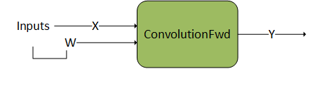

##### Pointwise Operations After Convolution 1

In this example, g2 consists of a sequential set of two `Pointwise` operations after the convolution.

##### Pointwise Operations After Convolution 2

Similar to the previous example, g2 consists of a sequential set of multiple `Pointwise` operations.

##### Pointwise Operations Before Matrix Multiplication

`Pointwise` operations can also precede a convolution or matrix multiplication, that is, g1 is composed of `Pointwise` operations.

##### Convolution Producer Node in Middle of DAG

The following pattern shows g1 as a DAG of `Pointwise` operations feeding into a convolution. In addition, g2 is a DAG consisting of two `Pointwise` operations. Note that the convolution is being consumed in the middle of g2 as opposed to g2 first node. This is a valid pattern.

##### Mixed Input Precision Matmul and Convolution

Mixed input precision for matmuls and convolutions is implemented as a special case of mainloop fusion. Inputs may have different data types and will be converted to the desired data types serving as the inputs of the `matmul` or `convolution` operation by a `Pointwise:Identity` operation. The following pattern shows g1 as a DAG of `Pointwise:Identity` operation converting the input data type of tensor A into a `matmul` operation. This is a valid pattern.

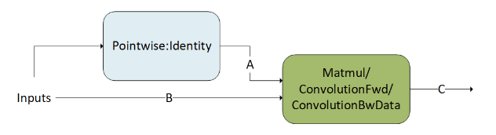

#### Normalizations

Layer Norm, RMS Norm, and Adaptive Layer Norm fusion patterns are supported using general runtime compiled engines.

##### NormalizationForward

`NormalizationForward` computes the normalization output `Y` from the input `X`. This operation is used in both the inference and training phase. The phases are distinguished by the attribute `CUDNN_ATTR_OPERATION_NORM_FWD_PHASE`.

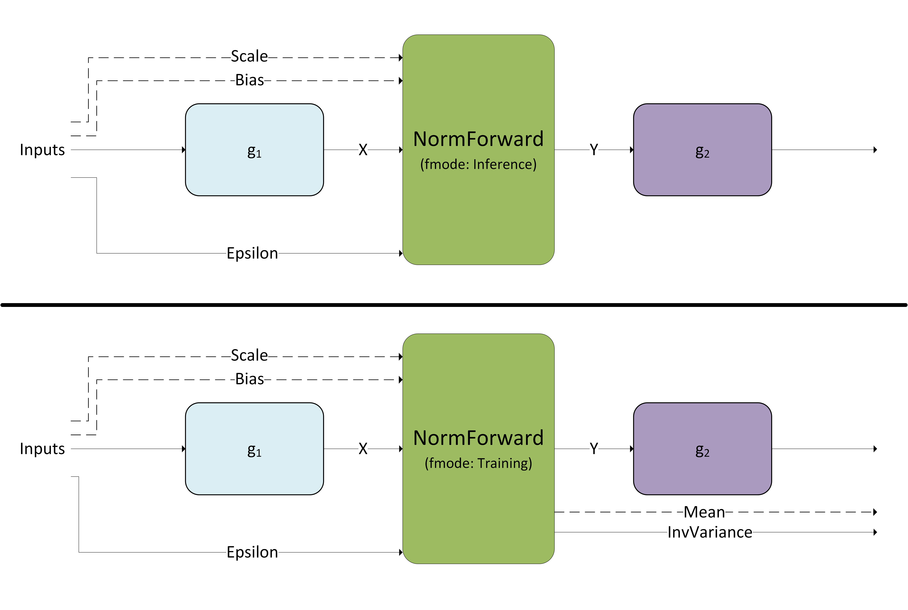

This operation supports different normalization modes which are set by the attribute `CUDNN_ATTR_OPERATION_NORM_FWD_MODE`.

For prologue fusion, g1 is a directed linear graph that can consist of zero or any number of the `CUDNN_BACKEND_OPERATION_POINTWISE_DESCRIPTOR` operations.

For epilogue fusion, g2 is a directed linear graph that can consist of zero or any number of the `CUDNN_BACKEND_OPERATION_POINTWISE_DESCRIPTOR` operations.

| Node and Other Attributes | Layer Normalization Forward | RMS Normalization Forward | Adaptive Layer Normalization Forward |  |  |  |  |  |  |  |  |  |
| --- | --- | --- | --- | --- | --- | --- | --- | --- | --- | --- | --- | --- |
| `operation` | `normFwd` | `normFwd` | `normFwd` |  |  |  |  |  |  |  |  |  |
| `X` |  | input | data type: input type | 2-5 dims [N’, D’] where mean and standard deviation are calculated over the last D’ dimensions (for example,  [N, C, H, W] where N’ = N and D’ = C, H, W) |  | input | data type: input type | 2-5 dims [N’, D’] where mean and standard deviation are calculated over the last D’ dimensions (for example, [N, C, H, W] where N’ = N and D’ = C, H, W) |  | input | data type: input type | 3 dims [B, S, D] or [S, B, D] where mean and standard deviation are calculated over the last D dimension |
| `Mean` |  | output (only applicable to fmode `CUDNN_NORM_FWD_TRAINING`) | data type: compute type | 2-5 dims [N’, 1,…] where 1 is repeated dim(D’) times (e.g. [N, 1, 1, 1] where N’ = N, D’= C, H, W and 1 is repeated dim(D’) = 3 times) |  | N/A |  | output (only applicable to fmode `CUDNN_NORM_FWD_TRAINING`) | data type: compute type | 3 dims [B, S, 1] |  |  |
| `InvVariance` |  | output (only applicable to fmode `CUDNN_NORM_FWD_TRAINING`) | data type: compute type | 2-5 dims  [N’, 1,…] where 1 is repeated dim(D’) times (e.g. [N, 1, 1, 1] where N’ = N, D’= C, H, W and 1 is repeated dim(D’) = 3 times) |  | output (only applicable to fmode `CUDNN_NORM_FWD_TRAINING`) | data type: compute type | 2-5 dims  [N’, 1,…] where 1 is repeated dim(D’) times (e.g. [N, 1, 1, 1] where N’ = N, D’= C, H, W and 1 is repeated dim(D’) = 3 times) |  | output (only applicable to fmode `CUDNN_NORM_FWD_TRAINING`) | data type: compute type | 3 dims [B, S, 1] |
| `Scale` |  | input weight (optional) | data type: weight type | 2-5 dims [1,…, D’] where 1 is repeated dim(N’) times (e.g. [1, C, H, W] where N’ = N, D’= C, H, W and 1 is repeated dim(N’) = 1 time) |  | input weight (optional) | data type: weight type | 2-5 dims [1,…, D’] where 1 is repeated dim(N’) times (e.g. [1, C, H, W] where N’ = N, D’= C, H, W and 1 is repeated dim(N’) = 1 time) |  | input weight | data type: weight type | 3 dims [B, 1, D] if X is [B, S, D] or [1, B, D] if X is [S, B, D] |
| `Bias` |  | input weight (optional) | data type: weight type | 2-5 dims [1,…, D’] where 1 is repeated dim(N’) times (e.g. [1, C, H, W] where N’ = N, D’= C, H, W and 1 is repeated dim(N’) = 1 time) |  | input weight (optional) | data type: weight type | 2-5 dims [1,…, D’] where 1 is repeated dim(N’) times (e.g. [1, C, H, W] where N’ = N, D’= C, H, W and 1 is repeated dim(N’) = 1 time) |  | input weight (optional) | data type: weight type | 3 dims [B, 1, D] if X is [B, S, D] or [1, B, D] if X is [S, B, D] |
| `Y` |  | output | data type: output type | 2-5 dims [N’, D’] where mean and standard deviation are calculated over the last D’ dimensions (e.g. [N, C, H, W] where N’ = N and D’ = C, H, W) |  | output | data type: output type | 2-5 dims [N’, D’] where mean and standard deviation are calculated over the last D’ dimensions (e.g. [N, C, H, W] where N’ = N and D’ = C, H, W) |  | output | data type: output type | 3 dims [B, S, D] or [S, B, D] where mean and standard deviation are calculated over the last D dimension |
| `epsilonDesc` |  | input | data type: constant | 2-5 dims [1,…] where 1 is repeated dim([N’, D’]) times (e.g. [1, 1, 1, 1] where N’ = N, D’ = C, H, W and 1 is repeated dims([N’, D’]) = dims([N, C, H, W]) = 4 times) |  | input | data type: constant | 2-5 dims [1,…] where 1 is repeated dim([N’, D’]) times (e.g. [1, 1, 1, 1] where N’ = N, D’ = C, H, W and 1 is repeated dims([N’, D’]) = dims([N, C, H, W]) = 4 times) |  | input | data type: constant | 3 dims [1, 1, 1] |
| `mode` | `CUDNN_LAYER_NORM` | `CUDNN_RMS_NORM` | `CUDNN_ADA_LAYER_NORM` |  |  |  |  |  |  |  |  |  |
| Supported `fmode` | `CUDNN_NORM_FWD_TRAINING`, `CUDNN_NORM_FWD_INFERENCE` | `CUDNN_NORM_FWD_TRAINING`, `CUDNN_NORM_FWD_INFERENCE` | `CUDNN_NORM_FWD_TRAINING`, `CUDNN_NORM_FWD_INFERENCE` |  |  |  |  |  |  |  |  |  |
| Supported data layout formats | NC(D)HW, N(D)HWC, Row-major, Column-major | NC(D)HW, N(D)HWC, Row-major, Column-major | NC(D)HW, N(D)HWC, Row-major, Column-major |  |  |  |  |  |  |  |  |  |
| Supported input types | FP16, FP32, BF16 | FP16, FP32, BF16 | FP16, FP32, BF16 |  |  |  |  |  |  |  |  |  |
| Supported output types | FP8, FP16, FP32, BF16 | FP8, FP16, FP32, BF16 | FP8, FP16, FP32, BF16 |  |  |  |  |  |  |  |  |  |
| Supported compute type | FP32 | FP32 | FP32 |  |  |  |  |  |  |  |  |  |
| Supported weight types | FP16, FP32, FP32 | FP16, FP32, BF16 | FP16, FP32, BF16 |  |  |  |  |  |  |  |  |  |
| Alignment requirements for input and output types | Minimum 16 bytes aligned, 128 bytes aligned for best performance on compute capability 9.0 or higher | Minimum 16 bytes aligned, 128 bytes aligned for best performance on compute capability 9.0 or higher | Minimum 16 bytes aligned, 128 bytes aligned for best performance on compute capability 9.0 or higher |  |  |  |  |  |  |  |  |  |

<Note>
For each operation, all applicable tensors must have the same layout.
</Note>

##### NormalizationBackward

`NormalizationBackward` computes the gradient `dX` and the scale and bias gradients `dScale` and `dBias`. This operation supports multiple modes which are set by the attribute `CUDNN_ATTR_OPERATION_NORM_BWD_MODE`. The mean and variance saved during the forward training pass is passed as input to the `NormBackward` operation.

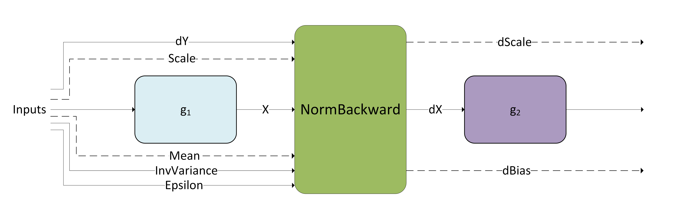

For prologue fusion, g1 is a directed linear graph that can consist of zero or any number of the `CUDNN_BACKEND_OPERATION_POINTWISE_DESCRIPTOR` operations.

For epilogue fusion, g2 is a directed linear graph that can consist of zero or any number of the `CUDNN_BACKEND_OPERATION_POINTWISE_DESCRIPTOR` operations.

| Node and Other Attributes | Layer Normalization Backward | RMS Normalization Backward | Adaptive Layer Normalization Backward |  |  |  |  |  |  |  |  |  |
| --- | --- | --- | --- | --- | --- | --- | --- | --- | --- | --- | --- | --- |
| `operation` | `normBwd` | `normBwd` | `normBwd` |  |  |  |  |  |  |  |  |  |
| `X` |  | input | data type: input type | 2-5 dims [N’, D’] where mean and standard deviation are calculated over the last D’ dimensions (e.g. [N, C, H, W] where N’ = N and D’ = C, H, W) |  | input | data type: input type | 2-5 dims [N’, D’] where mean and standard deviation are calculated over the last D’ dimensions (e.g. [N, C, H, W] where N’ = N and D’ = C, H, W) |  | input | data type: input type | 3 dims [B, S, D] or [S, B, D] where mean and standard deviation are calculated over the last D dimension |
| `Mean` |  | input | data type: compute type | 2-5 dims [N’, 1,…] where 1 is repeated dim(D’) times (e.g. [N, 1, 1, 1] where N’ = N, D’= C, H, W and 1 is repeated dim(D’) = 3 times) |  | N/A |  | input | data type: compute type | 3 dims [B, S, 1] |  |  |
| `InvVariance` |  | input | data type: compute type | 2-5 dims  [N’, 1,…] where 1 is repeated dim(D’) times (e.g. [N, 1, 1, 1] where N’ = N, D’= C, H, W and 1 is repeated dim(D’) = 3 times) |  | input | data type: compute type | 2-5 dims  [N’, 1,…] where 1 is repeated dim(D’) times (e.g. [N, 1, 1, 1] where N’ = N, D’= C, H, W and 1 is repeated dim(D’) = 3 times) |  | input | data type: compute type | 3 dims [B, S, 1] |
| `Scale` |  | input weight (optional) | data type: weight type | 2-5 dims [1,…, D’] where 1 is repeated dim(N’) times (e.g. [1, C, H, W] where N’ = N, D’= C, H, W and 1 is repeated dim(N’) = 1 time) |  | input weight (optional) | data type: weight type | 2-5 dims [1,…, D’] where 1 is repeated dim(N’) times (e.g. [1, C, H, W] where N’ = N, D’= C, H, W and 1 is repeated dim(N’) = 1 time) |  | input weight | data type: weight type | 3 dims [B, 1, D] if X is [B, S, D] or [1, B, D] if X is [S, B, D] |
| `DY` |  | input | data type: output type | 2-5 dims [N’, D’] where mean and standard deviation are calculated over the last D’ dimensions (e.g. [N, C, H, W] where N’ = N and D’ = C, H, W) |  | input | data type: output type | 2-5 dims [N’, D’] where mean and standard deviation are calculated over the last D’ dimensions (e.g. [N, C, H, W] where N’ = N and D’ = C, H, W) |  | input | data type: output type | 3 dims [B, S, D] or [S, B, D] where mean and standard deviation are calculated over the last D dimension |
| `DX` |  | output | data type: input type | 2-5 dims [N’, D’] where mean and standard deviation are calculated over the last D’ dimensions (e.g. [N, C, H, W] where N’ = N and D’ = C, H, W) |  | output | data type: input type | 2-5 dims [N’, D’] where mean and standard deviation are calculated over the last D’ dimensions (e.g. [N, C, H, W] where N’ = N and D’ = C, H, W) |  | output | data type: input type | 3 dims [B, S, D] or [S, B, D] where mean and standard deviation are calculated over the last D dimension |
| `Dscale` |  | output | data type: weight type | 2-5 dims [1,…, D’] where 1 is repeated dim(N’) times (e.g. [1, C, H, W] where N’ = N, D’= C, H, W and 1 is repeated dim(N’) = 1 time) |  | output | data type: weight type | 2-5 dims [1,…, D’] where 1 is repeated dim(N’) times (e.g. [1, C, H, W] where N’ = N, D’= C, H, W and 1 is repeated dim(N’) = 1 time |  | output | data type: weight type | 3 dims [B, 1, D] if X is [B, S, D] or [1, B, D] if X is [S, B, D] |
| `Dbias` |  | output | data type: weight type | 2-5 dims [1,…, D’] where 1 is repeated dim(N’) times (e.g. [1, C, H, W] where N’ = N, D’= C, H, W and 1 is repeated dim(N’) = 1 time) |  | output (optional) | data type: weight type | 2-5 dims [1,…, D’] where 1 is repeated dim(N’) times (e.g. [1, C, H, W] where N’ = N, D’= C, H, W and 1 is repeated dim(N’) = 1 time) |  | output | data type: weight type | 3 dims [B, 1, D] if X is [B, S,  D] or [1, B, D] if X is [S, B, D] |
| `mode` | `CUDNN_LAYER_NORM` | `CUDNN_RMS_NORM` | `CUDNN_ADA_LAYER_NORM` |  |  |  |  |  |  |  |  |  |
| Supported data layout formats | NC(D)HW, N(D)HWC, Row-major, Column-major | NC(D)HW, N(D)HWC, Row-major, Column-major | NC(D)HW, N(D)HWC, Row-major, Column-major |  |  |  |  |  |  |  |  |  |
| Supported input types | FP16, FP32, BF16 | FP16, FP32, BF16 | FP16, FP32, BF16 |  |  |  |  |  |  |  |  |  |
| Supported output types | FP8, FP16, FP32, BF16 | FP8, FP16, FP32, BF16 | FP8, FP16, FP32, BF16 |  |  |  |  |  |  |  |  |  |
| Supported compute type | FP32 | FP32 | FP32 |  |  |  |  |  |  |  |  |  |
| Supported weight types | FP16, FP32, FP32 | FP16, FP32, BF16 | FP16, FP32, BF16 |  |  |  |  |  |  |  |  |  |
| Alignment requirements for input and output types | 16 bytes aligned, 128 bytes aligned (compute capability 10.0) | 16 bytes aligned, 128 bytes aligned (compute capability 10.0) | 16 bytes aligned, 128 bytes aligned (compute capability 10.0) |  |  |  |  |  |  |  |  |  |

<Note>
For each operation, all applicable tensors must have the same data layout format (for example,  Row-major). Neither mixed input or output types, nor mixed compute types are supported.
</Note>

### Specialized Runtime Fusion Engines

The specialized runtime fusion engines target and optimize specialized graph patterns that commonly occur in popular deep learning models. These engines offer limited flexibility regarding supported fusion patterns, supported data types, and supported tensor layouts. Long term, these patterns are expected to be more generic.

The following sections highlight the supported patterns.

#### NormAddRelu

In vision models, normalization followed by ReLU activation is a commonly occurring pattern. The `NormAddRelu` fusion pattern, supported using a runtime compiled engine, aims to optimize this recurring operation graph. This pattern supports two normalization modes, batch normalization and instance normalization. The batch normalization mode also supports single node multi-GPU batch normalization for speeding up batch norm computation in multi-GPU systems. The pattern is intended for use in the forward pass during the training phase. The full pattern `NormAddRelu` with the add node is used in cases where there are skip connections in the model.

The pattern is illustrated in the following diagram and its options and limitations include:

  - The pointwise nodes: `Add`, `ReLU`, and `GT` (greater than) are optional.
  - All tensors should be in NHWC packed layout format.
  - Both 4D and 5D tensors are supported.
  - Only ReLU activation is supported.
  - The attribute `CUDNN_ATTR_OPERATION_NORM_FWD_MODE` for the norm forward operation must be set to `CUDNN_BATCH_NORM`or `CUDNN_INSTANCE_NORM`.
  - The attribute `CUDNN_ATTR_OPERATION_NORM_FWD_PHASE` for the norm forward operation must be set to `CUDNN_NORM_FWD_TRAINING`.
  - The norm input tensors: `Scale`, `Bias` (batch norm mode: `Input_running_mean` and `Input_running_var`) must be of `float` data type.
  - The norm output tensors: `mean` and `InvVariance`  (batch norm mode: `output_running_mean` and `output_running_var`) must be of `float` data type.
  - The norm input tensor `x`, residual input `Z` and output tensor `Y` can be any of `{FP32, FP16, BF16}` data types. For `FP16` and `BF16` data types, the channel count C for the tensors must be a multiple of 8 while for float data type the channel count must be a multiple of 4.
  - These patterns are supported on devices with compute capability >= 8.0.

In case of single node multi-GPU batch norm, each GPU computes the local statistics based on its input data and writes out the local statistics to the `peerTensors`. Each `peerTensor` resides on a separate GPU on the node and is used for reading and writing local statistics from the peer GPUs. This is followed by a global stats computation phase where each GPU aggregates the statistics from the peers and computes the global mean and variance for the batch norm output  computation on its local data. Apart from the options and limitations listed above, the following additional restrictions apply for using multi-GPU batch norm:

  - The attribute `CUDNN_ATTR_OPERATION_NORM_FWD_PEER_STAT_DESCS` of the `NormForward` operation must be set.
  - The size of the `peerTensors` vector should be equal to the number of GPUs in the node participating in the batch norm computation.
  - The maximum size of the `peerTensors` vector is 32.
  - Each GPU should operate on the same size of input data [N,C,H,W].
  - The size of each `peerTensor` in the `peerTensors` vector should be equal to `num_gpu * 4 * C` where C is the channel count of the `BN_x` tensor and `num_gpu` is the number of GPUs in the node participating in the batch norm computation.
  - All the elements of each tensor in the `peerTensors` vector should be `memset` to `0` before passing that tensor in the variant pack.

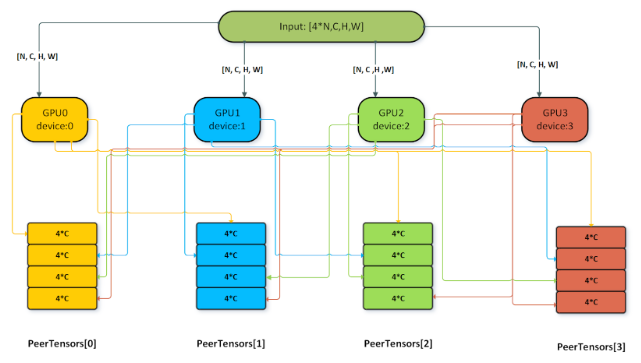

#### DReluForkDNorm

Similar to the `NormAddRelu` pattern, the `DReluForkDNorm` pattern also targets vision networks. It is intended to be used in backpropagation during the training phase. The `DReluForkDNorm` pattern is supported through a runtime compiled engine that usually complements the `NormAddRelu` pattern. This pattern supports four normalization modes:

- Batch normalization
- Instance normalization
- RMS normalization
- Layer normalization

It also supports single node multi-GPU batch normalization for speeding up batch norm backward computation in multi-GPU systems.

The pattern is illustrated in the following diagram and its options and limitations include:

  - The pointwise multiplication node for `dRelu` is optional.
  - The intermediate tensor `dZ` can be virtual or non-virtual for batch and instance normalization, virtual-only for layer and RMS normalization.
  - All tensors should be in NHWC packed layout format for batch and instance normalization. NCHW is also supported for layer and RMS normalization.
  - Both 4D and 5D tensors are supported.
  - Only the backward pass for ReLU activation (`dRelu`) is supported; the backward pass for other activation functions is not supported for norm fusions.
  - Bitmask tensor input is needed for the pointwise multiplication `dRelu` node.
  - The attribute `CUDNN_ATTR_OPERATION_NORM_BWD_MODE` for the norm backward operation must be set to `CUDNN_BATCH_NORM`, `CUDNN_INSTANCE_NORM`, `CUDNN_LAYER_NORM`, or `CUDNN_RMS_NORM`.
  - The norm backward input tensors: `Scale`, `Mean`, `InvVariance` and the output tensors `dScale` and `dBias` must be of `float` data type.
  - The`dRelu` input tensor `dY`, norm backward input `x`, input gradient `dZ`, and output tensor `dX` can be any of `{FP32, FP16, BF16}` data types. For `FP16` and `BF16` data types, the channel count C for the tensors must be a multiple of 8 while for `float` data type the channel count must be a multiple of 4.
  - These patterns are supported on devices with compute capability >= 8.0.

The single node multi-GPU batch normalization version of this pattern is typically used for `dScale` and `dBias` gradient aggregation across GPUs. For using the multi-GPU version, the attribute `CUDNN_ATTR_OPERATION_NORM_BWD_PEER_STAT_DESCS` of the `NormBackward` operation must be set.  Other restrictions for the `peerTensors` vector listed in the previous section apply for this pattern as well.

#### Fused Flash Attention fprop

cuDNN supports flash fused attention to perform scale dot product attention commonly used in models like GPT, BERT, and so on. The general pattern supported by this engine is BMM-Softmax-BMM with many other optional features that you can opt into. You can choose to create the graph by yourself or use the custom `sdpa` node in [cuDNN frontend](https://github.com/NVIDIA/cudnn-frontend/blob/1.0/pre_release_1/README.FE.1.0.md). Using the frontend node will make opting into the different options like causal mask, dropout, alibi masking, and so on, very easy.

The K-cache and V-cache inputs can be non-virtual tensors, or can optionally be composed of paged cache load operations

Pre-softmax optional DAGs cover multiple options for the users to configure:

  - pointwise `Multiply` node for attention scale after the first matmul
  - pointwise `Add` node for the relative positional encoding to add a bias after the first matmul
  - Different masking options like causal masking, padding masking, sliding window attention, and alibi masking. Users can choose multiple masking schemes together or no masking.
  - pointwise `Multiply` node that accepts a full tensor that can be used as a custom mask generated by the user
  - pointwise nodes that represent activation functions like `CUDNN_POINTWISE_TANH_FWD`

Post-softmax optional DAGs cover multiple options for the users to configure:

  - pointwise `Multiply` node with a RNG node to signify dropout
  - pointwise `Multiply` node with a user generated tensor acting as the dropout mask

All these DAGs are optional. A user can enable them depending on the cuDNN API they are targeting. If using the `sdpa` node in cuDNN frontend, they can set the provided API options to `true`, for example `use_causal_mask(True)` and internally, the frontend will add the correct graph automatically. While using the graph API directly, users can add the corresponding graph of the operations they want into the cuDNN graph.

The compound operations for example: Causal Mask, Sliding Window Mask, Softmax, and so on, can be represented using the following operation graphs in cuDNN.

**Causal Mask**

**Padding Mask**

**Sliding Window Mask**

**Alibi Mask**

**Softmax**

**Dropout**

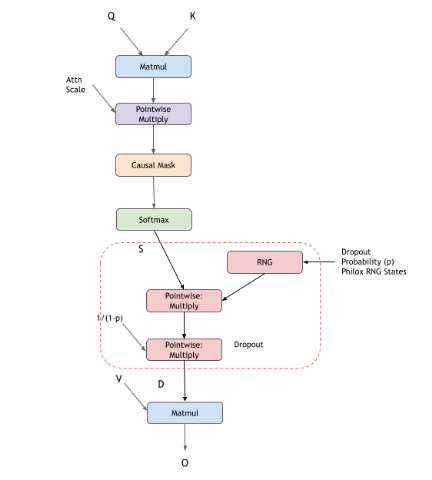

**Paged KV caches**

|  | Limitation |  |  |  |  |  |  |  |  |  |  |
| --- | --- | --- | --- | --- | --- | --- | --- | --- | --- | --- | --- |
| `Q`, `K^T`, and `V` tensor |  | All tensors must be either `FP16` or `BF16` data type. | Contracting dimension for `Q` must be a multiple of 8 with a maximum value of 128 for Ampere GPUs and 256 for Hopper GPUs. | Non-contracting dimension for `V` must be a multiple of 8 with a maximum value of 128 for Ampere GPUs and 256 for Hopper GPUs. | Contracting dimension for `Q` and `K^T` needs to have stride 1 in the layout. | Non-contracting dimension for `V` needs to have stride 1 in the layout. | The second dimension in `K^T` corresponding to the number of heads can be a factor of the number of heads of `Q`. | The second dimension in `V` corresponding to the number of heads can be a factor of the number of heads of `Q`. |  |  |  |
| Tensors for paged attention: `container_K`, `container_V`, `page_table_K`, `page_table_v` |  | Both containers have [num_blocks,h,block_size,d] dimensions. | `block_size` must be a power of two. | Both `page_tables`: | Have [b,1,ceil(s_kv/block_size),1] dimensions, where `s_kv` is the maximum sequence size in the associated container. | Have the `INT32` data type. | Must be minimally 4-byte aligned. | For performance reasons SM100 both `page_tables` are strongly suggested to have: | 16-byte alignment | Batch size as the out dimension | Total number of pages per batch that is a multiple of 4 |
| Softmax stats |  | Data type must be `FP32`. | Data must be in row major format. |  |  |  |  |  |  |  |  |
| `O` tensor |  | Data type must be either `FP16` or `BF16`. | The stride for the last dimension corresponding to the hidden dim per head should be 1. |  |  |  |  |  |  |  |  |
| `Seed` and `Offset` | INT32 or INT64 scalar in host or GPU |  |  |  |  |  |  |  |  |  |  |
| `Scale` to `Pointwise` | Attention scale can be FP16/BF16/FP32. |  |  |  |  |  |  |  |  |  |  |

Inference mode can be turned on by passing the Softmax stats as a virtual tensor and setting the RNG node probability to `0.0f`. The pattern is supported for GPUs with NVIDIA Ampere architecture and newer.

#### Fused Flash Attention fprop (FP8)

cuDNN also supports Fused Flash Attention in FP8 data type supported on NVIDIA Hopper GPUs. In addition to the standard `fprop` graph, there are additional dequantization scales, quantization scales, and absolute max (amax) calculations. The current FP8 support is a subset of the features supported in BF16 support. We are actively working on expanding the support for the FP8 kernels.

Due to the limited numerical precision of FP8 data type, for practical use cases, you must scale values computed in FP32 format before storing them in FP8 format, and descale the values stored in FP8 format before performing computations on them. For more information, refer to the [Transformer Engine FP8 primer](https://docs.nvidia.com/deeplearning/transformer-engine/user-guide/examples/fp8_primer.html).

**Scaling and Descaling**

In the context of FP8, scaling refers to multiplying each element of a FP32 tensor by a quantization factor.

The quantization factor is computed as: (*Max representable value in the FP8 format*) / (*Max absolute value seen in the tensor*).

For the E4M3 format, the quantization factor is `448.f/ tensor_amax` (rounded to the nearest lower power of two).

For the E5M2 format, the quantization factor is `57344.f / tensor_amax` (rounded to the nearest lower power of two).

The *dequantization factor* is the reciprocal of the quantization factor.

The meaning behind scaling is to spawn the full range of the FP8 format when computing on FP8 values and storing FP8 values, thereby, minimizing the precision loss. True values in FP32 format are multiplied by the quantization factor before storing them as scaled values in FP8 format. Computations on scaled values in FP8 format are descaled by multiplying with the dequantization factor to convert them back to their true values in FP32 format.

Scaling and descaling are critical for convergence with the FP8 data type, hence cuDNN only supports graph patterns for FP8 fused attention with the scaling and descaling  nodes present.

In the following diagram, red tensors indicate FP8 datatype tensors and black tensors are in FP32 datatype.

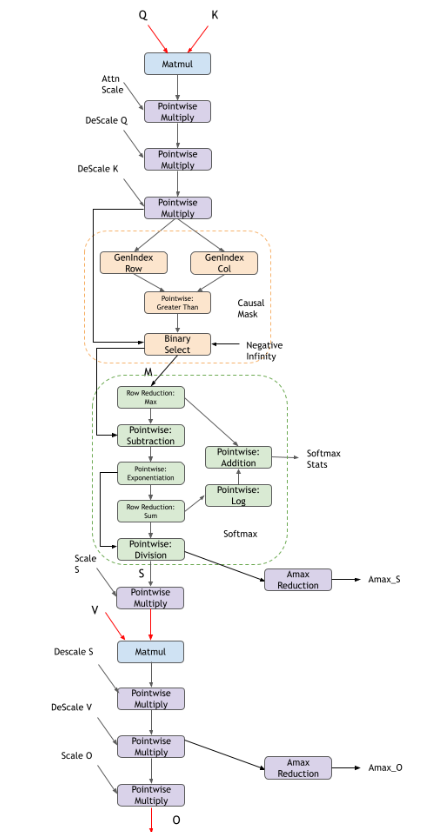

Pre-softmax optional DAGs cover multiple options for you to configure:

  - pointwise `Multiply` node for attention scale after the first matmul
  - Masking options include causal masking and no masking

Post-softmax optional DAGs cover multiple options for you to configure:

  - Currently there is no support for dropout

|  | Limitation |  |  |  |  |  |  |  |
| --- | --- | --- | --- | --- | --- | --- | --- | --- |
| `Q`, `K^T`, and `V` tensor |  | All tensors must be either `E4M3` or `E5M2` data type. | Contracting dimension for `Q` must be a multiple of 16 with maximum value of 256. | Non-contracting dimension for `V` must be a multiple of 16 with maximum value of 256. | Contracting dimension for `Q` and `K^T` needs to have stride 1 in the layout. | Non-contracting dimension for `V` needs to have stride 1 in the layout. | The second dimension in `K^T` corresponding to the number of heads can be a factor of the number of heads of `Q`. | The second dimension in `V` corresponding to the number of heads can be a factor of the number of heads of `Q`. |
| Softmax stats |  | Data type must be `FP32`. | Data must be in row major format. |  |  |  |  |  |
| `O` tensor |  | Data type must be either `E4M3` or `E5M2`. | The stride for the last dimension corresponding to the hidden dim per head should be 1. |  |  |  |  |  |
| `Scale` to `Pointwise` | Attention scale can be FP32. |  |  |  |  |  |  |  |
| Dequantization scales (`DeScale Q`, `DeScale K`, `DeScale V`, `DeScale S`) and Quantization scales (`ScaleS`, `ScaleO`) |  | Data type must be `FP32`. | Scalar values with dimension [1,1,1,1] and stride [1,1,1,1] | Allowed to be on both host or GPU |  |  |  |  |
| Amax values (`Amax_O`, `Amax_S`) |  | Data type must be `FP32`. | Scalar values with dimension [1,1,1,1] and stride [1,1,1,1] | GPU tensor |  |  |  |  |

We recommend using the cuDNN frontend scaled dot product attention nodes for cuDNN fused flash attention kernels. The following samples for the cuDNN frontend are available:
- [Attention Python samples](https://github.com/NVIDIA/cudnn-frontend/blob/main/samples/python/50_scaled_dot_product_attention.ipynb)
- [Attention C++ samples](https://github.com/NVIDIA/cudnn-frontend/tree/main/samples/cpp/sdpa)

For more information about cuDNN frontend scaled dot product attention, refer to [/operations/Attention](/operations/Attention).

#### Fused Flash Attention bprop

cuDNN supports the corresponding backpropagation graph for fused flash attention. This can be used together with the `fprop` graph to perform training on Large Language Models (LLMs).

All the options mentioned in `fprop` are applicable in the `bprop` graph as well. The corresponding `bprop` frontend node contains the same options and can be configured to do the `bprop`. Users opting in for the graph API, again need to add the graphs of the operations they want. The graph shown below is for a standard attention layer in GPT with causal masking.

<Note>

</Note>

The `bprop` support for activation functions has not been added to NVIDIA Ampere GPUs; it only exists on NVIDIA Hopper GPUs.

For Grouped Query Attention (GQA) and Multi Query Attention (MQA), you can configure an additional reduction node for `dK` and `dV`, which reduces the tensor from the full number of heads (`Q` heads) to the actual `K` and `V` heads.

For the input and output tensors, the limitations from the `fprop` graph are carried over. For the `bprop` specific tensors, the limitations are as follows:

|  | Limitation |  |  |  |  |
| --- | --- | --- | --- | --- | --- |
| `dQ`, `dK`, and `dV` tensor |  | All tensors must be either `FP16` or `BF16` data type. | The last dimension corresponding to the hidden dim per head must be a multiple of 8 with a maximum value of 128 for Ampere GPUs and 256 for Hopper GPUs. | The stride for the last dimension corresponding to the hidden dim per head should be 1. |  |
| Softmax sum |  | Data type must be `FP32`. | Data must be in row major format. |  |  |
| `dO` tensor |  | Data type must be either `FP16` or `BF16`. | The last dimension corresponding to the hidden dim per head must be a multiple of 8 with a maximum value of 128 for Ampere GPUs and 256 for Hopper GPUs. | The stride for the last dimension corresponding to the hidden dim per head should be 1. | The layout of the tensor is required to be the same as the `O` tensor. |
| `dqAccum` tensor |  | Data type must be `FP32`. | The tensor must be `memset` to zero before passing to cuDNN. | Data must be in row major format. |  |

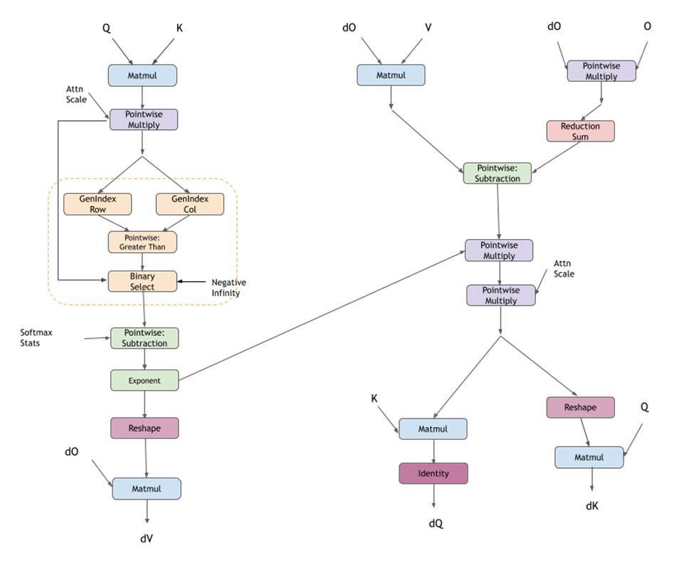

The pattern is supported for GPUs with NVIDIA Ampere architecture and newer.

#### Fused Flash Attention bprop (FP8)

cuDNN also supports Fused Flash Attention bprop in native FP8 data type supported on NVIDIA Hopper GPUs. In addition to the standard `bprop` graph, there are additional dequantization scales, quantization scales, and absolute max (amax) calculations. The current FP8 Flash Attention `bprop` support is corresponding to the FP8 Flash Attention `fprop` support.

In the following diagram, red tensors indicate FP8 datatype tensors and black tensors are in FP32 datatype.

|  | Limitation |  |  |  |  |
| --- | --- | --- | --- | --- | --- |
| `dQ`, `dK`, and `dV` tensor |  | All tensors must be either `E4M3` or `E5M2` data type. | The last dimension corresponding to the hidden dim per head must be 128. | The stride for the last dimension corresponding to the hidden dim per head should be 1. |  |
| `dO` tensor |  | Data type must be either `E4M3` or `E5M2`. | The last dimension corresponding to the hidden dim per head must be 128. | The stride for the last dimension corresponding to the hidden dim per head should be 1. | The layout of the tensor is required to be the same as the `O` tensor. |

### Specialized Pre-Compiled Engines

The pre-compiled specialized engines target and optimize for a specialized graph pattern with a ragged support surface. Because of this targeting, these graphs do not require runtime compilation.

In most cases, the specialized patterns are just special cases of the generic patterns used in the runtime fusion engines, but there are some cases where the specialized pattern does not fit any of the generic patterns. If your graph pattern matches a specialized pattern, you will get at least a pattern matching engine, and you might also get runtime fusion engines as another option.

Currently, the following patterns are supported by the pattern matching engines. Some nodes are optional. Optional nodes are indicated by dashed outlines.

#### ConvBNfprop

The `ConvBNfprop` pattern is illustrated in the following figure. Its restrictions and options include:

  - The three pointwise nodes scale, bias, and ReLU are optional.
  - X, Z, W, s1, b1 must all be of FP16 data type.
  - Z needs to be of shape [N, C, H, W] with NHWC packed layout.
  - W needs to be of shape [K, C, R, S] with KRSC packed layout.
  - s1, b1 need to be of shape [1, C, 1, 1] with NHWC packed layout.
  - Only ReLU activation is supported.
  - All of the intermediate tensors need to be virtual, except Y needs to be non-virtual.
  - I/O pointers should be 16 bytes aligned.
  - This pattern is only supported on devices with compute capability >= 8.0 (with the exception of NVIDIA Ada Lovelace architecture, 8.9).
  - On devices with compute capability >= 9.0, we only support two patterns:

    - the full pattern: scale + bias + ReLU + Conv + GenStats, and
    - the partial pattern: Conv + GenStats.

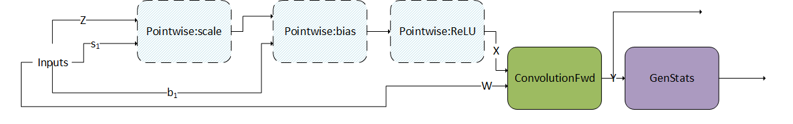

Skip connections are commonly observed in ResNet-like models. To support fusions in skip connections, we support a variant of the pattern above, the DBARCS pattern (short for Dual, Scale, Bias, Add, ReLU, Conv genStats). The limitations and options of the DBARCS pattern include:

  - The pointwise dual scale and dual bias nodes are either both present or not. This is indicated by the dashed block encircling the dual scale and dual bias nodes. In case both the nodes are missing, the `dual_X` tensor is directly fed as input to the add node.
  - The pointwise nodes scale, bias, add, and ReLU are required nodes.
  - Currently, only supported on Hopper GPUs.
  - For all the other data types, layout and virtualness restrictions of the `ConvBNfprop` pattern apply to this pattern as well.
  - `dual_X`, `dual_scale`, and `dual_bias` must all be of FP16 data type.
  - `dual_scale` and `dual_bias` must be of shape [1,C,1,1] with NHWC packed layout.
  - Intermediate outputs of the ReLU and Conv nodes: `Relu_Y` and `Y` are non-virtual. All the other intermediate outputs are virtual.
  - The weight tensor W for the convolution needs to be of  shape [K,C,1,1]. Only 1x1 filters with padding 0 are supported for the convolution in the DBARCS pattern.

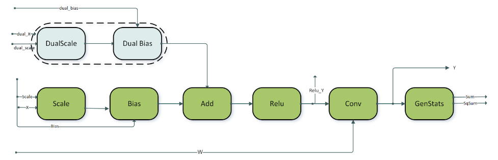

#### ConvBNwgrad

The `ConvBNwgrad` pattern is illustrated in the following figure. Its restrictions and options include:

  - The three pointwise operations are all optional, as indicated by the dashed outlines.
  - Only ReLU activation is supported.
  - X, s1, b1, and `dy` must all be of FP16 datatype.
  - I/O pointers should be 16 bytes aligned.
  - X, s1, b1, and `dy` must all have NHWC packed layouts.
  - All the intermediate tensors need to be virtual.
  - This pattern is only supported on devices with compute capability >= 8.0 (with the exception of NVIDIA Ada Lovelace architecture, 8.9).
  - On devices with compute capability >= 9.0, support is restricted to:

    - the full pattern: scale + bias + ReLU + `wgrad`.

#### ConvBiasAct

The `ConvBiasAct` pattern is illustrated in the following figure. Its restrictions and options include:

  - $\alpha_{1}$ and $\alpha_{2}$ need to be scalars.
  - The activation node is optional.
  - The size of the bias tensor should be [1, K, 1, 1].
  - Internal conversions are not supported. That is, the virtual output between nodes needs to have the same data type as the nodes compute type, which should be the same as the epilog type of the convolution node.
  - There are some restrictions on the supported combination of data types, which can be found in the API Reference (refer to [cudnnConvolutionBiasActivationForward()](https://docs.nvidia.com/deeplearning/cudnn/backend/latest/api/cudnn-cnn-library.html#cudnnConvolutionBiasActivationForward)).

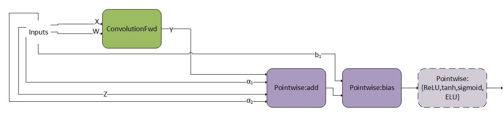

#### ConvScaleBiasAct

The `ConvScaleBiasAct` pattern is illustrated in the following figure. Its restrictions and options include:

  - $\alpha_{1}$, $\alpha_{2}$, and $b_{1}$ should have the same data type/layout and can only be FP32.
  - X, W, and Z can only be INT8x4 or INT8x32.
  - The size of the bias tensor should be [1, K, 1, 1].
  - Internal conversions are not supported. That is, the virtual output between nodes needs to be the same as their compute type.
  - Currently, `Pointwise:ReLU` is the only optional pointwise node.

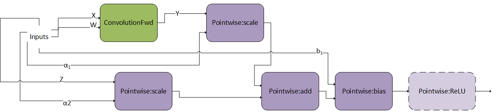

This pattern is very similar as `ConvBiasAct`. The difference is that here, the scales $\alpha_{1}$ and $\alpha_{2}$ are tensors, not scalars. If they are scalars, this pattern becomes a normal `ConvBiasAct`.

#### DgradDreluBNBwdWeight

The `DgradDreluBNBwdWeight` pattern is illustrated in the following figure. Its restrictions and options include:

  - Dgrad input `dy` and W are of FP16 datatypes.
  - Batch norm fwd inputs, `X_bn` is of FP16 datatype while the other tensors `mean_bn`, `invstd_dev_bn`, `scale_bn`, and `bias_bn` are FP32.
  - Outputs: `dScale`, `dBias`, A, B, C are of FP32 data type.
  - All pointers are 16 byte aligned.
  - This pattern is only supported on devices with compute capability >= 8.0 (with the exception of NVIDIA Ada Lovelace architecture, 8.9).

`DgradDreluBNBwdWeight` is a pre-compiled engine that can be used in conjunction with the `dBNApply` pattern to compute the backwards path of batch norm.

The `BNBwdWeight` operation takes in five inputs: `X_bn`, `mean_bn`, `invstddev_bn`, `scale_bn`, and `dy_bn` (that is, the output from the `ReLUBwd` node).

It produces five outputs: gradients of the batch norm scale and bias params, `dScale`, `dBias`, and coefficients A, B, C. Note that for illustration purposes, the inputs are duplicated. The inputs on the left and right are however exactly the same.

This pattern is typically used in the computation of the Batch Norm Backward Pass.

When computing the backward pass of batch norm, `dScale`, `dBias`, and `dX_bn` are needed. The `DgradDreluBnBwdWeight` pattern computes the former two. Using the generated A, B, and C we can use the following `dBNApply` pattern to compute `dX`, the input gradient, as follows `dx_bn = A*dy_bn + B*X_bn +C`.

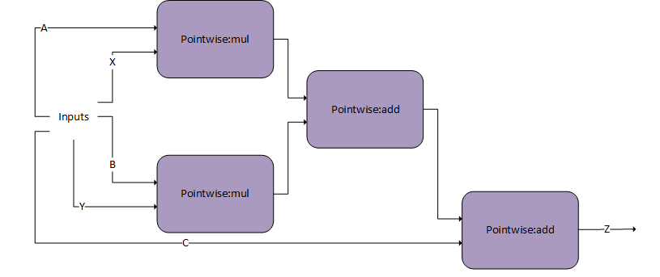

The `dBNApply` pattern was initially supported by a pre-compiled static engine but is now supported by the generic runtime fusion engine.

Note that the `DgradDreluBNBwdWeight` pattern is used in combination with the forward pass pattern `ConvBNfprop`. Because of performance reasons, the output of batch norm `Y_bn`, which was calculated in `ConvBNfprop` (output of scale-bias), needs to be recalculated by `DgradDreluBnBwdWeight`. The pointwise add node subtracts `mean_bn` from `X_bn`, hence the `alpha2` parameter for that node should be set to `-1`.

#### FP8 Fused Flash Attention

cuDNN supports fused flash attention with input and output data types being in FP8 format through a pre-compiled engine but with limited shape support and maximum sequence length allowed up to 512. Our general guidance is to use the specialized [Fused Flash Attention fprop (FP8)](/developer/graph-api#fused-flash-attention-fprop-fp8) and [Fused Flash Attention bprop (FP8)](/developer/graph-api#fused-flash-attention-bprop-fp8) runtime fusion engines for FP8 datatype support.

## Mapping with Backend Descriptors

For readability, the operations used in this section are abbreviated. The mapping with the actual backend descriptors can be found in this table:

| Notations Used In This Section | Backend Descriptor |
| --- | --- |
| `Pointwise:scale` | `CUDNN_BACKEND_OPERATION_POINTWISE_DESCRIPTOR` with mode `CUDNN_POINTWISE_MUL` and with operand B broadcasting into operand X |
| `Pointwise:bias` | `CUDNN_BACKEND_OPERATION_POINTWISE_DESCRIPTOR` with mode `CUDNN_POINTWISE_ADD` and with operand B broadcasting into operand X |
| `Pointwise:add` | `CUDNN_BACKEND_OPERATION_POINTWISE_DESCRIPTOR` with mode `CUDNN_POINTWISE_ADD` and with operand B with same dimensions as X |
| `Pointwise:mul` | `CUDNN_BACKEND_OPERATION_POINTWISE_DESCRIPTOR` with mode `CUDNN_POINTWISE_MUL` and with operand B with same dimensions as X |
| `Pointwise:ReLU` | `CUDNN_BACKEND_OPERATION_POINTWISE_DESCRIPTOR` with mode `CUDNN_POINTWISE_RELU_FWD` |
| `Pointwise:ReLUBwd` | `CUDNN_BACKEND_OPERATION_POINTWISE_DESCRIPTOR` with mode `CUDNN_POINTWISE_RELU_BWD` |
| `Pointwise:tanh` | `CUDNN_BACKEND_OPERATION_POINTWISE_DESCRIPTOR` with mode `CUDNN_POINTWISE_TANH_FWD` |
| `Pointwise:sigmoid` | `CUDNN_BACKEND_OPERATION_POINTWISE_DESCRIPTOR` with mode `CUDNN_POINTWISE_SIGMOID_FWD` |
| `Pointwise:ELU` | `CUDNN_BACKEND_OPERATION_POINTWISE_DESCRIPTOR` with mode `CUDNN_POINTWISE_ELU_FWD` |
| `Pointwise:{ReLU,tanh,sigmoid,ELU}` | `CUDNN_BACKEND_OPERATION_POINTWISE_DESCRIPTOR` with one of the following modes: `CUDNN_POINTWISE_RELU_FWD`, `CUDNN_POINTWISE_TANH_FWD`, `CUDNN_POINTWISE_SIGMOID_FWD`, `CUDNN_POINTWISE_ELU_FWD` |
| `matmul` | `CUDNN_BACKEND_OPERATION_MATMUL_DESCRIPTOR` |
| `ConvolutionFwd` | `CUDNN_BACKEND_OPERATION_CONVOLUTION_FORWARD_DESCRIPTOR` |
| `ConvolutionBwdFilter` | `CUDNN_BACKEND_OPERATION_CONVOLUTION_BACKWARD_FILTER_DESCRIPTOR` |
| `ConvolutionBwdData` | `CUDNN_BACKEND_OPERATION_CONVOLUTION_BACKWARD_DATA_DESCRIPTOR` |
| `GenStats` | `CUDNN_BACKEND_OPERATION_GEN_STATS_DESCRIPTOR` |
| `ResampleFwd` | `CUDNN_BACKEND_OPERATION_RESAMPLE_FWD_DESCRIPTOR` |
| `Reduction` | `CUDNN_BACKEND_OPERATION_REDUCTION_DESCRIPTOR` |
| `BnBwdWeight` | `CUDNN_BACKEND_OPERATION_BN_BWD_WEIGHTS_DESCRIPTOR` |
| `NormForward` | `CUDNN_BACKEND_OPERATION_NORM_FORWARD_DESCRIPTOR` |
| `NormBackward` | `CUDNN_BACKEND_OPERATION_NORM_BACKWARD_DESCRIPTOR` |
| `BOOLEAN` / `packed-BOOLEAN` | `CUDNN_DATA_BOOLEAN`: As described in the [cuDNN API Reference](https://docs.nvidia.com/deeplearning/cudnn/backend/latest/api/overview.html#api-overview), this type implies that eight boolean values are packed in a single byte, with the lowest index on the right (that is, least significant bit). `packed-BOOLEAN` and `BOOLEAN` are used interchangeably, where the former is used to emphasize and remind the user about the semantics. |
| `INT8` | `CUDNN_DATA_INT8` |
| `FP8` | `CUDNN_DATA_FP8_E4M3` or `CUDNN_DATA_FP8_E5M2` |
| `FP16` | `CUDNN_DATA_HALF` |
| `BF16` | `CUDNN_DATA_BFLOAT16` |
| `FP32` | `CUDNN_DATA_FLOAT` |
| `TF32` | A tensor core operation mode used to accelerate floating point convolutions or matmuls. This can be used for an operation with compute type `CUDNN_DATA_FLOAT`, on NVIDIA Ampere architecture or later and be disabled with `NVIDIA_TF32_OVERRIDE=1`. |

## cuDNN JIT

cuDNN is delivered as a collection of sub-libraries that supports various runtime configurations.

cuDNN JIT is a configuration of cuDNN sub-libraries that provides a significant reduction in the download and installed binary sizes compared to the full configuration (cuDNN FULL). cuDNN JIT achieves this reduction in size by supporting only the runtime fusion engines through the graph API, with some reductions in support surface and performance.  For details, refer to [cuDNN JIT Support Surface](/developer/graph-api#cudnn-jit-support-surface).

### cuDNN JIT Requirements and Limitations

- cuDNN JIT requires GPUs based on the NVIDIA Ampere GPU architecture and later architectures (compute capability 80 and above). Earlier GPU architectures are not supported.
- cuDNN JIT supports only the runtime fusion engines, namely, [generic runtime fusion engines](/developer/graph-api#generic-runtime-fusion-engines) and [specialized runtime fusion engines](/developer/graph-api#specialized-runtime-fusion-engines).
- [Pre-complied single-operation engines](/developer/graph-api#pre-compiled-single-operation-engines) and [specialized pre-compiled fusion engines](/developer/graph-api#specialized-pre-compiled-engines) are not supported.
- The [cuDNN JIT support surface](/developer/graph-api#cudnn-jit-support-surface) is narrower than the cuDNN FULL support surface.
- cuDNN JIT is supported only with the cuDNN dynamic libraries. Static libraries are not supported.

### Installing JIT

For instructions for installing cuDNN JIT packaging, refer to [cuDNN Installation Guide](/installation/backend).

### Setting the cuDNN Runtime Configuration

The cuDNN runtime configuration determines which sub-libraries are loaded and how cuDNN features are made available to your application.

To set the cuDNN runtime configuration, set the `CUDNN_LIB_CONFIG` environment variable to one of the values in the following table.

| `CUDNN_LIB_CONFIG` Setting | Summary | Required Sub-Libraries |  |  |  |  |  |
| --- | --- | --- | --- | --- | --- | --- | --- |
| `AUTO` [^fa] | Default setting. Assumed if the `CUDNN_LIB_CONFIG` environment variable is not set. cuDNN sets the runtime configuration automatically based on whether cuDNN JIT or cuDNN FULL is installed. | To run cuDNN JIT, only the cuDNN JIT libraries must be installed. To run cuDNN FULL, all cuDNN libraries must be installed. |  |  |  |  |  |
| `FULL` | Provides full usage of cuDNN functionality, including all precompiled kernels. | All |  |  |  |  |  |
| `JIT` [^f1] |  | Support is limited to runtime fusion engines through the graph API (no precompiled kernels). | Does not work with static libraries. |  | `libcudnn.so` | `libcudnn_graph.so` | `libcudnn_engines_runtime_compiled.so` |

### cuDNN JIT Support Surface

The support surface of cuDNN JIT is narrower than the support surface of cuDNN FULL. If your use case is not supported, you might see runtime errors if you use cuDNN JIT.

The following table compares the support and performance of cuDNN JIT and cuDNN FULL across different graph patterns.

| Graph Pattern | cuDNN JIT - Support | cuDNN JIT - Performance |  |  |  |
| --- | --- | --- | --- | --- | --- |
| [Fused Flash Attention fprop](/developer/graph-api#fused-flash-attention-fprop) | No difference compared to cuDNN FULL | No difference compared to cuDNN FULL |  |  |  |
| [Fused Flash Attention bprop](/developer/graph-api#fused-flash-attention-bprop) | No difference compared to cuDNN FULL | No difference compared to cuDNN FULL |  |  |  |
| [Fused Flash Attention fprop (FP8)](/developer/graph-api#fused-flash-attention-fprop-fp8) | No difference compared to cuDNN FULL | No difference compared to cuDNN FULL |  |  |  |
| [Fused Flash Attention bprop (FP8)](/developer/graph-api#fused-flash-attention-bprop-fp8) | No difference compared to cuDNN FULL | No difference compared to cuDNN FULL |  |  |  |
| [NormalizationForward](/developer/graph-api#normalizationforward) | No difference compared to cuDNN FULL | No difference compared to cuDNN FULL |  |  |  |
| [NormalizationBackward](/developer/graph-api#normalizationbackward) | No difference compared to cuDNN FULL | No difference compared to cuDNN FULL |  |  |  |
| [NormAddRelu](/developer/graph-api#normaddrelu) | No difference compared to cuDNN FULL | No difference compared to cuDNN FULL |  |  |  |
| [DReluForkDNorm](/developer/graph-api#dreluforkdnorm) | No difference compared to cuDNN FULL | No difference compared to cuDNN FULL |  |  |  |
| [Pointwise and Reduction Fusions](/developer/graph-api#generic-runtime-fusion-engines) | No difference compared to cuDNN FULL | No difference compared to cuDNN FULL |  |  |  |
| [Matmul and fusions](/developer/graph-api#generic-runtime-fusion-engines) | [Certain data alignment constraints](/developer/graph-api#generic-runtime-fusion-engines) | Performance might differ from cuDNN FULL |  |  |  |
| [ConvolutionFwd](/developer/graph-api#convolutionfwd) and [fusions](/developer/graph-api#generic-runtime-fusion-engines) |  | [Certain data alignment constraints](/developer/graph-api#generic-runtime-fusion-engines) | No [NC/32HW32 Memory Layout](/developer/core-concepts#nc32hw32-memory-layout) support for ConvolutionFwd | Performance might differ from cuDNN FULL |  |
| [Grouped ConvolutionFwd and fusions](/developer/graph-api#generic-runtime-fusion-engines) |  | [Certain data alignment constraints](/developer/graph-api#generic-runtime-fusion-engines) | No [NC/32HW32 Memory Layout](/developer/core-concepts#nc32hw32-memory-layout) support for ConvolutionFwd | Performance might differ from cuDNN FULL |  |
| [ConvolutionBwdData](/developer/graph-api#convolutionbwddata) and [fusions](/developer/graph-api#generic-runtime-fusion-engines) |  | [Certain data alignment constraints](/developer/graph-api#generic-runtime-fusion-engines) | No [NC/32HW32 Memory Layout](/developer/core-concepts#nc32hw32-memory-layout) support for ConvolutionFwd | Performance might differ from cuDNN FULL |  |
| [Grouped ConvolutionBwdData and fusions](/developer/graph-api#generic-runtime-fusion-engines) |  | [Certain data alignment constraints](/developer/graph-api#generic-runtime-fusion-engines) | No [NC/32HW32 Memory Layout](/developer/core-concepts#nc32hw32-memory-layout) support for ConvolutionFwd | Performance might differ from cuDNN FULL |  |
| [ConvolutionBwdFilter](/developer/graph-api#convolutionbwdfilter) and [fusions](/developer/graph-api#generic-runtime-fusion-engines) |  | [Certain data alignment constraints](/developer/graph-api#generic-runtime-fusion-engines) | No [NC/32HW32 Memory Layout](/developer/core-concepts#nc32hw32-memory-layout) support for ConvolutionFwd | Performance might differ from cuDNN FULL |  |
| [ConvBNfprop](/developer/graph-api#convbnfprop) [^f2] |  | [Certain data alignment constraints](/developer/graph-api#generic-runtime-fusion-engines) | No support for the `DSBARCS` pattern | Performance might differ from cuDNN FULL |  |
| [ConvBNwgrad](/developer/graph-api#convbnwgrad) [^f2] | [Certain data alignment constraints](/developer/graph-api#generic-runtime-fusion-engines) | Performance might differ from cuDNN FULL |  |  |  |
| [ConvBiasAct](/developer/graph-api#convbiasact) [^f2] |  | [Certain data alignment constraints](/developer/graph-api#generic-runtime-fusion-engines) | No [NC/32HW32 Memory Layout](/developer/core-concepts#nc32hw32-memory-layout) support for ConvolutionFwd | No ${\alpha}$ 1 and ${\alpha}$ 2 support | Performance might differ from cuDNN FULL |
| [ConvScaleBiasAct](/developer/graph-api#convscalebiasact) [^f2] |  | [Certain data alignment constraints](/developer/graph-api#generic-runtime-fusion-engines) | No [NC/32HW32 Memory Layout](/developer/core-concepts#nc32hw32-memory-layout) support for ConvolutionFwd | Performance might differ from cuDNN FULL |  |
| [DgradDreluBNBwdWeight](/developer/graph-api#dgraddrelubnbwdweight) | Not supported | Not supported |  |  |  |
| [Legacy API](https://docs.nvidia.com/deeplearning/cudnn/backend/latest/developer/legacy-api.html#legacy-api) | Not supported | Not supported |  |  |  |

## Using the Default Kernel Cache or a Custom Kernel Cache

The default kernel cache feature is introduced in **cuDNN Backend 9.22.0**.

When you use dynamic-shape operation graphs with runtime-compiled (RTC) kernels, cuDNN compiles kernels on demand. The kernel cache stores compiled CUBINs so that later plans with the same cache key can reuse them instead of recompiling, which significantly reduces plan build time.

- If you do not need to share caches across CUDA devices and Least Recently Used (LRU) eviction is acceptable, use the [default kernel cache](/developer/graph-api#using-the-default-kernel-cache).

- If you want to manage cache lifetime, share a cache across specific plans, or avoid LRU eviction, use a [custom kernel cache](/developer/graph-api#using-a-custom-kernel-cache-instead-of-the-default).

### Using the Default Kernel Cache

When the default kernel cache is used, **one** default cache exists per CUDA device (by device ordinal). All plans and handles on the same device share that cache. Each device has its own separate cache. Cached kernels are not shared across devices.

cuDNN uses a per-device deafult kernel cache if both the following conditions are met:

- The `graph.set_kernel_cache(kernel_cache)` function is not called in the frontend to set a kernel cache on your execution plan.
- The `CUDNN_ENABLE_DEFAULT_KERNEL_CACHE` environemnt variable hasn't been set to 0 to turn off the default kernel cache.

To set the maximum size of the default kernel cache on a device, set the `CUDNN_KERNEL_CACHE_SIZE_MB` environment  varaible to the desired size in MB. When the cache reaches this size, cuDNN uses LRU eviction to remove the least-recently-used entries. The default maximum cache size is 100 MB.

#### Cache Keys and Dynamic Shapes

Cache keys depend on the engine and whether dynamic shapes are enabled.

- If dynamic shapes are enabled, matching is topology-based (same engine and engine configuration).
- If dynamic shapes are disabled, the default key does not match, so kernels are recompiled.

For the operations in [Operations That Use the Default Without Dynamic Shapes](/developer/graph-api#operations-that-use-the-default-without-dynamic-shapes), cache keys can encode **problem structure**. Therefore, kerenels are cached (either in the default cache or a custom cache) regardless of the dynamic shape setting.

##### Operations That Require Dynamic Shapes

To use the `KernelCache` for runtime-compiled kernels (for example, many fusion, attention, or generic convolution engines), you must enable dynamic shapes. No other code changes are required.

- If you provide a `KernelCache` (as described in [Dynamic Shapes and Kernel Cache ](/utilities/dynamic-kernel-cache)), kernels continue to be cached in the user-provided cache.
- Otherwise, the kernels are cached in the default `KernelCache`.

##### Operations That Use the Default Without Dynamic Shapes

The per-device default kernel cache can be used for caching with the following operations **without** turning on dynamic shapes. No API changes are required.

- **Convolution (C1K1):** 1D and 2D convolution with channel size 1 and kernel size 1—forward (fprop), backward data gradient (dgrad), and backward weight gradient (wgrad), in NCHW and NHWC layouts where supported.
- **Layer normalization:** Layer normalization forward and backward (all supported implementations, including persistent and TMA variants).
- **Instance normalization:** Instance normalization forward and backward.
- **SGBN batch normalization:** SGBN batch normalization forward and backward.
- **Tensor IR:** Tensor IR-based engines (for example, MemBound, Matmul Tensor IR) where applicable. For these, cache keys can encode **problem structure**, so caching is possible without dynamic shapes.

### Using a Custom Kernel Cache Instead of the Default

If you want to manage cache lifetime, share a cache across specific plans, or avoid LRU eviction, use a **custom kernel cache** instead of the default. Custom caches use the base `KernelCache` type. They do not apply the default cache’s size limit or LRU eviction unless you implement such behavior yourself.

1. Create a kernel cache (for example, `std::make_shared<cudnn_frontend::KernelCache>()`).
2. Enable dynamic shapes on the graph (`graph.set_dynamic_shape_enabled(true)`).
3. Set the cache on the graph (`graph.set_kernel_cache(kernel_cache)`).

For the full API and more detail, see [Dynamic Shapes and Kernel Cache ](/utilities/dynamic-kernel-cache).

### Environment Variables

The following environment variables control the default kernel cache. They are read when the cache is used, for example, when the cache is first obtained for a device. Changing them during a run might not affect a cache that has already been created.

**`CUDNN_ENABLE_DEFAULT_KERNEL_CACHE`**

Specifies whether the default cache is enabled or disabled.

- `0`: The **default** cache is not created or used. RTC engines are recompiled on each use unless you attach a [custom kernel cache ](/utilities/dynamic-kernel-cache).
- `1` or unset: The default cache is used for plans with **no** user-provided cache.

**Default:** Enabled (unset or `1`).

**`CUDNN_KERNEL_CACHE_SIZE_MB`**

Specifies the maximum size of the default cache per device in MB and controls LRU eviction behavior.

- A positive floating-point value sets the maximum size of the default cache per device in MB. When the cache reaches this size, LRU eviction removes least recently used entries.
- `0` specifies that caching is effectively disabled for the default cache (no inserts).
- A negative value specifies that the size of the cache is unlimited. Use with care on memory-constrained systems.

**Default:** `100` (100 MB per device).

Invalid or non-numeric values fall back to the default (**100** MB).

**Footnotes**

[^fa]: To log warning messages about which runtime configuration is selected by `AUTO`, set `CUDNN_LOGLEVEL_DBG` to at least 2. For more information, refer to [Error Reporting And API Logging](https://docs.nvidia.com/deeplearning/cudnn/backend/latest/reference/troubleshooting.html#api-logging).
[^f1]: Replaces the `GRAPH_JIT_ONLY` setting, which is now deprecated and might be removed in a future release.
[^f2]: Refer also to [Generic Runtime Fusion Engines](/developer/graph-api#generic-runtime-fusion-engines).
