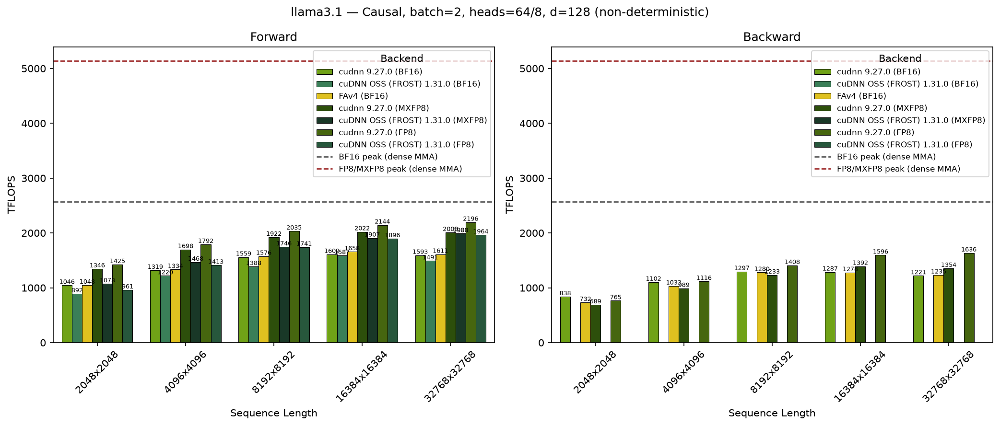
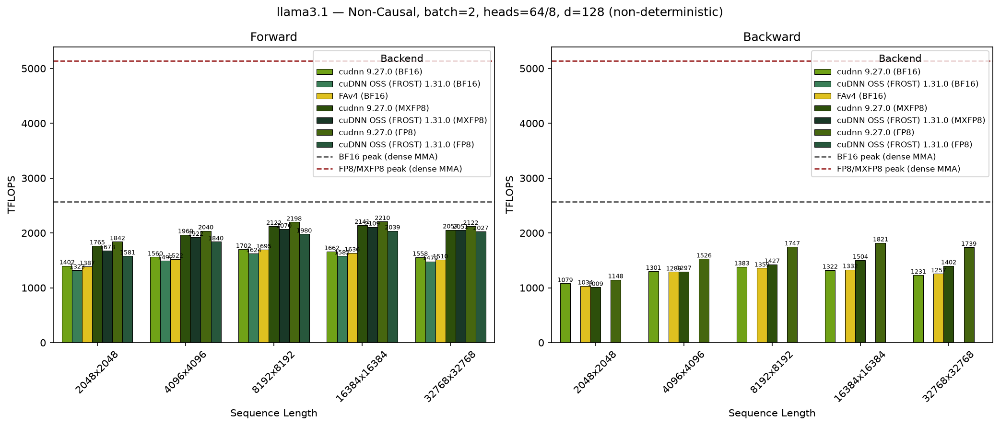
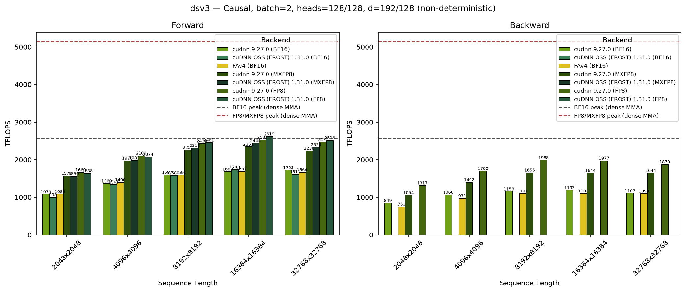
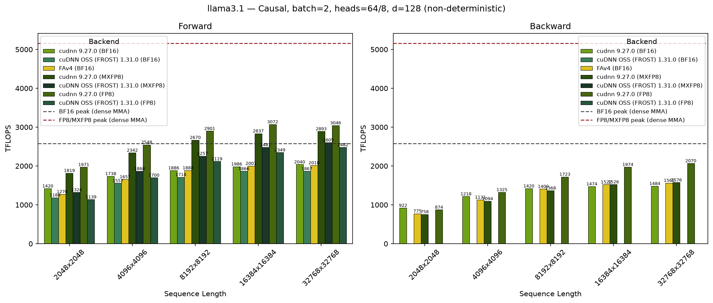
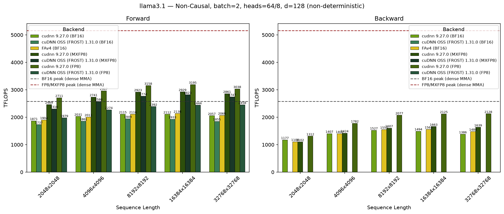
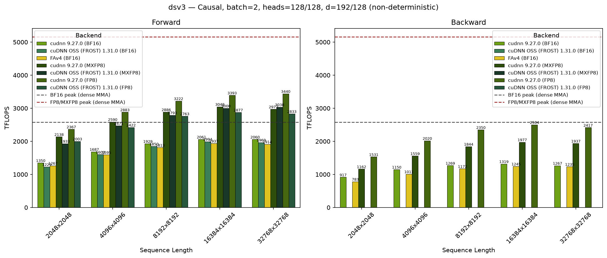

# Attention

## Scaled Dot Product Attention

This operation computes the scaled dot product attention (SDPA), as

$\text{Attention}(Q, K, V) = \text{softmax}\left(\frac{QK^T}{\sqrt{d}}\right)V$

using the FlashAttention-2 algorithm as described in the paper [FlashAttention-2: Faster Attention with Better Parallelism and Work Partitioning](https://arxiv.org/abs/2307.08691). It is applicable for both training and inference phases, with an option to generate a stats tensor to be used for backwards training computation.


## Support Matrix

cudnn SDPA operation requires SM80 (Ampere) or newer architectures and cuda toolkit 12.x or newer.

The support matrix is based on the latest cudnn backend version 9.18.1


| Arch <br /> | Datatype  <br />  | Layout  <br />                      | Paged  <br />  Attn| Masking     | Deterministic | Head dim |  
|-----------|-------------|-------------------------------|----------|-------------------------------------------| ------------- | ---- | 
| Ampere/Ada <br /> (Prefill) |  fp16, bf16 | BHSD, BSHD, Interleaved¹, <br /> Padded², Ragged³ | Yes | Yes⁴ | Yes | d &lt;= 256 | 
| Ampere/Ada <br /> (Decode)  |  fp16, bf16 | BHSD, BSHD, Interleaved, <br /> Padded, Ragged | Yes | Yes | Yes | d &lt;= 128  |
| Ampere/Ada <br /> (Bprop)   |  fp16, bf16 | BHSD, BSHD, Interleaved, <br /> Padded, Ragged | NA | Yes | Yes | d &lt;= 128 |
||
| Hopper <br /> (Prefill)      |  fp8, fp16, bf16 | BHSD, BSHD, Interleaved, <br /> Padded, Ragged | Yes | Yes | Yes | d &lt;= 256⁵ <br /> (d_qk = 192, d_vo = 128)|
| Hopper <br /> (Decode)       |  fp8, fp16, bf16 | BHSD, BSHD, Interleaved, <br /> Padded, Ragged | Yes | Yes | Yes | d &lt;= 256 <br /> (d_qk = 192, d_vo = 128)|
| Hopper <br /> (Bprop)        |  fp8, fp16, bf16 | BHSD, BSHD, Interleaved, <br /> Padded, Ragged | NA | Yes | Yes | d &lt;= 256 <br /> (d_qk = 192, d_vo = 128)|
||
| Blackwell (B200/B300) <br /> (Prefill)     |  fp8, fp16, bf16 | BHSD, BSHD, Interleaved, <br /> Padded, Ragged | Yes | Yes  | Yes | d &lt;= 256 <br /> (d_qk = 192, d_vo = 128) |
| Blackwell (B200/B300) <br /> (Decode)      |  fp8, fp16, bf16 | BHSD, BSHD, Interleaved, <br /> Padded, Ragged | Yes | Yes | Yes | d &lt;= 128 <br /> (d_qk = 192, d_vo = 128) |
| Blackwell (B200/B300) <br /> (Bprop)       |  fp8, fp16, bf16 | BHSD, BSHD, Interleaved, <br /> Padded, Ragged | NA | Yes | Yes  | d &lt;= 128 <br /> (d_qk = 192, d_vo = 128) <br /> (d_qk = 256, d_vo = 256)|
||
| Blackwell (Consumer) <br /> (Prefill) |  fp16, bf16 | BHSD, BSHD, Interleaved, <br /> Padded, Ragged | Yes | Yes | Yes | d &lt;= 256  |
| Blackwell (Consumer) <br /> (Decode)  |  fp16, bf16 | BHSD, BSHD, Interleaved, <br /> Padded, Ragged | Yes | Yes | Yes | d &lt;= 128 <br /> (d_qk = 192, d_vo = 128)|
| Blackwell (Consumer) <br /> (Bprop)   |  fp16, bf16 | BHSD, BSHD, Interleaved, <br /> Padded, Ragged | NA | Yes | Yes | d &lt;= 128 |


### Glossary
¹ Interleaved q,k,v tensors. Generally they have layouts as BS3HD, B3SHD.

² Padded, variable length sequences (requires padding mask). When sequences in a batch have different lengths, use `use_padding_mask=True` with sequence length tensors.

&nbsp;&nbsp; *Setup:* <br />
    &nbsp;&nbsp; - Set `use_padding_mask=True`  
    &nbsp;&nbsp; -  Provide `seq_len_q` tensor of shape `(B, 1, 1, 1)` with actual query sequence lengths  
    &nbsp;&nbsp; -  Provide `seq_len_kv` tensor of shape `(B, 1, 1, 1)` with actual key/value sequence lengths  

&nbsp;&nbsp; *Example:*<br />
&nbsp;&nbsp; Batch with sequences "aa" (length 2) and "bbb" (length 3), max length `S=8`:
  - `seq_len_q = [2, 3]`
  - `seq_len_kv = [2, 3]`
    ```
    Q[b=0] = aa000000  (6 padding tokens)
    Q[b=1] = bbb00000  (5 padding tokens)
    ```
  - Dimensions: $[B=2, H=1, S=8, D=64]$
  - Strides: $[512, 64, 64, 1]$ (standard BHSD)

&nbsp;&nbsp; cuDNN automatically masks out padding tokens during attention computation.

³ Ragged Layout.

&nbsp;&nbsp; For memory efficiency, variable-length sequences can be **packed** together without padding. This is called THD layout where $T = \sum(\text{seq\_len})$ is the total number of valid tokens.

&nbsp;&nbsp; **Requirements:**
- Must set ragged offset tensor via `tensor.set_ragged_offset(ragged_offset_tensor)`

&nbsp;&nbsp; **Ragged Offset Tensor:**
- Shape: $(B + 1, 1, 1, 1)$
- Contains cumulative token offsets in **elements** (not bytes)
- Last element is the total number of tokens

&nbsp;&nbsp; **Ragged Offset Multiplier (cuDNN 9.24+, UNIFIED forward only):**
- `tensor.set_ragged_offset_multiplier(value)` lets the ragged offsets be stored in coarser units; the engine multiplies each offset by `value` to recover element offsets.
- `max_total_seq_len_q` / `max_total_seq_len_kv` declare the **packed token totals** of the ragged Q and K/V. A ragged tensor's dims stay `(B, H, S_max, D)` and the per-sequence starts live in a device-side offset tensor, so the packed total is not otherwise expressible in the graph. Supplying it lets the implementation bound the token axis exactly rather than inferring an upper bound from the bound buffers' extents — which matters when a buffer is allocated larger than the tokens it holds, since rows past the real total are masked but still take part in `P @ V` and so must be finite. The values only ever tighten the inferred bound, never widen it, and are accepted only on a ragged layout. `sdpa_backward` has taken the same two arguments since cuDNN 9.6.
- Example: with a multiplier of $H \times D$, a token-unit cumulative-sequence-length tensor (e.g. `cu_seq_len_q`) can be bound directly as the ragged offset, avoiding a conversion pass.

&nbsp;&nbsp; **Memory Layout visualization:**

  &nbsp;&nbsp;&nbsp;&nbsp; *Example:*

  &nbsp;&nbsp;&nbsp;&nbsp; Same sequences "aa" and "bbb" packed together:<br />
  - `seq_len_q = [2, 3]`<br />
  - `seq_len_kv = [2, 3]`<br />

      ```
      Q = aabbb  (no padding, T=5 total tokens)
      ```

  - Dimensions: $[B=2, H=1, S=8, D=64]$ (S is still max sequence length)
  - Strides: $[512, 64, 64, 1]$ (strides unchanged, but ignored for ragged)
  - **Ragged offset:** $[0, 2 \times H \times D, 5 \times H \times D] = [0, 128, 320]$

  &nbsp;&nbsp;&nbsp;&nbsp; *Partially Packed Layout:*<br />
  
  &nbsp;&nbsp;&nbsp;&nbsp; Tokens within each batch can be contiguous without being globally packed.<br />

  - Ragged offset: $[0, 4 \times H \times D, 7 \times H \times D] = [0, 256, 448]$
      ```
      Q = aa00bbb0  (batch 0 at offset 0, batch 1 at offset 4)
      ```

  &nbsp;&nbsp;&nbsp;&nbsp; *Not Supported:*<br />

  &nbsp;&nbsp;&nbsp;&nbsp; Tokens that are not contiguous within a batch cannot be represented.

  - `seq_len_q = [2, 3]`
      ```
      Q = a0abbb00bb000000  (tokens interleaved - NOT SUPPORTED)
      ```
&nbsp;&nbsp; **Note that Q,K,V and their gradients can be individually ragged or not.**<br /> 

&nbsp;&nbsp; **Backward Pass with THD:**

&nbsp;&nbsp; When using THD layout with cudnn,  maximum total tokens are needed  for efficient workspace allocation. If not set, defaults to $B \times S$ which may overallocate memory.

⁴ None, Causal, Sliding window, Additive Bias, Softcap, Arbitrary masking.

⁵ d_qo should be equal to d_kv. (Except when d_qk == 192 and d_vo = 128, which is also supported.)

### Important Notes on Support Surface
1. All attention flavors MHA, MQA, GQA are supported.
2. The head dim (d) should be a multiple of 8 for fp16/bf16 and multiple of 16 for fp8 data-types.
3. The seqlens s_q, and s_kv can have arbitrary value.
4. The layout of q,k,v,o and dq, dk, dv, do can be independent of each other.
5. **Dropout**: Randomly zeros some of the attention weights after the softmax as a form of regularization.
    You can configure dropout in two ways:
    - **Philox RNG dropout** (more performant): Provide:
      - An RNG seed tensor (INT32 or INT64)
      - An RNG offset tensor (INT32 or INT64)
      - A float representing the dropout probability (probability that any weight is set to zero)
      - (Debug only) Output RNG dump tensor to capture the generated dropout mask
    - **Custom dropout mask**: Provide:
      - A `dropout mask` tensor matching the attention weights' dimensions. Dimensions set to 1 will broadcast.
      - A `dropout scale` tensor to adjust remaining weights, typically $1 / (1 - \text{dropout probability})$.
6. Stats from fprop is supported (Max, Sum). In addition QKClip required for KimiK2, Qwen are also supported optionally.

## Benchmarks

To run the sdpa benchmarks, refer to [benchmarks/sdpa](https://github.com/NVIDIA/cudnn-frontend/blob/main/benchmark/attention_training/README.md) folder. Current results:

### GB200 - Llama 3.1 Causal (top_left)

- SDPA parameters: `batch=1; num_q_heads=64; num_kv_heads=8; head_dim=128; is_causal=True`
- Sequence lengths shown on x-axis
- Results obtained on NVIDIA GB200 GPU

### GB200 - Llama 3.1 Non-Causal (no_mask)

- SDPA parameters: `batch=1; num_q_heads=64; num_kv_heads=8; head_dim=128; is_causal=False`
- Sequence lengths shown on x-axis
- Results obtained on NVIDIA GB200 GPU

### GB200 - DeepSeek V3 Causal (top_left)

- SDPA parameters: `batch=1; num_q_heads=128; num_kv_heads=128; head_dim_qk=192; head_dim_vo=128; is_causal=True`
- Sequence lengths shown on x-axis
- Results obtained on NVIDIA GB200 GPU

### GB300 - Llama 3.1 Causal (top_left)

- SDPA parameters: `batch=1; num_q_heads=64; num_kv_heads=8; head_dim=128; is_causal=True`
- Sequence lengths shown on x-axis
- Results obtained on NVIDIA GB300 GPU

### GB300 - Llama 3.1 Non-Causal (no_mask)

- SDPA parameters: `batch=1; num_q_heads=64; num_kv_heads=8; head_dim=128; is_causal=False`
- Sequence lengths shown on x-axis
- Results obtained on NVIDIA GB300 GPU

### GB300 - DeepSeek V3 Causal (top_left)

- SDPA parameters: `batch=1; num_q_heads=128; num_kv_heads=128; head_dim_qk=192; head_dim_vo=128; is_causal=True`
- Sequence lengths shown on x-axis
- Results obtained on NVIDIA GB300 GPU

## API
### SDPA FP16/BF16 Forward 

#### C++ API

```cpp
// returns [output, softmax_stats]
std::array<std::shared_ptr<Tensor_attributes>, 2> 
sdpa(std::shared_ptr<Tensor_attributes> q,
     std::shared_ptr<Tensor_attributes> k,
     std::shared_ptr<Tensor_attributes> v,
     SDPA_attributes options);
```

The `options` parameter of type `SDPA_attributes` is used to control the attributes of the forward operation, as detailed below:

```cpp
// Indicates that softmax_stats should be generated (useful during training).
// If false, the softmax_stats output will be nullptr.
SDPA_attributes& set_generate_stats(bool const value);

// Return softmax_stats in base 2, i.e. (max + ln(sum_exp)) * log2(e), instead of the
// default natural-log form max + ln(sum_exp). Matches flash-attention-style
// kernels that fold log2(e) into the softmax scale. Only affects softmax_stats.
SDPA_attributes& set_stats_use_log2(bool const value);

// Indicates whether the kernel should output max of attention score
// and numerically stable sum of exponents using normalized values wrt max score
SDPA_attributes& set_logit_max(std::shared_ptr<Tensor_attributes> value);
SDPA_attributes& set_score_sum_exp(std::shared_ptr<Tensor_attributes> value);

SDPA_attributes& set_attn_scale(std::shared_ptr<Tensor_attributes> value);
SDPA_attributes& set_attn_scale(float const value);

// DEPRECATED
// Calls set_generate_stats(!value) (note the negation of `value`).
SDPA_attributes& set_is_inference(bool const value);

// ========================== BEGIN paged attn options =====================
SDPA_attributes& set_paged_attention_k_table(std::shared_ptr<Tensor_attributes> value);
SDPA_attributes& set_paged_attention_v_table(std::shared_ptr<Tensor_attributes> value);
SDPA_attributes& set_paged_attention_max_seq_len_kv(int const value);
// ==========================  END  paged attn options =====================

// ========================== BEGIN    var len options =====================
SDPA_attributes& set_padding_mask(bool const value);

// integer tensor that specifies the sequence length of each batch
SDPA_attributes& set_seq_len_q(std::shared_ptr<Tensor_attributes> value);
SDPA_attributes& set_seq_len_kv(std::shared_ptr<Tensor_attributes> value);

// integer tensor of shape (B+1, 1, 1, 1) that specifies the cumulative sequence
// lengths (prefix sums, leading 0) of each batch. Mutually exclusive with
// set_seq_len_q/set_seq_len_kv; both tensors must be set together.
// Requires cuDNN 9.24+ and the UNIFIED implementation.
SDPA_attributes& set_cu_seq_len_q(std::shared_ptr<Tensor_attributes> value);
SDPA_attributes& set_cu_seq_len_kv(std::shared_ptr<Tensor_attributes> value);
// ==========================  END     var len options =====================

// ========================== BEGIN score mod options =====================
SDPA_attributes& set_score_mod(std::function<Tensor_t(Graph_t, Tensor_t)>);

// Use in combination to set diagonal masking
SDPA_attributes& set_diagonal_alignment(DiagonalAlignment_t const alignment);
SDPA_attributes& set_diagonal_band_left_bound(int const value);
SDPA_attributes& set_diagonal_band_right_bound(int const value);

// DEPRECATED
// Sets the diagonal position to TOP_LEFT
// calls set_diagonal_band_right_bound(0) if no right_bound was specified
SDPA_attributes& set_causal_mask(bool const value);

// DEPRECATED
// Sets the diagonal position to BOTTOM_RIGHT
// and calls set_diagonal_band_right_bound(0) if no right_bound was specified
SDPA_attributes& set_causal_mask_bottom_right(bool const value);

// DEPRECATED
// calls set_diagonal_band_left_bound(value)
SDPA_attributes& set_sliding_window_length(int const value);

SDPA_attributes& set_bias(std::shared_ptr<Tensor_attributes> value);

SDPA_attributes& set_block_mask(std::shared_ptr<Tensor_attributes> value);

SDPA_attributes& set_alibi_mask(bool const value);
// ==========================  END  score mod options =====================

// ========================== BEGIN   dropout options =====================
SDPA_attributes& set_dropout(float const probability,
                             std::shared_ptr<Tensor_attributes> seed,
                             std::shared_ptr<Tensor_attributes> offset);

SDPA_attributes& set_dropout(std::shared_ptr<Tensor_attributes> mask,
                             std::shared_ptr<Tensor_attributes> scale);

// for debugging dropout mask with seed and offset
SDPA_attributes& set_rng_dump(std::shared_ptr<Tensor_attributes> value);
// ==========================  END    dropout options =====================

// ========================== BEGIN   experimental options ================
// Sets the underlying SDPA implementation to use (default is AUTO).
SDPA_attributes& set_implementation(AttentionImplementation_t value);

// Use unfused mul/add in the softmax computation.
SDPA_attributes& set_unfuse_fma(bool const value);
// ==========================  END    experimental options ================

SDPA_attributes& set_compute_data_type(DataType_t value);
```

#### Python API

```python
graph.sdpa(
    q,                                    # Query tensor
    k,                                    # Key tensor (or container for paged attention)
    v,                                    # Value tensor (or container for paged attention)
    attn_scale=None,                      # Attention scale factor (float or tensor)
    bias=None,                            # Additive bias mask tensor
    block_mask=None,                      # Block mask tensor (128x128 tiles, UNIFIED only)
    use_alibi_mask=False,                 # Enable ALiBi positional encoding
    use_padding_mask=False,               # Enable variable sequence length masking
    seq_len_q=None,                       # Per-batch query sequence lengths
    seq_len_kv=None,                      # Per-batch key/value sequence lengths
    cu_seq_len_q=None,                    # Cumulative query sequence lengths (UNIFIED only)
    cu_seq_len_kv=None,                   # Cumulative key/value sequence lengths (UNIFIED only)
    diagonal_alignment=TOP_LEFT,          # Diagonal alignment: TOP_LEFT or BOTTOM_RIGHT
    diagonal_band_left_bound=None,        # Left bound for sliding window (None = no bound)
    diagonal_band_right_bound=None,       # Right bound for causal mask (0 = causal, None = no bound)
    dropout=None,                         # Dropout config: (prob, seed, offset) or (mask, scale)
    rng_dump=None,                        # Debug: output tensor for RNG dropout mask
    paged_attention_k_table=None,         # Page table for K container
    paged_attention_v_table=None,         # Page table for V container
    paged_attention_max_seq_len_kv=None,  # Max KV sequence length for paged attention
    max_total_seq_len_q=None,             # Packed token total for Q (ragged tensors)
    max_total_seq_len_kv=None,            # Packed token total for KV (ragged tensors)
    generate_stats=None,                  # Output softmax stats for training (True/False)
    stats_use_log2=False,                 # Return stats as (max + ln(sum_exp)) * log2(e) instead of max + ln(sum_exp)
    implementation=AUTO,                  # SDPA implementation: AUTO, COMPOSITE, UNIFIED
    unfuse_fma=False,                     # Use unfused mul/add in the softmax computation
    softmax_precision=None,               # Softmax exponent precision: FLOAT (default) or HALF (FROST FP8 / MXFP8 engines, cc 10.7)
    attn_scale_prefolded=False,           # Q already carries attn_scale * log2(e); the engine applies no scale (FROST engines, cc 10.7)
    compute_data_type=NOT_SET,            # Computation data type
    name=None,                            # Operation name
)
```

**Args:**
- `q` (cudnn_tensor): The query data with shape $(B, H_q, S_q, D_{qk})$.
- `k` (cudnn_tensor): The key data. When `paged_attention_k_table` is provided, this is a container of non-contiguous key blocks.
- `v` (cudnn_tensor): The value data. When `paged_attention_v_table` is provided, this is a container of non-contiguous value blocks.
- `attn_scale` (Optional[Union[float, cudnn_tensor]]): Scale factor for attention scores. Typically $\frac{1}{\sqrt{d}}$. Default is None (no scaling).
- `bias` (Optional[cudnn_tensor]): Additive bias mask for attention scores. Supports broadcasting.
- `block_mask` (Optional[cudnn_tensor]): Block-level mask for 128x128 tiles. Only supported with UNIFIED implementation. On SM10x, the native backend requires cuDNN 9.26.0 or newer: older kernels can return NaNs when the first KV tile is masked out. This restriction is checked during native validation/planning; ordinary attention and FROST admission are unaffected. Because mask contents may change between executions, the requirement applies to every graph with a block-mask tensor, including one initially containing an all-visible mask.
- `use_alibi_mask` (Optional[bool]): Enable ALiBi (Attention with Linear Biases) positional encoding. Requires `diagonal_band_right_bound=0`.
- `use_padding_mask` (Optional[bool]): Enable variable sequence length masking. Must also provide a Q-side and a KV-side length tensor, each in per-batch (`seq_len_q`/`seq_len_kv`) or cumulative (`cu_seq_len_q`/`cu_seq_len_kv`) form.
- `seq_len_q` (Optional[cudnn_tensor]): Per-batch query sequence lengths with shape $(B, 1, 1, 1)$.
- `seq_len_kv` (Optional[cudnn_tensor]): Per-batch key/value sequence lengths with shape $(B, 1, 1, 1)$.
- `cu_seq_len_q` (Optional[cudnn_tensor]): Cumulative query sequence lengths (prefix sums with a leading 0) with shape $(B+1, 1, 1, 1)$ or 1-D $(B+1,)$ (promoted automatically), int32 or int64. Mutually exclusive with `seq_len_q` (a side cannot use both forms); a KV-side length tensor (`seq_len_kv` or `cu_seq_len_kv`) must also be provided, and `use_padding_mask=True` is required. The two sides may use different forms (e.g. `cu_seq_len_q` with `seq_len_kv`), which requires cuDNN 9.25+. Supplying `cu_seq_len_q` requires cuDNN 9.24+ and the UNIFIED implementation.
- `cu_seq_len_kv` (Optional[cudnn_tensor]): Cumulative key/value sequence lengths; same shape, type, and constraints as `cu_seq_len_q`.
- `diagonal_alignment` (Optional[cudnn.diagonal_alignment]): Alignment for diagonal masking. `TOP_LEFT` for standard causal, `BOTTOM_RIGHT` for prefix-LM style.
- `diagonal_band_left_bound` (Optional[int]): Left bound for sliding window attention. Masks columns at or before `row_idx - left_bound`.
- `diagonal_band_right_bound` (Optional[int]): Right bound for causal masking. Set to 0 for causal mask. Masks columns beyond `row_idx + right_bound`.
- `dropout` (Optional[tuple]): Dropout configuration. Either `(probability, seed, offset)` for Philox RNG or `(mask, scale)` for custom mask.
- `rng_dump` (Optional[cudnn_tensor]): Debug tensor to capture the Philox RNG dropout mask.
- `paged_attention_k_table` (Optional[cudnn_tensor]): Page table with block offsets into the K container.
- `paged_attention_v_table` (Optional[cudnn_tensor]): Page table with block offsets into the V container.
- `paged_attention_max_seq_len_kv` (Optional[int]): Maximum sequence length for K/V caches. Recommended when using paged attention.
- `generate_stats` (Optional[bool]): If True, output softmax statistics for backward pass. Required for training.
- `stats_use_log2` (Optional[bool]): If True, `stats` is returned in base 2, $\log_2(e)\,[\max + \ln(\sum e^{s - \max})]$, instead of the default natural-log form $\max + \ln(\sum e^{s - \max})$. This is the convention of flash-attention-style kernels (FA2/FA3, TRT-LLM) that fold $\log_2 e$ into the softmax scale, so consumers that mix LSE tensors from several backends (cascade/split-KV merges, speculative decoding) get one convention without an extra elementwise pass. Only affects `stats`; `score_max` and `score_sum_exp` are unchanged, and `sdpa_backward` still expects natural-log stats. Served by the FROST SDPA engines and, on cuDNN 9.27.0+, by both the `UNIFIED` and `COMPOSITE` implementations (`CUDNN_ATTR_OPERATION_SOFTMAX_STATS_LOG2` on the softmax operation descriptor used by both implementations); on older backends both decline it at validation, so only a FROST engine can serve it there.
- `implementation` (Optional[cudnn.attention_implementation]): SDPA implementation to use. `AUTO` (default), `COMPOSITE`, or `UNIFIED`.
- `unfuse_fma` (Optional[bool]): Use unfused mul/add in the softmax computation.
- `softmax_precision` (Optional[cudnn.data_type]): Precision of the softmax exponent and probability path. `None` (the default) is the f32 pipeline every engine runs and leaves the engine choice open. `HALF` asks for the f16x2 exponent arm of the FROST FP8 and MXFP8 forward engines on cc 10.7 (head-dim flavors 128, 192x128, 256 and 512): the exponent runs on packed f16 pairs and P is cast from f16 straight to the FP8 pair format, halving the transcendental work of the softmax warps. Numerics-changing (P moves by about one f16 ulp of the exponent), so it is an op attribute rather than a tuning knob: the cuDNN backend has no field for it, a set value keeps the graph on the python engines (`serialize()` and `key()` refuse it), and an engine without the arm declines instead of degrading. An explicit `FLOAT` is also a set value: it selects the f32 pipeline on the python engines only, so omit the attribute unless that is intended. `stats`, when requested, always come from the exact f32 row sum; on the d256 and d512 FP8 / MXFP8 kernels (which normalize O with a register row sum) a HALF forward without `stats` normalizes O with an f16 pair sum of the stored probabilities instead, so on those flavors O under HALF is not bit-identical with and without `generate_stats` (both within the family bound; d128, d192x128 and the FLOAT pipeline are unaffected). Forward only: `sdpa_backward` declines it. The f16 arm rounds the exponent argument to f16 before the FP8 cast of P, so a probability within one f16 rounding step of an FP8 code midpoint can land one code away from the f32 pipeline's (one E5M2 code is a 25 % step, one E4M3 code 12.5 %); on O that is at most one code step of that key's weight times its V -- rare, bounded, and budgeted by the FP8 test harnesses like the f32 pipeline's own midpoint flips.
- `attn_scale_prefolded` (Optional[bool]): Declares that Q was already multiplied by `attn_scale * log2(e)` (before quantization for FP8 / MXFP8 inputs), so the engine applies no softmax scale; `attn_scale` must stay unset. Served by the FROST MXFP8 and f16/bf16 forward engines on cc 10.7 (head-dim flavors 128, 192x128, 256 and 512; not over paged KV; not on per-tensor FP8, whose kernels fold the descale factors into the softmax scale). `stats` keep their usual form. On a graph without `stats`, `attn_scale_prefolded=True` together with `softmax_precision=HALF` fuses the per-score shift and the f32-to-f16 convert into one instruction per pair (measured 6-7 % faster on the d128 MXFP8 kernel at 32k context). `False` (or `0`) is the default and counts as unset. Forward only: `sdpa_backward` declines it.
- `compute_data_type` (Optional[cudnn.data_type]): Data type for internal computation.
- `name` (Optional[str]): Name for the operation.

**Returns:**
- `o` (cudnn_tensor): The output attention data with shape $(B, H_q, S_q, D_v)$.
- `stats` (Optional[cudnn_tensor]): Softmax statistics with shape $(B, H_q, S_q, 1)$ when `generate_stats=True`. Natural log by default ($\max + \ln \sum e^{s - \max}$); base 2 when `stats_use_log2=True`.

#### Configurable Options

- **Attention scale** (`attn_scale`): Applies a scaling factor to attention scores before the softmax, such as $\frac{1}{\sqrt{\text{d}}}$. Set to 1.0 by default. Can be passed as a float or as a tensor.

- **Bias mask**: Applies an additive bias mask to attention scores. You must pass a bias tensor as specified in the tensors section below. The dimensions that are passed as 1 will apply a broadcasted mask over attention scores.

- **Block mask**: Masks out tiles of attention scores at a 128x128 block granularity. The block mask is a uint8 tensor where each bit represents whether a 128x128 tile should be computed (1) or masked out (0). This is supported with the UNIFIED implementation.

- **ALiBi mask**: Attention with Linear Biases (ALiBi) is an additive mask applied to the attention scores as described in the paper [Train Short, Test Long: Attention with Linear Biases Enables Input Length Extrapolation](https://arxiv.org/abs/2108.12409). When using ALiBi, `diagonal_band_right_bound` must be set to exactly 0 (causal masking).

- **Padding mask** (Variable Sequence Length): Masks out padded time steps to ignore them in computation. You must pass per-batch sequence length tensors as specified in the tensors section below. In padded or ragged layout (discussed below) where the actual seqlen can be less than the max seqlens of a graph, certain batches can be skipped by setting the actual seqlen of the corresponding batch to 0.

- **Diagonal masking options**: These options control causal and sliding window masking:

- **Diagonal Alignment** (`diagonal_alignment`): Specifies where the diagonal starts. Options are:
  - `TOP_LEFT`: The diagonal starts at the top-left of the attention matrix. Used for standard causal masking.
  - `BOTTOM_RIGHT`: The diagonal starts at the bottom-right of the attention matrix, aligned with the actual sequence length. Useful for prefix-LM or when $S_q \neq S_{kv}$.

- **Diagonal Band Right Bound** (`diagonal_band_right_bound`): Specifies that attention scores beyond column `row_idx + right_bound` are masked with negative infinity. Setting this to 0 enables causal masking.

- **Diagonal Band Left Bound** (`diagonal_band_left_bound`): Specifies that attention scores at or before column `row_idx - left_bound` are masked with negative infinity. This enables sliding window attention.

- **Common masking patterns**:
  - Causal mask (top-left): `diagonal_alignment=TOP_LEFT`, `right_bound=0`
  - Causal mask (bottom-right): `diagonal_alignment=BOTTOM_RIGHT`, `right_bound=0`
  - Sliding window: Set `left_bound` to window size
  - Band attention: Set both `left_bound` and `right_bound`

- **Paged attention**: Enables non-contiguous K/V caches to reduce memory fragmentation. See the [PagedAttention paper](https://arxiv.org/abs/2309.06180).
  - **Requirements**:
    - Pass `page_table_k` tensor with block offsets into the K container (optional if K is not paged)
    - Pass `page_table_v` tensor with block offsets into the V container (optional if V is not paged)
    - Pass sequence length tensors (`seq_len_q`, `seq_len_kv`) for padding mask
    - Optionally pass `paged_attention_max_seq_len_kv` for the maximum KV sequence length (recommended)
  - **FROST engines** (opt-in, f16/bf16): paged decode and MTP graphs run a dedicated decode tile instead of the prefill pipeline. On the SM100 line: `S_q * pack_g <= 128` on the d128 flavor (`pack_g` = the packed head group for a PackGQA plan — `H_q/H_kv`, or its largest divisor of 128 — and 1 otherwise; `TILE_CGA_M=1`). On cc 10.7 (Rubin): the d256 flavor's swap-AB decode tile over a dense or a paged cache — PackGQA packs the whole group into the tile's Q rows (24/2 = 12 rows), the KV range splits (dense or paged) through the shared combine, which also applies the fused epilogue gate when the plan splits, and an MTP step rides it in token units (`S_q * G <= 16` packed rows in one unit of the 16-column tile, rows in (16, 32] on the 32-column tile, a packed group in up to two token units). Other shapes run the prefill pipeline. See `python/cudnn/sdpa/frost/SUPPORT_MATRIX_TRACKER.md`. On cc 10.7 (SM107) the f16/bf16 row serves paged KV for packed (THD / ragged-Q) queries on the d128 and d256 flavors, with or without `sink_token` -- prefill- and decode-shaped packed batches (per-request Q of 1 / 4 / 8), GQA with PackGQA, HND and NHD pools -- through the paged prefill pipeline; dense (BSHD) paged queries are declined there except the decode-shaped d256 graphs the decode tile serves (above), and a sink graph is never split on any row.
  - **MXFP8 page pools** (`sdpa_mxfp8` with `paged_attention_*`): the descales are page pools too (`descale_k [num_pages, H_kv, page_size, ceil4(D/32)]`, `descale_v [num_pages, H_kv, page_size/32, D]`, F8_128x4, so `page_size` is a multiple of 128; for D > 128 the `descale_v` planes are D-plane-major across the whole pool); the cuDNN backend has no engine for them -- the FROST MXFP8 engines serve them on the SM100 line (every native flavor, dense queries) and on cc 10.7 (d128 / d256, dense queries, sinks compose); THD (ragged-Q) queries over MXFP8 pools decline on every arch today. See `python/cudnn/sdpa/frost/SUPPORT_MATRIX_TRACKER.md`.
  - **FROST engines** (cc 10.7, f16/bf16): dense d128 graphs whose `S_q * pack_g <= 128` ride the same decode tile (`TILE_CGA_M=1`, the shared body compiled for sm_107a; issue #1472) and dense d128 GQA packs on the shared prefill body under a diagonal band (a mask-free graph whose rows fit the decode tile unpacked rides it unpacked); paged THD queries keep the prefill pipeline there. With `sink_token`, dense d128 decode / verify graphs inside the measured band (bottom-right causal `S_q <= 16` or mask-free `S_q == 1`, GQA 4 / 8 / 16, at least 32 (batch, KV-head) units, caches 1k-16k, no window) are served by these plans by default, without the opt-in flag. Paged THD queries with GQA 4 / 8 / 16 pack by default there, with or without `sink_token`, and a sink no longer changes the scheduling or tile-width choice of a paged THD plan. See `python/cudnn/sdpa/frost/SUPPORT_MATRIX_TRACKER.md`.
  - **Offset calculation**:
    - $K_{cache}[b,h,s,d] = K_{container}[page\_table\_k[b,1,s / bs_k, 1], h, s \mod bs_k, d]$
    - $V_{cache}[b,h,s,d] = V_{container}[page\_table\_v[b,1,s / bs_v, 1], h, s \mod bs_v, d]$
  - **Packed page tables**: Page tables can also use ragged offsets to pack only the necessary block indices, useful for frameworks that prefer packed representations.

- **Implementation**: Select the underlying SDPA implementation:
  - `AUTO` (default): Auto-selects the best implementation. Recommended for most users.
  - `COMPOSITE`: Standard cuDNN graph representing SDPA as distinct operations.
  - `UNIFIED`: Optimized fused SDPA operation (cuDNN 9.13.1+). Supports a subset of features including block masking.

- **Unfuse FMA** (`unfuse_fma`): Uses unfused mul/add in the softmax computation.

- **Generate stats** (`generate_stats`): When `True`, outputs softmax statistics needed for backward pass during training. Set to `True` for training, `False` for inference.

- **Stats in base 2** (`stats_use_log2`): Returns `stats` as $\log_2(e)\,[\max + \ln(\sum e^{s - \max})]$ rather than the natural-log default. The value is exactly the natural-log stats times $\log_2 e$, so it is a convention switch, not a different quantity; the backward pass is unaffected and continues to take natural-log stats.

#### Limitations

- Head dimension must be a multiple of 8.
- ALiBi requires causal masking (`diagonal_band_right_bound=0`).
- Block masking is only supported with the UNIFIED implementation.
- Ampere/Ada architectures are limited to head dimensions up to 256 for prefill, 128 for decode and backward.

#### Fused epilogue gate (FROST, SM107)

A gated attention tail -- the SDPA output multiplied by the sigmoid of a per-element gate tensor `G` of O's shape,
`O_gated = O * sigmoid(G)` -- is built as three graph nodes, an `sdpa` (or `sdpa_fp8` / `sdpa_mxfp8`) node followed by
`sigmoid` and `mul` pointwise nodes on `O`. The Rubin d256 FROST forward engines serve the whole tail fused when they
serve the graph: the MXFP8 row (`sdpa_fwd_prefill_sm107_mxfp8`) is offered by default and leads on cc 10.7, so the fused
tail is its default execution; the half row (`sdpa_fwd_prefill_sm107`) is offered by default but its placement keeps the
backend first for dense d256 graphs, which then run the tail unfused as the three nodes -- it serves the tail fused when it
leads the plan list, when the backend declines, or under `CUDNN_FRONTEND_ENABLE_FROST_ENGINES=1`; the FP8 row
(`sdpa_fwd_prefill_sm107_fp8`) serves it under that flag. On the fused path the gate tile is TMA-staged by the kernel's load
warp and applied in the epilogue after the
dead-row select, so the gated `O` (and the quantized `O` on the FP8 / MXFP8 rows) is written once. Served today at
`d_qk = d_v = 256` with a bf16 `G`, dense / unsplit / non-PackGQA / non-paged layouts; any other combination
falls back to the unfused three-node execution -- with one exception on the f16/bf16 engine: a decode-shaped
graph (`S_q` times the packed GQA group within the decode tile's routed rows: 16 in one unit of the 16-column
tile, (16, 32] on the 32-column tile, a packed group in up to two token units) whose plan splits the KV range
runs on the d256 decode tile, and there the gate is applied by the split **combine** on the fp32 merged value
before the single cast (the
same `h * tanh(g / 2) + h` arithmetic as the fused epilogue: one rounding, so the split and the unsplit gated
plans differ only by the attention's summation order), over a dense or a paged cache, packed or not -- not when the graph enables
execute-time shape overrides (the combine binds `G` to the declared shape; such a graph keeps the unsplit fused kernel). Two
contracts hold on the fused path: `Stats` (LSE) is
independent of `G`, and `Amax_O` -- an output of the `sdpa` node, which precedes the gate on the graph -- is the
amax of the **un-gated** normalised `O` (in `scale_o` units on FP8, unscaled on MXFP8), while the stored `O` is
the gated value. The per-engine claims are tracked in
[`python/cudnn/sdpa/frost/SUPPORT_MATRIX_TRACKER.md`](../../python/cudnn/sdpa/frost/SUPPORT_MATRIX_TRACKER.md).

```python
o, stats = graph.sdpa(name="sdpa", q=q, k=k, v=v, is_inference=False, attn_scale=scale, use_causal_mask=True)
o.set_dim(o_dims).set_stride(o_strides)          # the sdpa output stays VIRTUAL but declared; the mul output is the real O
gate = graph.tensor(name="gate", dim=o_dims, stride=o_strides, data_type=cudnn.data_type.BFLOAT16)
o_gated = graph.mul(a=o, b=graph.sigmoid(input=gate, name="sig"), name="gated")   # the tail the engine fuses
o_gated.set_output(True).set_dim(o_dims).set_stride(o_strides).set_data_type(cudnn.data_type.BFLOAT16)
```

The same fusion is reachable without the graph API through the
[gated attention block](../fe-oss-apis/gated_attention_block.md) (`fuse_gate=True`).

#### Tensors
##### Input Tensors

| Tensor Name                                    | Device     | Data Type      | Dimensions                                                                                                     |
|------------------------------------------------|------------|----------------|----------------------------------------------------------------------------------------------------------------|
| Q                                              | GPU        | FP16 or BF16   | $(B, H_{q}, S_{q}, D_{qk})$                                                                                    |
| K                                              | GPU        | FP16 or BF16   | $(B, H_{k}, S_{kv}, D_{qk})$, or $(num\_blocks_{k}, H_{k}, bs_{k}, D_{qk})$ in case of paged K cache           |
| V                                              | GPU        | FP16 or BF16   | $(B, H_{v}, S_{kv}, D_{v})$, or $(num\_blocks_{v}, H_{v}, bs_{v}, D_{v})$  in case of paged V cache            |
| (Bias mask) Bias Mask                          | GPU        | FP16 or BF16   | $(1, 1, S_{q}, S_{kv})$, $(1, H_{q}, S_{q}, S_{kv})$, $(B, 1, S_{q}, S_{kv})$, or $(B, H_{q}, S_{q}, S_{kv})$  |
| (Padding mask/Paged Caches) Sequence Length Q  | GPU        | INT32          | $(B, 1, 1, 1)$                                                                                                 |
| (Padding mask/Paged Caches) Sequence Length KV | GPU        | INT32          | $(B, 1, 1, 1)$                                                                                                 |
| (Philox RNG Dropout) Seed                      | CPU or GPU | INT32 or INT64 | $(1, 1, 1, 1)$                                                                                                 |
| (Philox RNG Dropout) Offset                    | CPU or GPU | INT32 or INT64 | $(1, 1, 1, 1)$                                                                                                 |
| (Custom Dropout Mask) Mask                     | GPU        | FP16 or BF16   | $(1, 1, S_{q}, S_{kv})$, $(1, H_{q}, S_{q}, S_{kv})$, $(B, 1, S_{q}, S_{kv})$, or $(B, H_{q}, S_{q}, S_{kv})$  |
| (Custom Dropout Mask) Scale                    | GPU        | FP32           | $(1, 1, 1, 1)$                                                                                                 |
| (Packed Layout) Ragged Offset                  | GPU        | INT32          | $(B + 1, 1, 1, 1)$                                                                                             |
| (Paged Attention) Page Table K                 | GPU        | INT32          | $(B, 1, ceil(S_{kv}/bs_{k}), 1)$                                                                               |
| (Paged Attention) Page Table V                 | GPU        | INT32          | $(B, 1, ceil(S_{kv}/bs_{v}), 1)$                                                                               |
| (Paged Attention) Max Sequence Length KV       | CPU        | INT32 or INT64 | $(1, 1, 1, 1)$                                                                                                 |

##### Output Tensors

| Tensor Name                         | Device     | Data Type    | Dimensions                   |
|-------------------------------------|------------|--------------|------------------------------|
| O                                   | GPU        | FP16 or BF16 | $(B, H_{q}, S_{q}, D_{v})$   |
| Stats (training only)               | GPU        | FP32         | $(B, H_{q}, S_{q}, 1)$       |
| (Philox RNG Dropout) RNG Dump       | GPU        | FP32         | $(B, H_{q}, S_{q}, S_{kv})$  |

Where:

- $B$ is the batch size
- $H_{q}$ is the number of query heads
- $H_{k}$ is the number of key heads
- $H_{v}$ is the number of value heads
- $S_{q}$ is the sequence length of the query
- $S_{kv}$ is the sequence length of the key and value
- $D_{qk}$ is the embedding dimension per head of query and key
- $D_{v}$ is the embedding dimension per head of value
- $bs_{k}$ is the (power of 2) block size of the K container
- $bs_{v}$ is the (power of 2) block size of the V container
- $num\_blocks_{k}$ is the number of blocks in the K container
- $num\_blocks_{v}$ is the number of blocks in the V container


#### Samples and Tests

- Python forward sample: [samples/python/50_sdpa_forward.ipynb](https://github.com/NVIDIA/cudnn-frontend/blob/main/samples/python/50_sdpa_forward.ipynb)

- Python backward sample: [samples/python/51_sdpa_backward.ipynb](https://github.com/NVIDIA/cudnn-frontend/blob/main/samples/python/51_sdpa_backward.ipynb)

- Python prefill sample with paged caches: [samples/python/52_sdpa_with_paged_caches.ipynb](https://github.com/NVIDIA/cudnn-frontend/blob/main/samples/python/52_sdpa_with_paged_caches.ipynb)

- Python decode sample with packed paged caches: [samples/python/53_sdpa_decode_with_paged_caches.ipynb](https://github.com/NVIDIA/cudnn-frontend/blob/main/samples/python/53_sdpa_decode_with_paged_caches.ipynb)

- C++ sample: [samples/cpp/sdpa](https://github.com/NVIDIA/cudnn-frontend/tree/main/samples/cpp/sdpa)

- Python tests (v2 with randomized configurations): [test/python/sdpa/graph/test_mhas_v2.py](https://github.com/NVIDIA/cudnn-frontend/blob/main/test/python/sdpa/graph/test_mhas_v2.py)


**Example Usage:**

```python
import cudnn
import torch
import math

# Create graph
graph = cudnn.pygraph(
    io_data_type=cudnn.data_type.HALF,
    intermediate_data_type=cudnn.data_type.FLOAT,
    compute_data_type=cudnn.data_type.FLOAT,
)

# Create tensor descriptors
q = graph.tensor_like(q_gpu)
k = graph.tensor_like(k_gpu)
v = graph.tensor_like(v_gpu)

# Forward pass with causal masking
o, stats = graph.sdpa(
    name="sdpa",
    q=q,
    k=k,
    v=v,
    attn_scale=1.0 / math.sqrt(d),
    generate_stats=True,                          # For training
    diagonal_band_right_bound=0,                  # Causal mask
    diagonal_alignment=cudnn.diagonal_alignment.TOP_LEFT,
)

o.set_output(True).set_dim(shape_o).set_stride(stride_o)
stats.set_output(True).set_data_type(cudnn.data_type.FLOAT)

# Build and execute
graph.build([cudnn.heur_mode.A, cudnn.heur_mode.FALLBACK])
```
### SDPA FP16/BF16 Backward

This operation computes gradient tensors for scaled dot product attention (SDPA) using the FlashAttention-2 algorithm as described in the paper [FlashAttention-2: Faster Attention with Better Parallelism and Work Partitioning](https://arxiv.org/abs/2307.08691). You are required to pass the stats tensor from the forward operation to the backward operation as input.

#### C++ API
```cpp
// returns [dQ, dK, dV]
std::array<std::shared_ptr<Tensor_attributes>, 3>
sdpa_backward(std::shared_ptr<Tensor_attributes> q,
              std::shared_ptr<Tensor_attributes> k,
              std::shared_ptr<Tensor_attributes> v,
              std::shared_ptr<Tensor_attributes> o,
              std::shared_ptr<Tensor_attributes> dO,
              std::shared_ptr<Tensor_attributes> stats,
              SDPA_backward_attributes);
```

The `options` parameter of type `SDPA_backward_attributes` is used to control the attributes of backward operation, as detailed below:

```cpp
SDPA_backward_attributes& set_attn_scale(std::shared_ptr<Tensor_attributes> value);
SDPA_backward_attributes& set_attn_scale(float const value);

// ========================== BEGIN    var len options =====================
SDPA_backward_attributes& set_padding_mask(bool const value);

// integer tensor that specifies the sequence length of each batch
SDPA_backward_attributes& set_seq_len_q(std::shared_ptr<Tensor_attributes> value);
SDPA_backward_attributes& set_seq_len_kv(std::shared_ptr<Tensor_attributes> value);

// Token-axis capacity bounds, including gaps between sequences, used for workspace allocation
SDPA_backward_attributes& set_max_total_seq_len_q(int64_t const value);
SDPA_backward_attributes& set_max_total_seq_len_kv(int64_t const value);
// ==========================  END     var len options =====================

// ========================== BEGIN score mod options =====================
SDPA_backward_attributes& set_score_mod(std::function<Tensor_t(Graph_t, Tensor_t)>);

// Use in combination to set_diagonal_alignment to set (bottom right) causal masking
SDPA_backward_attributes& set_diagonal_alignment(DiagonalAlignment_t const alignment);
SDPA_backward_attributes& set_diagonal_band_left_bound(int const value);
SDPA_backward_attributes& set_diagonal_band_right_bound(int const value);

// DEPRECATED
// Sets the diagonal position to TOP_LEFT
// calls set_diagonal_band_right_bound(0) if no right_bound was specified
SDPA_backward_attributes& set_causal_mask(bool const value);

// DEPRECATED
// Sets the diagonal position to BOTTOM_RIGHT
// and calls set_diagonal_band_right_bound(0) if no right_bound was specified
SDPA_backward_attributes& set_causal_mask_bottom_right(bool const value);

// DEPRECATED
// calls set_diagonal_band_left_bound(value)
SDPA_backward_attributes& set_sliding_window_length(int const value);

SDPA_backward_attributes& set_bias(std::shared_ptr<Tensor_attributes> value);
SDPA_backward_attributes& set_dbias(std::shared_ptr<Tensor_attributes> value);

SDPA_backward_attributes& set_alibi_mask(bool const value);
// ==========================  END  score modoptions =====================

// ========================== BEGIN   dropout options =====================
SDPA_backward_attributes& set_dropout(float const probability,
                                      std::shared_ptr<Tensor_attributes> seed,
                                      std::shared_ptr<Tensor_attributes> offset);
SDPA_backward_attributes& set_dropout(std::shared_ptr<Tensor_attributes> mask,
                                      std::shared_ptr<Tensor_attributes> scale,
                                      std::shared_ptr<Tensor_attributes> scale_inv);

// for debugging dropout mask with seed and offset
SDPA_backward_attributes& set_rng_dump(std::shared_ptr<Tensor_attributes> value);
// ==========================  END    dropout options =====================

SDPA_backward_attributes& set_deterministic_algorithm(bool const value);

SDPA_backward_attributes& set_compute_data_type(DataType_t const value);

```

#### Python API

```python
graph.sdpa_backward(
    q,                                    # Query tensor from forward pass
    k,                                    # Key tensor from forward pass
    v,                                    # Value tensor from forward pass
    o,                                    # Output tensor from forward pass
    dO,                                   # Gradient of output
    stats,                                # Softmax statistics from forward pass
    attn_scale=None,                      # Attention scale factor (must match forward)
    bias=None,                            # Bias tensor from forward pass
    dBias=None,                           # Output tensor for bias gradient
    use_alibi_mask=False,                 # Enable ALiBi (must match forward)
    use_padding_mask=False,               # Enable variable sequence length masking
    seq_len_q=None,                       # Per-batch query sequence lengths
    seq_len_kv=None,                      # Per-batch key/value sequence lengths
    max_total_seq_len_q=None,             # Q-side token capacity, including inter-sequence gaps
    max_total_seq_len_kv=None,            # KV-side token capacity, including inter-sequence gaps
    diagonal_alignment=TOP_LEFT,          # Diagonal alignment (must match forward)
    diagonal_band_left_bound=None,        # Left bound (must match forward)
    diagonal_band_right_bound=None,       # Right bound (must match forward)
    dropout=None,                         # Dropout config (must match forward)
    use_deterministic_algorithm=False,    # Force deterministic gradient computation
    compute_data_type=NOT_SET,            # Computation data type
    name=None,                            # Operation name
)
```

**Args:**
- `q` (cudnn_tensor): The query data from the forward pass.
- `k` (cudnn_tensor): The key data from the forward pass.
- `v` (cudnn_tensor): The value data from the forward pass.
- `o` (cudnn_tensor): The output data from the forward pass.
- `dO` (cudnn_tensor): The gradient of the loss with respect to the output.
- `stats` (cudnn_tensor): The softmax statistics tensor from the forward pass (`generate_stats=True`).
- `attn_scale` (Optional[Union[float, cudnn_tensor]]): The attention scale factor. Must match the forward pass.
- `bias` (Optional[cudnn_tensor]): The bias tensor from the forward pass.
- `dBias` (Optional[cudnn_tensor]): Output tensor to store the bias gradient.
- `use_alibi_mask` (Optional[bool]): Enable ALiBi. Must match the forward pass configuration.
- `use_padding_mask` (Optional[bool]): Enable variable sequence length masking. Must match forward pass.
- `seq_len_q` (Optional[cudnn_tensor]): Per-batch query sequence lengths.
- `seq_len_kv` (Optional[cudnn_tensor]): Per-batch key/value sequence lengths.
- `max_total_seq_len_q` (Optional[int]): Token-axis capacity bound for the ragged Q side, including gaps between sequences. Used for workspace allocation. The bound must cover the token positions addressed by Q, O, dO, Stats and dQ. Defaults to `None` (no explicit packed-capacity bound).
- `max_total_seq_len_kv` (Optional[int]): Token-axis capacity bound for the ragged K/V side, including gaps between sequences. Used for workspace allocation. The bound must cover the token positions addressed by K, V, dK and dV. Defaults to `None` (no explicit packed-capacity bound).
- `diagonal_alignment` (Optional[cudnn.diagonal_alignment]): Must match the forward pass.
- `diagonal_band_left_bound` (Optional[int]): Must match the forward pass.
- `diagonal_band_right_bound` (Optional[int]): Must match the forward pass.
- `dropout` (Optional[tuple]): Dropout configuration. Must match the forward pass to ensure the same dropout mask is applied.
- `use_deterministic_algorithm` (Optional[bool]): If True, forces deterministic gradient computation. This ensures bitwise-identical results across multiple runs but may be slower. Default is False.
- `compute_data_type` (Optional[cudnn.data_type]): Data type for internal computation.
- `name` (Optional[str]): Name for the operation.

**Returns:**
- `dQ` (cudnn_tensor): The gradient with respect to the query tensor.
- `dK` (cudnn_tensor): The gradient with respect to the key tensor.
- `dV` (cudnn_tensor): The gradient with respect to the value tensor.

**Important Notes:**
- The backward operation does NOT support paged attention. K and V must be contiguous tensors.
- All masking and dropout configurations must exactly match the forward pass to ensure correct gradients.
- Omitting a bound is not equivalent to explicitly passing $B \times S_q$ or $B \times S_{kv}$. With no bound, the native backward path uses padded intermediate workspace layouts instead of copying ragged offsets into those intermediates. Behavior depends on the engine and backend: the native path discards explicit bounds on cuDNN older than 9.6.0, when a head dimension is not a multiple of 16, and on SM8x/SM12x GPUs with cuDNN 9.18.1 or newer, falling back to padded layouts; some FROST THD backward engines reject graphs that do not declare both totals. Where a bound is kept, it enables packed intermediate layouts and must cover their addressed span.
- When setting `max_total_seq_len_q` and `max_total_seq_len_kv`, use an upper bound on the **physical token span**, including gaps and any nonzero starting offset. For a fully packed buffer starting at token zero, the sum of sequence lengths suffices. For a partially packed buffer, use at least `max(start_token[b] + seq_len[b])` over all sequences and all tensors on the corresponding side; convert ragged element offsets to token positions using each tensor's layout first.
- For example, two 128-token sequences beginning at token positions 0 and 256 need a bound of at least **384**, although their lengths sum to 256. Passing 256 can under-allocate intermediate workspace and corrupt gradients or memory. The frontend cannot infer this span while building a graph because ragged offsets reside in device memory.


- Python sample: [samples/python/51_sdpa_backward.ipynb](https://github.com/NVIDIA/cudnn-frontend/blob/main/samples/python/51_sdpa_backward.ipynb)

- C++ sample: [samples/cpp/sdpa](https://github.com/NVIDIA/cudnn-frontend/tree/main/samples/cpp/sdpa)

- Python tests (v2 with randomized configurations): [test/python/sdpa/graph/test_mhas_v2.py](https://github.com/NVIDIA/cudnn-frontend/blob/main/test/python/sdpa/graph/test_mhas_v2.py)

#### Tensors

##### Input Tensors

| Tensor Name           | Device     | Data Type      | Dimensions                 |
|-----------------------|------------|----------------|----------------------------|
| dO                    | GPU        | FP16 or BF16   | $(B, H_{q}, S_{q}, D_{v})$ |

##### Output Tensors

| Tensor Name           | Device     | Data Type    | Dimensions                   |
|-----------------------|------------|--------------|------------------------------|
| dQ                    | GPU        | FP16 or BF16 | $(B, H_{q}, S_{q}, D_{qk})$  |
| dK                    | GPU        | FP16 or BF16 | $(B, H_{k}, S_{kv}, D_{qk})$ |
| dV                    | GPU        | FP16 or BF16 | $(B, H_{v}, S_{kv}, D_{v})$  |

**Example Usage:**

```python
# Backward pass graph
graph_backward = cudnn.pygraph(
    io_data_type=cudnn.data_type.HALF,
    intermediate_data_type=cudnn.data_type.FLOAT,
    compute_data_type=cudnn.data_type.FLOAT,
)

q = graph_backward.tensor_like(q_gpu)
k = graph_backward.tensor_like(k_gpu)
v = graph_backward.tensor_like(v_gpu)
o = graph_backward.tensor_like(o_gpu)
dO = graph_backward.tensor_like(dO_gpu)
stats = graph_backward.tensor_like(stats_gpu)

dQ, dK, dV = graph_backward.sdpa_backward(
    name="sdpa_backward",
    q=q,
    k=k,
    v=v,
    o=o,
    dO=dO,
    stats=stats,
    attn_scale=attn_scale,
    diagonal_band_right_bound=0,  # Must match forward
    diagonal_alignment=cudnn.diagonal_alignment.TOP_LEFT,
    use_deterministic_algorithm=True,  # For reproducible training
)

dQ.set_output(True).set_dim(q_gpu.shape).set_stride(q_gpu.stride())
dK.set_output(True).set_dim(k_gpu.shape).set_stride(k_gpu.stride())
dV.set_output(True).set_dim(v_gpu.shape).set_stride(v_gpu.stride())
```

### Block Sparse Attention FE OSS API

The experimental [Block Sparse Attention API](../fe-oss-apis/bsa.md) provides
CuTe DSL forward and explicit backward kernels driven by per-query-block lists
of selected key/value blocks. It is a standalone Python FE OSS API and is
separate from the cuDNN Graph API described above.

### HSTU Attention FE OSS API (SM100/SM103)

The experimental [HSTU Attention API](../fe-oss-apis/hstu/hstu_attention.md)
provides packed-variable-length forward and backward CuTe DSL kernels for
Blackwell SM100/SM103 GPUs. HSTU applies SiLU to scaled QK scores without
softmax, supports its specialized mask modes, and exposes the sequence
normalization factor separately as `scaling_seqlen`. FP16 and BF16 arbitrary-mask
forward and backward automatically build private block metadata on the active
CUDA stream without adding public API parameters; D256 backward builds both
Q-to-K and K-to-Q views from one coarse classification.

### Gated Attention Block FE OSS API (SM107)

The experimental [Gated Attention Block API](../fe-oss-apis/gated_attention_block.md) is a model-level FE OSS
API for NVIDIA Rubin (SM107): the QKV+gate projection, QK-RMSNorm (optional) with partial RoPE, GQA SDPA,
sigmoid gate and out projection of a Qwen3.5-style gated attention sub-layer behind one class, one workspace
and one `execute()`, every stage a FROST kernel. It runs bf16 / fp16, per-tensor FP8 and MXFP8 -- the MXFP8
pipeline optionally with MXFP4 (e2m1 x E8M0) projection weights and with an NVFP4 or MXFP4 block-quantized output
feeding an fp4 x fp4 out projection -- with two fusion knobs (`fuse_norm_rope`, `fuse_gate`) that take the block to
three launches (four with the fp4 output), plus a bf16 backward with a recompute policy. It is separate from the
cuDNN Graph API above; the fused epilogue gate it uses is also available as the graph pattern described under
"Fused epilogue gate".

### SDPA PyTorch Custom Ops (`cudnn::sdpa_fwd` / `cudnn::sdpa_bwd`)

PyTorch custom ops (`torch.library`) exposing the full cuDNN SDPA feature
surface — the features `torch.nn.functional.scaled_dot_product_attention`'s
aten contract cannot express:

- **attention sinks** — per-Q-head logits folded into the softmax denominator
- **diagonal bands** — `window_left` and `window_right`. The two bounds use
  different conventions, matching `diagonal_band_left_bound` /
  `diagonal_band_right_bound`: `window_left` counts visible tokens *including*
  self (so FA2's `(w, 0)` maps to `window_left = w + 1`), while `window_right`
  is the last visible column *past* the diagonal, with no offset (FA2's
  `(_, r)` maps to `window_right = r`). `window_right=0` is exactly causal;
  `window_right > 0` admits future columns and so cannot be combined with
  `is_causal`, which the op rejects rather than silently resolving.
- **bottom-right causal alignment** — inference-style diagonals
- **padded batches** — per-batch actual lengths via `seq_len_q` / `seq_len_kv`
- **THD / varlen packing** — FlashAttention-style `(T, H, D)` + `cu_seqlens`

The ops build cuDNN pygraph `sdpa` / `sdpa_backward` nodes; the engine Router
picks the best serving plan (FROST OSS kernels or cuDNN-backend engines) per
configuration. Graphs are cached per configuration (bounded, thread-safe;
cuDNN handles are thread-local).

#### Usage

```python
import torch
import cudnn

_ = cudnn.sdpa_torch  # lazy public export: importing registers cudnn::sdpa_fwd / cudnn::sdpa_bwd

# Dense BHSD with sinks + sliding window
o, lse = torch.ops.cudnn.sdpa_fwd(q, k, v, scale, is_causal=True,
                                  window_left=128, sinks=sinks, return_lse=True)

# THD / varlen (FA-style packed (T, H, D) + cu_seqlens), differentiable:
q, k, v = (t.requires_grad_(True) for t in (q_thd, k_thd, v_thd))
o, lse = torch.ops.cudnn.sdpa_fwd(q, k, v, scale, is_causal=True,
                                  cu_seqlens_q=cu, cu_seqlens_kv=cu,
                                  max_seqlen_q=mx, max_seqlen_kv=mx,
                                  return_lse=True)
o.backward(grad)  # routes through cudnn::sdpa_bwd via register_autograd

# Or through the python wrapper (same op underneath). It defaults to
# return_lse=False; autograd needs the stats, so ask for them explicitly:
o, lse = cudnn.sdpa_torch(q, k, v, is_causal=True, cu_seqlens_q=cu, cu_seqlens_kv=cu,
                          max_seqlen_q=mx, max_seqlen_kv=mx, return_lse=True)
```

#### Contracts and limits

- Dense tensors are BHSD `(B, H, S, D)` (any strides; the graph declares the
  actual layout). Varlen tensors are packed `(T, H, D)`; non-contiguous views
  (e.g. K/V slices of a fused `(T, 2, H, D)` KV projection) are declared with
  their true strides. On the varlen path, a non-dense innermost dim or a
  misaligned base pointer is repaired by one copy (warned as slow path); the
  dense path declares the given strides as-is.
- One io dtype per call (`fp16` or `bf16`); mixed-dtype inputs are rejected.
- `sdpa_bwd` serves the **THD/varlen** path. Dense backward and sink backward
  (dSink) are follow-ups and raise `NotImplementedError`. It consumes a
  **padded** `(B, H, max_seqlen_q, 1)` fp32 LSE (backend restriction: bprop
  THD rejects ragged LSE on SM8X/SM12X).
- Autograd (`register_autograd`) requires `return_lse=True` on the forward;
  the glue converts the packed TH1 stats to the padded layout device-side.
- Both ops ship `register_fake` meta kernels. `cudnn::sdpa_fwd` passes
  `torch.library.opcheck` on the dense and varlen paths, including
  dynamic-shape AOT dispatch (`torch.compile`-ready); the opcheck autograd
  case exercises `cudnn::sdpa_bwd` through the registered backward.

#### Requirements

- `nvidia-cudnn-frontend`, cuDNN backend ≥ 9.6 (THD token-major
  stats), sm80+.

Tests: [test/python/sdpa/torch/test_torch_ops.py](https://github.com/NVIDIA/cudnn-frontend/blob/main/test/python/sdpa/torch/test_torch_ops.py).

### SDPA FP8 Forward

This operation computes the scaled dot product attention (SDPA) in the 8-bit floating point (FP8) datatype, using the FlashAttention-2 algorithm as described in the paper [FlashAttention-2: Faster Attention with Better Parallelism and Work Partitioning](https://arxiv.org/abs/2307.08691). It is applicable for both training and inference phases, with an option to generate a stats tensor to be used for backwards training computation.

The FP8 datatype consists of two encodings:
- `FP8_E4M3` (1 sign bit, 4 exponent bits, and 3 mantissa bits)
- `FP8_E5M2` (1 sign bit, 5 exponent bits, 2 mantissa bits).

Due to the limited numerical precision of FP8 data type, for practical use cases, you must scale values computed in FP32 format before storing them in FP8 format, and descale the values stored in FP8 format before performing computations on them. For more information, refer to [the Transformer Engine FP8 Primer](https://docs.nvidia.com/deeplearning/transformer-engine/user-guide/examples/fp8_primer.html).

The suggested value for the scaling factor is computed as: (Max representable value in the fp8 format) / (Max absolute value seen in the tensor for the previous layer).
- For E4M3, the suggested scaling factor is `448.f/ prev_layer_tensor_amax` (rounded to the nearest lower power of two)
- For E5M2, the suggested scaling factor is `57344.f/ prev_layer_tensor_amax` (rounded to the nearest lower power of two)

The suggested value for the descale factor is the reciprocal of the scale factor.

Since scaling and descaling are critical for convergence with FP8 datatype, you are required to pass scaling and descaling input tensors, as well as amax output tensors.

#### C++ API
```cpp
// returns [o, stats, amax_s, amax_o]
std::array<std::shared_ptr<Tensor_attributes>, 4>
Graph::sdpa_fp8(std::shared_ptr<Tensor_attributes> q,
                std::shared_ptr<Tensor_attributes> k,
                std::shared_ptr<Tensor_attributes> v,
                std::shared_ptr<Tensor_attributes> descale_q,
                std::shared_ptr<Tensor_attributes> descale_k,
                std::shared_ptr<Tensor_attributes> descale_v,
                std::shared_ptr<Tensor_attributes> descale_s,
                std::shared_ptr<Tensor_attributes> scale_s,
                std::shared_ptr<Tensor_attributes> scale_o,
                SDPA_fp8_attributes attributes);
```

The `options` parameter of type `SDPA_fp8_attributes` is used to control the attributes of the forward operation, as detailed below:

```cpp
// Indicates that softmax_stats should be generated (useful during training).
// If false, the softmax_stats output will be nullptr.
SDPA_fp8_attributes&
set_generate_stats(bool const value);

SDPA_fp8_attributes&
set_logit_max(std::shared_ptr<Tensor_attributes> value);

SDPA_fp8_attributes&
set_score_sum_exp(std::shared_ptr<Tensor_attributes> value);

SDPA_fp8_attributes&
set_attn_scale(std::shared_ptr<Tensor_attributes> value);

SDPA_fp8_attributes&
set_attn_scale(float const value);

SDPA_fp8_attributes&
set_causal_mask(bool const value);

SDPA_fp8_attributes&
set_bias(std::shared_ptr<Tensor_attributes> value);

SDPA_fp8_attributes&
set_padding_mask(bool const value);

SDPA_fp8_attributes&
set_seq_len_q(std::shared_ptr<Tensor_attributes> value);

SDPA_fp8_attributes&
set_seq_len_kv(std::shared_ptr<Tensor_attributes> value);

SDPA_fp8_attributes&
set_dropout(float const probability,
            std::shared_ptr<Tensor_attributes> seed,
            std::shared_ptr<Tensor_attributes> offset);

SDPA_fp8_attributes&
set_dropout(std::shared_ptr<Tensor_attributes> mask,
            std::shared_ptr<Tensor_attributes> scale);

// DEPRECATED
// Calls set_generate_stats(!value) (note the negation of `value`).
SDPA_fp8_attributes&
set_is_inference(bool const value);
```


#### Python API
```
Args:
    q (cudnn_tensor): The query data.
    k (cudnn_tensor): The key data.
    v (cudnn_tensor): The value data.
    descale_q (cudnn_tensor): Descale factor for query.
    descale_k (cudnn_tensor): Descale factor for key.
    descale_v (cudnn_tensor): Descale factor for value.
    descale_s (cudnn_tensor): Descale factor for S tensor.
    scale_s (cudnn_tensor): Scale factor for S tensor.
    scale_o (cudnn_tensor): Scale factor for output.
    attn_scale (Optional[Union[float, cudnn_tensor]]): The scale factor for attention. Default is None.
    use_causal_mask (Optional[bool]): Whether to use causal mask. Default is False.
    use_padding_mask (Optional[bool]): Enable variable sequence length masking. Requires seq_len_q/seq_len_kv or cu_seq_len_q/cu_seq_len_kv. Default is False.
    seq_len_q (Optional[cudnn_tensor]): Per-batch query sequence lengths with shape (B, 1, 1, 1).
    seq_len_kv (Optional[cudnn_tensor]): Per-batch key/value sequence lengths with shape (B, 1, 1, 1).
    cu_seq_len_q (Optional[cudnn_tensor]): Cumulative query sequence lengths (prefix sums with a leading 0) with shape (B+1, 1, 1, 1) or 1-D (B+1,), int32 or int64. Mutually exclusive with seq_len_q (a side cannot use both forms); a KV-side length tensor (seq_len_kv or cu_seq_len_kv) must also be provided. The two sides may use different forms (e.g. cu_seq_len_q with seq_len_kv). Requires cuDNN 9.25+ and the UNIFIED implementation (the FP8 path requires 9.25+ for cumulative sequence lengths in any form).
    cu_seq_len_kv (Optional[cudnn_tensor]): Cumulative key/value sequence lengths; same shape, type, and constraints as cu_seq_len_q.
    compute_data_type (Optional[cudnn.data_type]): The data type for computation. Default is NOT_SET.
    name (Optional[str]): The name of the operation.
    generate_stats (Optional[bool]): If true, compute and output softmax stats (useful at training time). Default is None, but one of {generate_stats, is_inference} must be set.
Deprecated Args:
    is_inference (Optional[bool]): If false, compute and output softmax stats. Prefer generate_stats instead (NOTE: generate_stats takes the negation of the argument to is_inference).

Returns:
    o (cudnn_tensor): The output data.
    stats (Optional[cudnn_tensor]): The softmax statistics, if generate_stats is true.
    amax_s (cudnn_tensor): The absolute maximum of S tensor.
    amax_o (cudnn_tensor): The absolute maximum of output tensor.
```

#### Configurable Options

The current FP8 support is a subset of the options supported in FP16 and BF16 support.
- Attention scale (`attn_scale`): Applies a scaling factor to attention scores before the softmax, such as $\frac{1}{\sqrt{\text{d}}}$. Set to 1.0 by default.
- Causal mask: Fills the upper triangular matrix of attention scores with negative infinity.
- Padding mask (`use_padding_mask`): Variable sequence lengths, provided either as per-batch lengths (`seq_len_q`/`seq_len_kv`) or as cumulative sequence lengths (`cu_seq_len_q`/`cu_seq_len_kv`; cuDNN 9.25+, UNIFIED implementation only).

#### Limitations

- Requires Hopper (SM90) or newer architecture.
- Head dimension must be a multiple of 16.
- Limited masking options compared to FP16/BF16 (causal and padding masks only).
- Requires explicit scale/descale tensors for all FP8 inputs and outputs.

#### Tensors

The tensors in forward operation are defined as the following:

$P = QK^T$

$S = \text{softmax}(P)$

$O = SV$

##### Input Tensors

| Tensor Name           | Device     | Data Type    | Dimensions                   |
|-----------------------|------------|--------------|------------------------------|
| Q                     | GPU        | E4M3 or E5M2 | $(B, H_{q}, S_{q}, D_{qk})$  |
| K                     | GPU        | E4M3 or E5M2 | $(B, H_{k}, S_{kv}, D_{qk})$ |
| V                     | GPU        | E4M3 or E5M2 | $(B, H_{v}, S_{kv}, D_{v})$  |
| Descale Q             | GPU        | FP32         | $(1, 1, 1, 1)$               |
| Descale K             | GPU        | FP32         | $(1, 1, 1, 1)$               |
| Descale V             | GPU        | FP32         | $(1, 1, 1, 1)$               |
| (Bias mask) Bias Mask               | GPU        | E4M3 or E5M2   | $(1, 1, S_{q}, S_{kv})$, $(1, H_{q}, S_{q}, S_{kv})$, $(B, 1, S_{q}, S_{kv})$, or $(B, H_{q}, S_{q}, S_{kv})$  |
| (Padding mask) Sequence Length Q    | GPU        | INT32          | $(B, 1, 1, 1)$                                                                                                 |
| (Padding mask) Sequence Length KV   | GPU        | INT32          | $(B, 1, 1, 1)$                                                                                                 |
| (Philox RNG Dropout) Seed           | CPU or GPU | INT32 or INT64 | $(1, 1, 1, 1)$                                                                                                 |
| (Philox RNG Dropout) Offset         | CPU or GPU | INT32 or INT64 | $(1, 1, 1, 1)$                                                                                                 |
| (Custom Dropout Mask) Mask          | GPU        | E4M3 or E5M2   | $(1, 1, S_{q}, S_{kv})$, $(1, H_{q}, S_{q}, S_{kv})$, $(B, 1, S_{q}, S_{kv})$, or $(B, H_{q}, S_{q}, S_{kv})$  |
| (Custom Dropout Mask) Scale         | GPU        | FP32           | $(1, 1, 1, 1)$                                                                                                 |
| Descale S             | GPU        | FP32         | $(1, 1, 1, 1)$               |
| Scale S               | GPU        | FP32         | $(1, 1, 1, 1)$               |

##### Output Tensors

| Tensor Name           | Device     | Data Type    | Dimensions                   |
|-----------------------|------------|--------------|------------------------------|
| O                     | GPU        | E4M3 or E5M2 | $(B, H_{q}, S_{q}, D_{v})$   |
| Stats (training only) | GPU        | FP32         | $(B, H_{q}, S_{q}, 1)$       |
| AMax S                | GPU        | FP32         | $(1, 1, 1, 1)$               |
| AMax O                | GPU        | FP32         | $(1, 1, 1, 1)$               |

Where:

- $B$ is the batch size
- $H_{q}$ is the number of query heads
- $H_{k}$ is the number of key heads
- $H_{v}$ is the number of value heads
- $S_{q}$ is the sequence length of the query
- $S_{kv}$ is the sequence length of the key and value
- $D_{qk}$ is the embedding dimension per head of query and key
- $D_{v}$ is the embedding dimension per head of value

#### Samples and tests
- C++ sample: [samples/cpp/sdpa](https://github.com/NVIDIA/cudnn-frontend/tree/main/samples/cpp/sdpa)

### SDPA FP8 Backward

This operation computes the gradients for scaled dot product attention (SDPA) 8-bit floating point (FP8) datatype, using the FlashAttention-2 algorithm as described in the paper [FlashAttention-2: Faster Attention with Better Parallelism and Work Partitioning](https://arxiv.org/abs/2307.08691). You are required to pass the stats tensor from the forward operation to the backward operation as input.

- C++ sample: [samples/cpp/sdpa](https://github.com/NVIDIA/cudnn-frontend/tree/main/samples/cpp/sdpa)

#### C++ API
```cpp
// returns [dQ, dK, dV, amax_dQ, amax_dK, amax_dV, amax_dP]
std::array<std::shared_ptr<Tensor_attributes>, 7>
Graph::sdpa_fp8_backward(std::shared_ptr<Tensor_attributes> q,
                         std::shared_ptr<Tensor_attributes> k,
                         std::shared_ptr<Tensor_attributes> v,
                         std::shared_ptr<Tensor_attributes> o,
                         std::shared_ptr<Tensor_attributes> dO,
                         std::shared_ptr<Tensor_attributes> Stats,
                         std::shared_ptr<Tensor_attributes> descale_q,
                         std::shared_ptr<Tensor_attributes> descale_k,
                         std::shared_ptr<Tensor_attributes> descale_v,
                         std::shared_ptr<Tensor_attributes> descale_o,
                         std::shared_ptr<Tensor_attributes> descale_do,
                         std::shared_ptr<Tensor_attributes> descale_s,
                         std::shared_ptr<Tensor_attributes> descale_dp,
                         std::shared_ptr<Tensor_attributes> scale_s,
                         std::shared_ptr<Tensor_attributes> scale_dq,
                         std::shared_ptr<Tensor_attributes> scale_dk,
                         std::shared_ptr<Tensor_attributes> scale_dv,
                         std::shared_ptr<Tensor_attributes> scale_dp,
                         SDPA_fp8_backward_attributes attributes);
```

The `options` parameter of type `SDPA_fp8_backward_attributes` is used to control the attributes of the backward operation, as detailed below:


```cpp
SDPA_fp8_backward_attributes&
set_attn_scale(std::shared_ptr<Tensor_attributes> value);

SDPA_fp8_backward_attributes&
set_attn_scale(float const value);

SDPA_fp8_backward_attributes&
set_causal_mask(bool const value);

SDPA_fp8_backward_attributes&
set_max_total_seq_len_q(int64_t const value);

SDPA_fp8_backward_attributes&
set_max_total_seq_len_kv(int64_t const value);
```

`set_max_total_seq_len_q` / `set_max_total_seq_len_kv` declare the packed token totals of a ragged (THD) layout, exactly as on `SDPA_backward_attributes` (see the glossary above); they are accepted only when the Q/K/V/O/dO/Stats or the gradients carry a ragged offset. The same two attributes serve the MXFP8 backward (`sdpa_mxfp8_backward` builds `SDPA_fp8_backward_attributes` too).

#### Python API
```
Args:
    q (cudnn_tensor): The query data.
    k (cudnn_tensor): The key data.
    v (cudnn_tensor): The value data.
    o (cudnn_tensor): The output data.
    dO (cudnn_tensor): The output gradient data.
    stats (cudnn_tensor): The softmax statistics in case the operation is in a training step.
    descale_q (cudnn_tensor): Descale factor for query.
    descale_k (cudnn_tensor): Descale factor for key.
    descale_v (cudnn_tensor): Descale factor for value.
    descale_o (cudnn_tensor): Descale factor for output.
    descale_dO (cudnn_tensor): Descale factor for output gradient.
    descale_s (cudnn_tensor): Descale factor for S tensor.
    descale_dP (cudnn_tensor): Descale factor for P gradient tensor.
    scale_s (cudnn_tensor): Scale factor for S tensor.
    scale_dQ (cudnn_tensor): Scale factor for query gradient.
    scale_dK (cudnn_tensor): Scale factor for key gradient.
    scale_dV (cudnn_tensor): Scale factor for value gradient.
    scale_dP (cudnn_tensor): Scale factor for dP gradient.
    attn_scale (Optional[Union[float, cudnn_tensor]]): The scale factor for attention. Default is None.
    use_padding_mask (Optional[bool]): Enable variable sequence length masking; on a ragged (THD) layout it is required, with both length tensors. Default is False.
    seq_len_q (Optional[cudnn_tensor]): Per-batch valid sequence lengths of Q (int32, shape (B, 1, 1, 1)). Required with use_padding_mask. Default is None.
    seq_len_kv (Optional[cudnn_tensor]): Per-batch valid sequence lengths of K/V (int32, shape (B, 1, 1, 1)). Required with use_padding_mask. Default is None.
    use_causal_mask (Optional[bool]): Whether to use causal mask. Default is False.
    compute_data_type (Optional[cudnn.data_type]): The data type for computation. Default is NOT_SET.
    name (Optional[str]): The name of the operation.
    max_total_seq_len_q (Optional[int]): Packed token total of the ragged Q (and the O / dO / Stats / dQ sharing its token axis). Only valid on a ragged layout. Default is None.
    max_total_seq_len_kv (Optional[int]): Packed token total of the ragged K/V (and dK / dV). Only valid on a ragged layout. Default is None.

Returns:
    dQ (cudnn_tensor): The query gradient data.
    dK (cudnn_tensor): The key gradient data.
    dV (cudnn_tensor): The value gradient data.
    amax_dQ (cudnn_tensor): The absolute maximum of query gradient tensor.
    amax_dK (cudnn_tensor): The absolute maximum of key gradient tensor.
    amax_dV (cudnn_tensor): The absolute maximum of value gradient tensor.
    amax_dP (cudnn_tensor): The absolute maximum of dP tensor.
```

#### Limitations

- Requires Hopper (SM90) or newer architecture.
- Dropout is not supported in FP8 backward pass.
- Only causal masking is supported.
- Requires explicit scale/descale tensors for all FP8 inputs and outputs.

#### Tensors

The tensors in backward operation are defined as the following:

$dV = S^TdO$

$dS = dOV^T$

$dP = \text{dSoftmax}(dS)$

$dQ = dPK$

$dK = QdP$

##### Input Tensors

| Tensor Name           | Device     | Data Type    | Dimensions                   |
|-----------------------|------------|--------------|------------------------------|
| Q                     | GPU        | E4M3 or E5M2 | $(B, H_{q}, S_{q}, D_{qk})$  |
| K                     | GPU        | E4M3 or E5M2 | $(B, H_{k}, S_{kv}, D_{qk})$ |
| V                     | GPU        | E4M3 or E5M2 | $(B, H_{v}, S_{kv}, D_{v})$  |
| O                     | GPU        | E4M3 or E5M2 | $(B, H_{q}, S_{q}, D_{v})$   |
| dO                    | GPU        | E4M3 or E5M2 | $(B, H_{q}, S_{q}, D_{v})$   |
| Stats                 | GPU        | FP32         | $(B, H_{q}, S_{q}, 1)$       |
| Descale Q             | GPU        | FP32         | $(1, 1, 1, 1)$               |
| Descale K             | GPU        | FP32         | $(1, 1, 1, 1)$               |
| Descale V             | GPU        | FP32         | $(1, 1, 1, 1)$               |
| Descale O             | GPU        | FP32         | $(1, 1, 1, 1)$               |
| Descale dO            | GPU        | FP32         | $(1, 1, 1, 1)$               |
| Descale S             | GPU        | FP32         | $(1, 1, 1, 1)$               |
| Descale dP            | GPU        | FP32         | $(1, 1, 1, 1)$               |
| Scale S               | GPU        | FP32         | $(1, 1, 1, 1)$               |
| Scale dQ              | GPU        | FP32         | $(1, 1, 1, 1)$               |
| Scale dK              | GPU        | FP32         | $(1, 1, 1, 1)$               |
| Scale dV              | GPU        | FP32         | $(1, 1, 1, 1)$               |
| Scale dP              | GPU        | FP32         | $(1, 1, 1, 1)$               |

##### Output Tensors

| Tensor Name           | Device     | Data Type    | Dimensions                   |
|-----------------------|------------|--------------|------------------------------|
| dQ                    | GPU        | E4M3 or E5M2 | $(B, H_{q}, S_{q}, D_{qk})$  |
| dK                    | GPU        | E4M3 or E5M2 | $(B, H_{k}, S_{kv}, D_{qk})$ |
| dV                    | GPU        | E4M3 or E5M2 | $(B, H_{v}, S_{kv}, D_{v})$  |
| Amax dQ               | GPU        | FP32         | $(1, 1, 1, 1)$               |
| Amax dK               | GPU        | FP32         | $(1, 1, 1, 1)$               |
| Amax dV               | GPU        | FP32         | $(1, 1, 1, 1)$               |
| Amax dP               | GPU        | FP32         | $(1, 1, 1, 1)$               |

Where:

- $B$ is the batch size
- $H_{q}$ is the number of query heads
- $H_{k}$ is the number of key heads
- $H_{v}$ is the number of value heads
- $S_{q}$ is the sequence length of the query
- $S_{kv}$ is the sequence length of the key and value
- $D_{qk}$ is the embedding dimension per head of query and key
- $D_{v}$ is the embedding dimension per head of value


## Execute-Time Shape Overrides

Unified SDPA forward distinguishes the shape a graph **declares** from the shape a
run **uses**:

| stage | what it says | who sees it |
|---|---|---|
| build, `pygraph(is_override_shape_enabled=True)` | the largest extent this graph will ever be asked for | the heuristic, i.e. the plan choice |
| execute, `override_uids` / `override_shapes` / `override_strides` | the extent **this** run actually uses | the backend, at launch |

The declaration is the envelope the plan is built for, not a promise about any
one run. One plan can then serve many extents without being rebuilt, which is
what a serving stack wants when it groups requests into length buckets.

The example requires a frontend compiled against cuDNN >= 9.21 and a cuDNN
>= 9.23 runtime for the workspace query with overrides. Its 64-row extent is
from the measured plan below; validate other plans before using that window.

```python
import cudnn
import torch

B, H, D = 1, 4, 64
g = cudnn.pygraph(
    io_data_type=cudnn.data_type.HALF,
    intermediate_data_type=cudnn.data_type.FLOAT,
    compute_data_type=cudnn.data_type.FLOAT,
    is_override_shape_enabled=True,
)
Q = g.tensor(name="q", dim=[B, H, 256, D], stride=[H * 256 * D, 256 * D, D, 1], data_type=cudnn.data_type.HALF)
K = g.tensor(name="k", dim=[B, H, 256, D], stride=[H * 256 * D, 256 * D, D, 1], data_type=cudnn.data_type.HALF)
V = g.tensor(name="v", dim=[B, H, 256, D], stride=[H * 256 * D, 256 * D, D, 1], data_type=cudnn.data_type.HALF)
O, _ = g.sdpa(Q, K, V, is_inference=True, attn_scale=1.0 / (D ** 0.5))
O.set_output(True).set_data_type(cudnn.data_type.HALF)
g.build([cudnn.heur_mode.A, cudnn.heur_mode.FALLBACK])

# This run uses 64 of the declared 256 rows. Buffers keep the declared extent.
q, k, v = (torch.randn(B, H, 256, D, dtype=torch.float16, device="cuda") for _ in range(3))
o = torch.empty(B, H, 256, D, dtype=torch.float16, device="cuda")
geometry = [B, H, 64, D]
strides = [H * 256 * D, 256 * D, D, 1]
overrides = dict(
    override_uids=[Q.get_uid(), K.get_uid(), V.get_uid(), O.get_uid()],
    override_shapes=[geometry, geometry, geometry, geometry],
    override_strides=[strides, strides, strides, strides],
)
# Query for the same geometry passed to execute (cuDNN >= 9.23).
workspace = torch.empty(g.get_workspace_size(**overrides), dtype=torch.uint8, device="cuda")
g.execute({Q: q, K: k, V: v, O: o}, workspace, **overrides)
```

### What an override does and does not do

- **Buffers are sized for the declaration.** An override says how much of a
  declared buffer this run uses; it neither shrinks the allocation nor re-packs
  the layout, and the strides describe the declared storage. Allocating only the
  run's extent leaves the kernel addressing past the buffer.
- **The plan is chosen at build time.** `override_*` does not re-run the
  heuristic and does not reselect an engine, so grouping lengths into buckets is
  the caller's policy rather than something this feature does. Two graphs
  declared at different extents are two different plans.
- **It is not `set_dynamic_shape_enabled` / the kernel cache.** That feature
  reuses compiled kernels across dynamic-shape graphs (see
  [Dynamic Shapes and Kernel Cache](../utilities/dynamic-kernel-cache.md)); this
  one keeps a single plan and re-describes its operands per run.
- **It is not CUDA graph capture/replay.** Overrides are an execute-path
  argument; capturing a graph populated with a fixed variant pack is a separate
  contract.

### Boundaries

Measured on an L20 (SM89), cuDNN 9.26, FP16, `B=1 H=4 D=64`, plan
`eng8_k24=1_k27=0_k38=0_k40=3_k41=1` for prefill and
`eng8_k24=1_k27=0_k38=0_k40=2_k41=1` for decode. Buffers cover the declared
extent, or the larger override for the explicitly oversized probe:

| declared | run | result |
|---|---|---|
| 256, non-causal | 64 / 128 / 192 / 256 | served, max abs error ~3e-4 (FP16 storage) |
| 256, causal | 2 / 33 / 64 / 96 / 128 | served, same error |
| 256, `generate_stats=True` | 64 | served, O and Stats both follow the override |
| 1 (decode), KV declared 256 | `s_q=1`, `s_kv=64` | served |
| 256 | `s_q = 1` | **rejected**: `CUDNN_STATUS_NOT_SUPPORTED_INVALID_DYNAMIC_SHAPE` |
| 256 | 96 / 160 (non-causal, off the 64-row tile grid) | **not rejected, wrong output** |
| 256 | 320 (beyond the declaration, with storage and strides for 320 rows) | **not rejected** on the measured plan; outside the declared envelope |
| any | `override_uids` and `override_shapes` of different length | rejected at variant-pack finalize (`CUDNN_STATUS_BAD_PARAM`) |

These are observations of this platform and plan, not a portable supported-shape
contract. The tests gate measured overrides and strict xfails on the device,
runtime version, and selected plan. The oversized probe allocates physical
storage for every overridden row; an xfail does not make an undersized CUDA
allocation safe. Acceptance outside the declaration is not a correctness guarantee.

Two consequences for callers:

1. **Decode and prefill are different engine classes.** A declared prefill graph
   cannot be overridden to `s_q == 1`, and a graph declared at `s_q == 1` should
   not be expected to serve prefill lengths. Keep one graph per class.
2. **The legal window is narrower than "anything up to the declaration".** In the
   non-causal class only multiples of the plan's Q tile were served on the
   measured configuration; the other lengths produced wrong output without an
   error. Validate the window you intend to use against your own plan and shapes
   before relying on it, and prefer run extents that match the declaration's
   tiling.

The `s_q == 1` boundary and the declared-max-length sensitivity of the heuristic
(an `eng8` -> `eng10` flip between a declared 128 and 256, and 2.0-2.3x cost on
4-token rows on B200) were reported in
[#1087](https://github.com/NVIDIA/cudnn-frontend/issues/1087) for SM100/SM107.
Those numbers belong to the reporter's platform; the table above is this
repository's L20 measurement, and on that configuration the plan list did not
change between a declared 64 and a declared 256. The split-KV note in the same
report (an override forces the split-KV factor to 1; 1.2-1.6x on low-occupancy
shapes for the per-batch `seq_len` form) is likewise the reporter's measurement
and has not been repeated here.

## FAQs

### Logical vs Physical Layout

#### BHSD Layout (Batch-Head-Sequence-Dim)

The default logical layout where dimensions are ordered as $(B, H, S, D)$.

- **Dimensions:** $[B, H_q, S_q, D_{qk}]$
- **Strides:** $[H_q \times S_q \times D_{qk}, S_q \times D_{qk}, D_{qk}, 1]$

This is the most common layout and matches PyTorch's default attention tensor ordering.

#### BSHD Layout (Batch-Sequence-Head-Dim)

A physical layout where sequence comes before heads in memory, while maintaining the logical $(B, H, S, D)$ dimension order.

- **Dimensions:** $[B, H_q, S_q, D_{qk}]$ (logical order, unchanged)
- **Strides:** $[S_q \times H_q \times D_{qk}, D_{qk}, H_q \times D_{qk}, 1]$

Note: The dimension order remains $(B, H, S, D)$ but strides are reordered so that in memory, sequence varies faster than head.

### Determinism Support

#### Fprop
Always deterministic on all architectures

#### Bprop
SM100 - Deterministic requires cuDNN backend version 9.19.0 or later.
SM80 and SM120 do not support deterministic algorithm with ragged input tensor.
SM90 - Determinism is supported.


### cuDNN Flex Attention API

SDPA and SDPA backward operations now accept the functions `set_score_mod` and `set_score_mod_bprop`, which allows modification of the attention score matrix. These functions can be used to program a sub-graph of pointwise operations that can subsequently be used to program the score modifier. Note that this function usage is mutually exclusive to the usage of ready made options. Also, note that the graph argument in the score_mod function is not the same as the sdpa graph. So, any tensor to be passed as input to the score-mod sub-graph must first be registered with main graph and subsequently passed as argument to the score_mod function. The SDPA operation also now accepts the function `set_block_mask`, which applies a block mask to the score matrix. The implementation assumes a 128 x 128 block size.

## cuDNN Version History for SDPA

This section documents features and fixes introduced in each cuDNN version for SDPA operations.

### Version 9.21.0
- `set_unfuse_fma` / `unfuse_fma` support for Unified SDPA forward on SM100

### Version 9.19.0
- FP8 deterministic algorithm support on Blackwell
- d_qk=192 with d_v=128 support for FP8

### Version 9.18.0
- THD/Ragged support on Ampere and Ada (SM80/SM89)
- Deterministic algorithm on Blackwell for FP16/BF16

### Version 9.15.0
- Padding mask support for Unified SDPA
- Paged attention inputs for Unified SDPA

### Version 9.14.0
- Block mask support for Unified SDPA
- **Known Issue**: Non-causal + s_kv > 1024 + sliding window may have issues

### Version 9.13.0
- Unified SDPA implementation (requires 9.13.1)
- FP8 output in FP16/BF16 format on Blackwell
- Sink token support

### Version 9.11.0
- DeepSeek configuration (d_qk=192, d_v=128) backward on Hopper
- Blackwell backward support with d_qk=192

### Version 9.10.2
- Paged attention with packed page tables

### Version 9.10.0/9.10.1
- **Known Issues**: General stability issues - recommend using 9.10.2+

### Version 9.9.0
- Various head dimension expansions for decode mode

### Version 9.7.0
- Bottom-right causal masking for FP8 (SM100+)
- Paged + ragged combination support

### Version 9.6.0
- GQA with ragged offset support
- Bottom-right causal mask seqlen flexibility

### Version 9.5.0
- Paged attention support
- dBias with variable sequence lengths

### Version 9.3.0
- Bottom-right causal masking for FP16/BF16
- **Minimum recommended version for new deployments**

### Version 9.2.0
- Sliding window attention

### Version 9.1.0
- FP8 SDPA support (Hopper+)

### Version 9.0.0
- Sequence length flexibility (s_q, s_kv not required to be multiples of 64)

### Version 8.9.6
- Padding mask, ALiBi mask support
- Bias mask support

### Version 8.9.3
- Initial SDPA support (SM80+)
