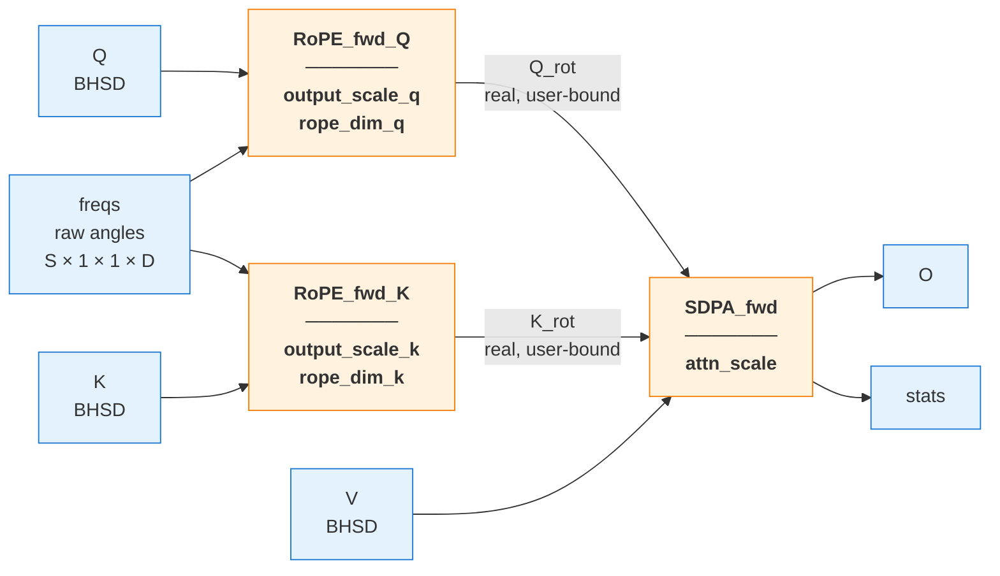
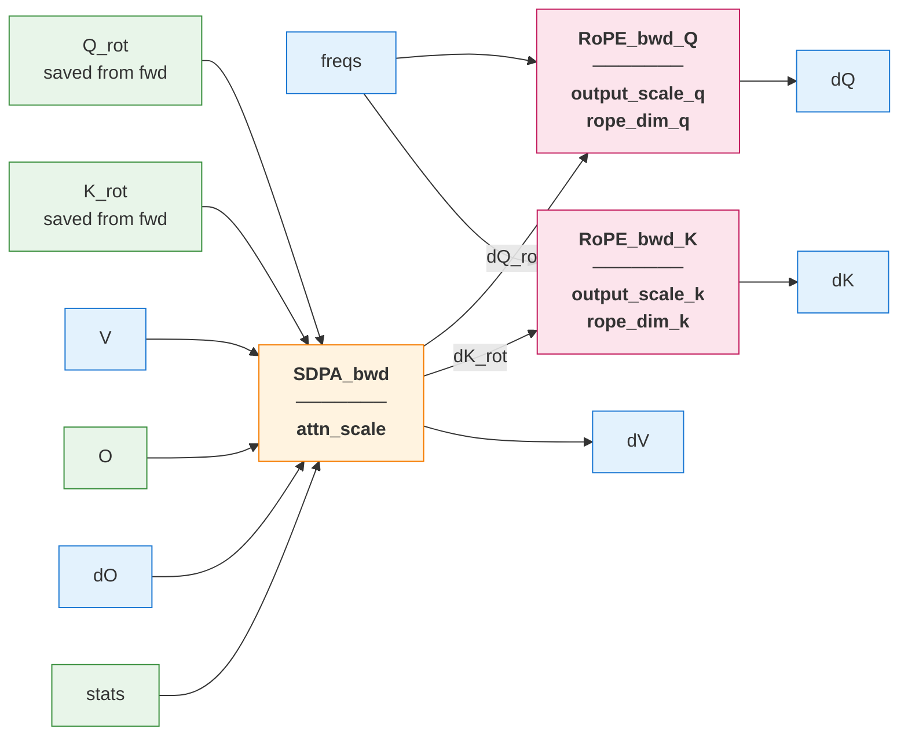
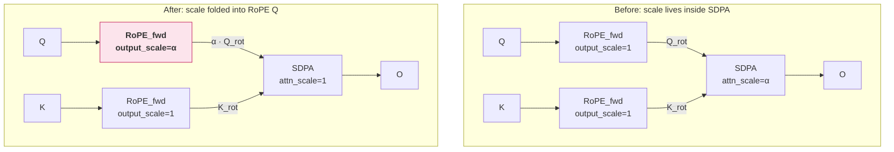
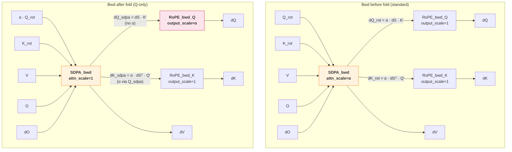

# RoPE (Rotary Position Embedding)

RoPE is a first-class backend operation (`CUDNN_BACKEND_OPERATION_ROPE_FWD_DESCRIPTOR` / `_BWD_DESCRIPTOR`), not an SDPA attribute. The backend op-graph contains `RoPE(Q) + RoPE(K) + SDPA(Q', K', V)`; the SDPA fusion engine pattern-matches and runs the RoPE kernels around the attention kernel as a single execution unit.

The kernel takes **raw `freqs`** (angles), not pre-computed cos+sin. It computes `sincosf(freqs)` once per position into shared memory, amortized across heads. One tensor instead of two; matches the TE/Mcore convention where `RotaryEmbedding` already caches raw angles.

## Math

Non-interleaved (halved) rotation. Head dim `D` is split into a leading nope segment of size `D − rope_dim` (scaled passthrough) and a trailing rope segment of size `rope_dim`:

$$
y_{\text{nope}} = \alpha \cdot x_{\text{nope}}
$$

$$
y_{\text{lo}} = \alpha \cdot (x_{\text{lo}} \cos\theta - x_{\text{hi}} \sin\theta)
$$

$$
y_{\text{hi}} = \alpha \cdot (x_{\text{hi}} \cos\theta + x_{\text{lo}} \sin\theta)
$$

where `x_lo, x_hi` are the two halves of the rope segment and `α = output_scale`. The same scale folds into both rotated halves *and* the passthrough so the entire output is uniformly scaled.

The backward op is rotation by `−θ` (transpose of the forward rotation) — implemented as the same kernel with `sin_sign = −1`. cos is unchanged.

## Forward graph

User builds:

```python
q_rot = graph.rope(input=q, freqs=freqs, output_scale=α_q, rope_dim=...)
k_rot = graph.rope(input=k, freqs=freqs, output_scale=α_k, rope_dim=...)
o, stats = graph.sdpa(q=q_rot, k=k_rot, v=v, attn_scale=...)
```



`Q_rot` and `K_rot` are **real (user-bound) outputs**, not workspace, so they survive into the backward graph as inputs to SDPA bwd.

## Backward graph



`dfreqs` is not produced — frequencies are constant during training.

User builds:

```python
dq_rot, dk_rot, dv = graph.sdpa_backward(q=q_rot, k=k_rot, v=v, o=o, dO=dO, stats=stats, attn_scale=...)
dq = graph.rope_backward(dY=dq_rot, freqs=freqs, output_scale=α_q, rope_dim=...)
dk = graph.rope_backward(dY=dk_rot, freqs=freqs, output_scale=α_k, rope_dim=...)
```

## Folding `attn_scale` into RoPE

Standard scaled attention multiplies `QKᵀ` by `α = 1/√D` inside the softmax. Because RoPE is linear, that scale can be hoisted into the RoPE Q output without changing the math:

$$
\langle \alpha \cdot R(\theta) Q, R(\theta) K \rangle = \alpha \cdot \langle R(\theta) Q, R(\theta) K \rangle
$$



The fwd kernel applies `output_scale` uniformly to both rotated halves and the nope-dim passthrough so every position of the Q output carries the α factor. SDPA then runs with `attn_scale = 1`.

### Backward: where α actually flows

This is subtle. Standard scaled SDPA bwd has α between the softmax bwd and the matmul bwds:

$$
dV = P^\top dO, \quad dS = P \odot \big(dP - \text{rowSum}(O \odot dO)\big), \quad dQ' = \alpha \cdot dS \cdot K', \quad dK' = \alpha \cdot dS^\top \cdot Q'
$$

α appears explicitly in *both* `dQ'` and `dK'`.

In the folded case (`Q_sdpa = α·Q'`, `K_sdpa = K'`, `attn_scale = 1`), `S = Q_sdpa · K_sdpa^T` has the same value (α moved across the dot product), so `P`, `O`, `dS`, `dV` are unchanged. But the engine no longer multiplies by α between softmax bwd and the matmuls:

$$
dQ_{\text{sdpa}} = 1 \cdot dS \cdot K_{\text{sdpa}} = dS \cdot K' \quad \textbf{(missing α)}
$$

$$
dK_{\text{sdpa}} = 1 \cdot dS^\top \cdot Q_{\text{sdpa}} = dS^\top \cdot (\alpha Q') = \alpha \cdot dS^\top \cdot Q' \quad \textbf{(α came in through } Q_{\text{sdpa}}\textbf{)}
$$

So K is already correct out of SDPA bwd; only Q needs RoPE_bwd to re-introduce the α factor.



### General rule

The fold setting on each side is the *same* in fwd and bwd. The bwd correctness then drops out of the chain rule mechanically: whatever `output_scale` you used on `RoPE_fwd_X`, use the same on `RoPE_bwd_X`.

| Setup              | RoPE_fwd_Q | RoPE_fwd_K | SDPA attn_scale | RoPE_bwd_Q | RoPE_bwd_K |
|--------------------|------------|------------|-----------------|------------|------------|
| No fold (standard) | 1          | 1          | α               | 1          | 1          |
| Q-only fold        | α          | 1          | 1               | α          | 1          |
| Symmetric (mscale) | √α         | √α         | 1               | √α         | √α         |

Why the asymmetry of the Q-only row "just works" for K bwd: the SDPA bwd computes `dK_sdpa = dS^T · Q_sdpa`, and `Q_sdpa` already carries α — so K's gradient gets α "for free" without an explicit scale on RoPE_bwd_K.

### Why bother

One fewer pass over Q/K data: the α multiply happens during the same load that does the rotation, instead of being a separate op. Also unblocks future TE-block fusion where attention scaling needs to be a property of the Q/K producer, not the matmul consumer.

### Folding `inv_ln2` (extension)

The same fold knob can absorb the `1/ln(2)` constant the softmax kernel uses to bridge `exp` ↔ `exp2`. GPU hardware only has `exp2`, so the kernel internally does:

$$
\exp(z) = \exp_2(z \cdot \log_2 e) = \exp_2(z \cdot \text{inv\_ln2})
$$

— a per-element `inv_ln2` multiply against the score matrix `S` (the largest intermediate tensor in attention). If the producer pre-scales by `inv_ln2` instead, the kernel can use `exp2` directly. The chain reasoning:

$$
\exp_2(\text{inv\_ln2} \cdot S - \max) = \exp_2(\text{inv\_ln2} \cdot (S - \max)) = \exp(S - \max)
$$

— same correct softmax, but the multiply moved from `O(BHS_qS_{kv})` (per-S-cell) to `O(BHS_qD)` (per-Q-element) and is amortized into the RoPE load.

Note: softmax is **not** scale-invariant — `softmax(c·x) ≠ softmax(x)` in general. So `attn_scale = 1/√D` stays mandatory (it controls the softmax shape). `inv_ln2` is different: it's a base-conversion artifact, removable only because the kernel switches `exp ↔ exp2` to match.

#### Bwd contract

The trick has two halves that move together. The kernel needs an `softmax_input_is_log2` flag that toggles **both**:

- **Fwd**: skip the internal `S *= inv_ln2`; run `exp_2(S - \max)` directly.
- **Bwd**: emit `dS_sdpa = ∂L/∂(kernel's S)` — the gradient w.r.t. the already-log2-scaled S, not the natural-log S.

Math for the bwd half. With `P_i = \exp_2(S_i - m) / Z`, the chain rule gives

$$
\frac{\partial P_j}{\partial S_i} = \ln 2 \cdot P_j \cdot (\delta_{ij} - P_i)
$$

which propagates to

$$
dS_\text{sdpa} = \ln 2 \cdot \big( P \odot (dP - \text{rowSum}(P \odot dP)) \big) = \ln 2 \cdot \text{standard\_dS}
$$

So the bwd output is bigger by a factor of `ln 2` than today's kernel. That extra factor cancels with the user's `output_scale = α · inv_ln2` on RoPE_bwd:

$$
dQ = (\alpha \cdot \text{inv\_ln2}) \cdot R(-\theta) \cdot dQ_\text{sdpa}
   = (\alpha \cdot \text{inv\_ln2}) \cdot R(-\theta) \cdot (\ln 2 \cdot \text{standard\_dS} \cdot K)
   = \alpha \cdot R(-\theta) \cdot \text{standard\_dS} \cdot K
$$

Same on K via Q_sdpa. **Net effect: no change to the FE-side rule.** RoPE_bwd uses the same `output_scale` as RoPE_fwd, whatever you folded into it. The kernel-internal `ln 2` factor cancels with the `inv_ln2` you put in `output_scale`, automatically, by the chain rule.

| Setup                            | RoPE_fwd_Q       | RoPE_fwd_K | SDPA attn_scale | softmax flag        | RoPE_bwd_Q       | RoPE_bwd_K |
|----------------------------------|------------------|------------|-----------------|---------------------|------------------|------------|
| No fold                          | 1                | 1          | α               | (kernel handles)    | 1                | 1          |
| Q-only fold of α                 | α                | 1          | 1               | (kernel handles)    | α                | 1          |
| Q-only fold of α + inv_ln2       | α · inv_ln2      | 1          | 1               | input_is_log2       | α · inv_ln2      | 1          |
| Symmetric mscale + inv_ln2       | √α · inv_ln2     | √α         | 1               | input_is_log2       | √α · inv_ln2     | √α         |

## API

```cpp
// Forward
auto Q_rot = graph.rope(Q, freqs, RoPE_attributes()
                                      .set_output_scale(α_q)
                                      .set_rope_dim(rope_dim_q));

// Backward
auto dQ = graph.rope_backward(dQ_rot, freqs, RoPE_backward_attributes()
                                                 .set_output_scale(α_q)
                                                 .set_rope_dim(rope_dim_q));
```

Python:

```python
q_rot = graph.rope(input=q, freqs=freqs, output_scale=α_q, rope_dim=rope_dim_q)
dq    = graph.rope_backward(dY=dq_rot, freqs=freqs, output_scale=α_q, rope_dim=rope_dim_q)
```

## Support matrix

| Arch       | Datatype  | Layout | Head dim | rope_dim       | Backend version |
|------------|-----------|--------|----------|----------------|-----------------|
| SM80+      | f16, bf16 | BHSD   | even     | even, ≤ D      | ≥ 9.24          |

`freqs` is `[S, 1, 1, rope_dim]` in f32. For a partial-rotation config (e.g. DeepSeek-V3 MLA with `qk_rope_head_dim = 64` inside `D = 192`), the user supplies the smaller `freqs` tensor and sets `rope_dim = 64`; the leading `D − rope_dim` positions become a scaled passthrough.
