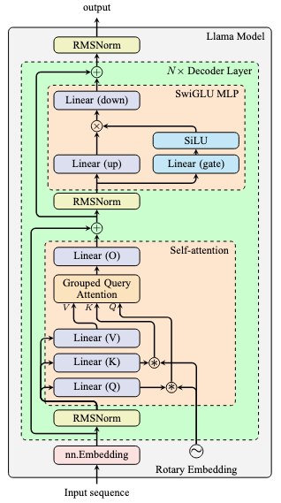

The code in this directory is a reference implementation of the Llama model in PyTorch and cuDNN.

# Prerequisites

The code in this directory depends on the following Python packages:
- `torch`: PyTorch
- `transformers`: Hugging Face transformers library
- `tabulate`: Python library for formatting tables
- `nvidia_cudnn_frontend`: cuDNN Frontend API (this repository)

You can install these packages by running the following command:

```
pip install torch transformers tabulate nvidia_cudnn_frontend
```

Please reference to the [README.md](../../README.md) for more details on how to install the cuDNN Frontend API.

<div style="text-align: center;">
  <br/>
  Llama 3.1 8B model architecture
</div>

# Scripts

**100_download_weight.py**

This script downloads the Llama 3.1 8B model weights from Hugging Face and saves them in a PyTorch .pt file. It uses the Hugging Face transformers library. You also need to have a valid Hugging Face token to download the weights. Note that the Llama models are gated and you should have granted access to the model before you can download the weights with your token.

Running this script will download the weights and save them into file `llama3.1_8b_weights.bf16.pt` in the current directory. This weight file will be used in the subsequent scripts.

**101_hf_llama_tieout.py**

This script creates a PyTorch implementation of the Llama 3.1 8B model using Hugging Face transformers library and loads the pretrained weights. Then randomize a small input tensor of integer token IDs, processed through the model, and perform a backward pass. The input, output, and the gradient tensors are saved into file `tensors-bf16-tieout.pt` in the current directory as a reference for the subsequent scripts.

**102_torch_llama_tieout.py**

This script creates a concise PyTorch implementation of the Llama 3.1 8B model. The code is cleaned up for clarity and readability but not optimized for performance. For example, KV cache is not implemented in this script.

Running this script will load the tensors saved in `tensors-bf16-tieout.pt`, then reuse the input tensors to run a forward pass and a backward pass. The output, and the gradient tensors are compared with the reference tensors for numerical correctness.

**103_cudnn_llama_tieout.py**

This script replaces a few modules in the implementation of Llama 3.1 8B model from the script `102_torch_llama_tieout.py` with custom PyTorch implementations that uses cuDNN. Specifically, the `nn.Linear` module, `nn.RMSNorm` module, and `nn.functional.scaled_dot_product_attention` functions are replaced by a custom PyTorch function to use cuDNN.

Running this script will load the tensors saved in `tensors-bf16-tieout.pt`, then reuse the input tensors to run a forward pass and a backward pass. The output, and the gradient tensors are compared with the reference tensors for numerical correctness.

**104_torch_llama_nvtx.py**

This is mostly the same as `102_torch_llama_tieout.py` that it launches a Llama model in PyTorch implementation and runs a forward pass and a backward pass. The code adds NVTX ranges to critical parts of the model to collect performance data.

To run this script, you should have nsys installed. If you already installed CUDA toolkit, it should be in the path `/usr/local/cuda/bin/nsys`. Afterwards, you run the script with the command:

```
nsys profile -f true --gpu-metrics-devices=cuda-visible --export=sqlite -o 104_torch_llama_nvtx.nsys-rep \
    python 104_torch_llama_nvtx.py
```

Then you will see two new files are created, `104_torch_llama_nvtx.nsys-rep` and `104_torch_llama_nvtx.nsys-rep.sqlite`. The performance data is stored in the SQLite file.

**105_cudnn_llama_nvtx.py**

Similar to `104_torch_llama_nvtx.py`, but this is using cuDNN modules for the Llama model implementation as in `103_cudnn_llama_tieout.py`. To run this script, you should run with the command:

```
nsys profile -f true --gpu-metrics-devices=cuda-visible --export=sqlite -o 105_cudnn_llama_nvtx.nsys-rep \
    python 105_cudnn_llama_nvtx.py
```

Then you will see two new files are created, `105_cudnn_llama_nvtx.nsys-rep` and `105_cudnn_llama_nvtx.nsys-rep.sqlite`. The performance data is stored in the SQLite file.

**decode_nvtx_profile.py**

A script to extract the performance data from the SQLite file that created from running `104_torch_llama_nvtx.py` or `105_cudnn_llama_nvtx.py` as described above. You should give the SQLite file as an argument to the script:

```
python decode_nvtx_profile.py 104_torch_llama_nvtx.nsys-rep.sqlite
```

And the output of this script will be like:

```
Analyzing CUDA profile from: 104_torch_llama_nvtx.sqlite
Found 8011 kernels, 14025 CPU calls, and 20796 events
nvtx event                       num calls    kernel count    kernel time total
-----------------------------  -----------  --------------  -------------------
:fwd                                     1           1,257           10,955,357
:fwd.layer                              32           1,248           10,895,549
:fwd.layer.attn                         32             768            6,077,055
:fwd.layer.attn.attn                    32             480            4,273,727
:fwd.layer.attn.attn.gqa                32              32              522,816
:fwd.layer.attn.attn.o_proj             32              32              527,104
:fwd.layer.attn.attn.qkv_proj           32              96            1,536,703
:fwd.layer.attn.attn.rope               32             320            1,687,104
:fwd.layer.attn.prenorm                 32             256            1,698,816
:fwd.layer.mlp                          32             480            4,818,494
:fwd.layer.mlp.mlp                      32             192            3,014,238
:fwd.layer.mlp.prenorm                  32             256            1,694,816
:fwd.output_norm                         1               8               55,136
```

The table shows the number of time a NVTX event is encountered, the number of CUDA kernels involved in total, and the total time (nanoseconds) spent in these CUDA kernels.
